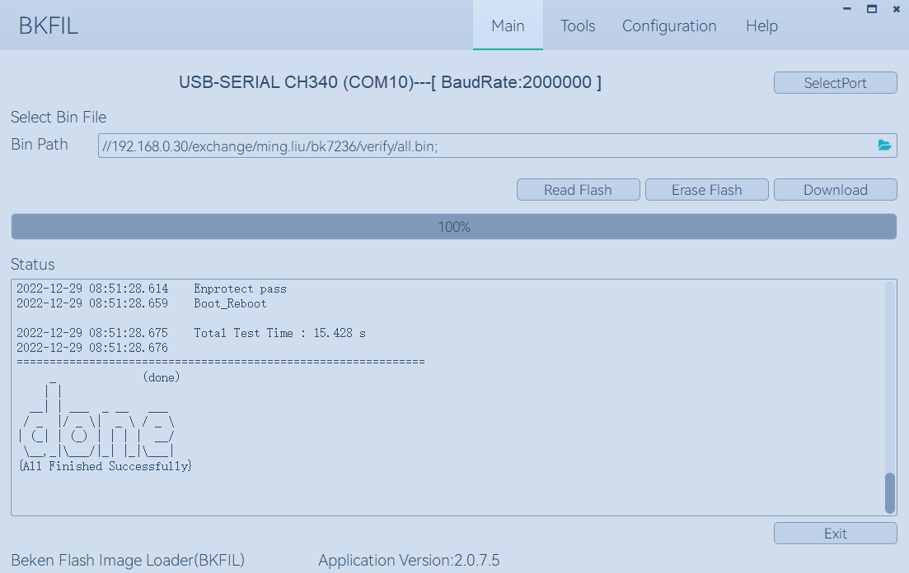

Quick Start Guide
==============================================

:link_to_translation:`zh_CN:[中文]`

This article demonstrates:

 - Code download
 - Environment deployment and compilation
 - How to configure Armino project
 - How to build the project and flash the bin to board

Introduction
--------------------------------------------------------

BK7236 is a SoC that integrates the following features:

 - Wi-Fi 6 (2.4 GHz Band)
 - Bluetooth Low Energy 5.4
 - ARMv8-M Star (M33F) MCU
 - Multiple peripherals
 - Built-in TrustEngine security hardware

Powered by 22nm technology, BK7236 provides a robust, highly integrated platform, which helps
meet the continuous demands for efficient power usage, compact design, security, high performance,
reliability and high security.

Beken provides basic hardware and software resources to help application developers realize
their ideas using BK7236 series hardware. The software development framework Armino is
intended for development of Internet-of-Things (IoT) applications with Wi-Fi, Bluetooth, power
management, security and other system features.

Preparation
--------------------------------------------------------

Hardware：

 - BK7236 Demo board( :ref:`Introduction to Development Board <bk7236>` )
 - Serial port burning tool
 - PC

Armino SDK Code download
--------------------------------------------------------------------

We can download Armino from gitlab::

    mkdir -p ~/armino
    cd ~/armino
    git clone https://gitlab.bekencorp.com/armino/bk_idk.git

We also can download Armino from github::

	mkdir -p ~/armino
	cd ~/armino
	git clone https://github.com/bekencorp/bk_idk.git

Then switch to the stable branch Tag node, such as v2.0.1.32::

    git checkout -B your_branch_name v2.0.1.32

.. warning::

    When using git clone to download the code on Windows, there may be issues with symbolic link failure and line ending problems, which can lead to compilation failure. Please solve them as follows:

    - Symbolic link failure issue:

    1. Configure the Git environment variable before downloading the code::
      
        git config --global core.symlinks true

    2. Execute the git clone command with administrator privileges.

    - Line ending issue:

    1.Configure the Git environment variable before downloading the code::

        git config --global core.autocrlf false

.. note::

    The GitHub code is relatively lagging behind the GitLab code. If you want to obtain the latest SDK code, please download it from GitLab. Please contact the your BK7236 project owner to get relevant accounts.

Environment Deployment and Compilation
------------------------------------------------

We provide an environment deployment and compilation solution based on Docker containers, which supports efficient compilation work on Linux, macOS, and Windows systems. With Docker containerization technology, you do not need to manually install various libraries and toolchains required for compilation, which significantly simplifies the deployment and compilation process. This solution is suitable for users who are familiar with the Docker environment and understand its basic usage, helping you quickly deploy and compile the environment.

For users who are not familiar with Docker technology or cannot use the Docker environment due to network restrictions, we also provide a local compilation deployment solution based on script commands. The local deployment solution currently only supports compilation on the Linux system.

.. toctree::
    :maxdepth: 1

        Local Deployment <env-manual>
        Docker Deployment <env-docker>

Configuration project
------------------------------------

We can also use the project configuration file for differentiated configuration::

    Project Profile Override Chip Profile Override Default Configuration
    Example： bk7236/config >> bk7236.defconfig >> KConfig
    + Example of project configuration file：
        projects/app/config/bk7236/config
    + Sample chip configuration file：
        middleware/soc/bk7236/bk7236.defconfig
    + Sample KConfig configuration file：
        middleware/arch/cm33/Kconfig
        components/bk_cli/Kconfig

Click :ref:`Kconfig Configuration <bk_config_kconfig>` to learn more about Armino Kconfig.

New project
------------------------------------

The default project is projects/app. For new projects, please refer to projects/app project

Burn Code
------------------------------------

On the Windows platform, Armino currently supports UART burning.
After the app project is compiled, generate all-app.bin in the build/app/bk7236 directory and burn it using this bin file. When burning the security project for the first time, it is necessary to first burn bootloader.bin, and then burn all-app.bin.

Burn through serial port
****************************************

.. note::

    Armino supports UART burning. It is recommended to use the CH340 serial port tool board to download.

Serial port burning tool is shown in the figure below:

.. figure:: ../../../common/_static/download_tool_uart.png
    :align: center
    :alt: Uart
    :figclass: align-center

    UART

Download burning tools (BKFILL.exe)：

	http://dl.bekencorp.com/tools/flash/
	Get the latest version in this directory. Ex：BEKEN_BKFIL_V2.1.6.0_20231123.zip

The snapshot of BKFILL.exe downloading.

    BKFIL GUI

Burn the serial port DL_UART0, click ``Download`` to burn the image, and then power down and restart the device after burning.
If the burning process cannot obtain the device and gets stuck on the ``Getting Bus``. You can press the restart button once to restore the CPU state.

Click :ref:`BKFIL <bk_tool_bkfil>` to learn more about BKFIL.

Serial port Log and Command Line
------------------------------------

Currently the BK7236 use the DL_UART0 as the Log output and Cli input; You can get the supported command list through the help command.
