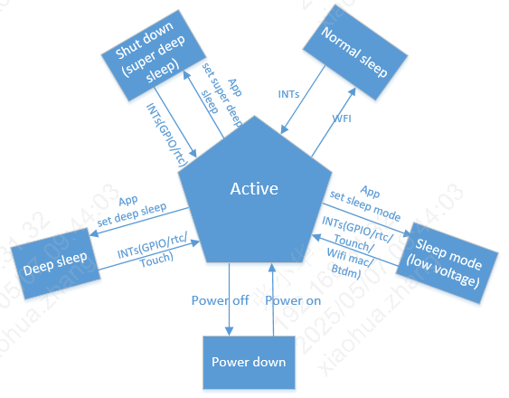

系统状态机说明
=============================================

:link_to_translation:`en:[English]`

系统支持不同的睡眠模式:
 - active
 - normal sleep
 - sleep mode(low voltage)
 - deep sleep
 - shut down(super deep sleep)
 - power down

支持的唤醒方式：

       +------------------+--------+--------+---------+--------+--------+
       | #sleep mode      | GPIO   | RTC    | WIFImac | BTdm   | TOUCH  |
       +==================+========+========+=========+========+========+
       | normal sleep     | Y      | Y      | Y       | Y      | Y      |
       +------------------+--------+--------+---------+--------+--------+
       | sleep mode       | Y      | Y      | Y       | Y      | Y      |
       +------------------+--------+--------+---------+--------+--------+
       | deep sleep       | Y      | Y      | N       | N      | Y      |
       +------------------+--------+--------+---------+--------+--------+
       | super deep sleep | Y      | Y      | N       | N      | N      |
       +------------------+--------+--------+---------+--------+--------+

active(正常工作)
--------------------------------------------
 - CPU处于工作状态且WIFI,BT可以正常收发数据。

normal sleep(普通睡眠)
--------------------------------------------
 - RTOS没有任务需要处理时，系统进入IDLE任务中，在IDLE任务中，CPU会进入WFI睡眠；当有任何中断到来时，都能让系统退出WFI状态，进入正常工作状态。

sleep mode(低压睡眠，又名low voltage)
--------------------------------------------
 - 低压睡眠是一种相对比较节省功耗的睡眠模式。在该模式下系统只有32K时钟，此时只有部分硬件模块在工作，除了AON和部分模拟模块在工作，其他硬件模块在低压下暂停运行和关闭。

 - 低压睡眠模式AON的电压会降低，VDDDIG的电压也会降低低。例如：如果SRAM不下电，在SRAM上保存的数据，处于保持中，低压唤醒后还能够继续使用。

 - 进入低压的条件:
   - 1.RTOS没有任务需要处理时，系统进入IDLE任务中。
   - 2.满足了进入低压的票（BT和WIFI进入sleep；多媒体关闭；APP的票置上；以及使用的低压都值上）。

 - 当唤醒信号触发后，系统退出低压状态，AON,VDDDIG电压会升到正常电压。

 - 处于低压状态下，以下唤醒源(GPIO,RTC,Touch,WIFI,BT)可以让系统退出低压。注意：WIFI,BT进入低压是根据WIFI，BT的业务场景来投票进入，投票比较特殊（SDK内部做好，应用程序不用关注），但是应用程序进入低压前需要把上层业务关闭。

 - 该模式下32K的时钟源可以根据自己业务的场景选择，时钟源可以参考 :doc:`bk_clock` 。

 - 为了达到最优功耗，不需要的模块，进入低压前请关闭，退出低压后，可以再开启。

deep sleep(深度睡眠)
--------------------------------------------
 - 深度睡眠是一种唤醒功能全且最节省功耗的睡眠模式。在该模式下系统只有32K时钟，只有AON和部分硬件模块在工作，其他硬件电路模块都下电。

   当唤醒信号触发后，系统退出深度睡眠状态，系统复位。

 - 处于深度睡眠状态下，以下唤醒源(GPIO,RTC,Touch)可以让系统退出深度睡眠。

 - 该模式下32K的时钟源默认是使用ROSC的32K。

 - 进入深度睡眠的条件:
   - 1.RTOS没有任务需要处理时，系统进入IDLE任务中;
   - 2.满足了进入深度睡眠的票（BT和WIFI进入sleep,多媒体关闭，APP的票置上）

shut down(超深度睡眠，又名super deep sleep)
--------------------------------------------
 - 与deepsleep区别在于该模式下aon电压域也断电，仅部分模拟区域有电；数字唤醒源不起效，只能依靠模拟GPIO或RTC唤醒。

.. note::
        1.超深度睡眠支持唤醒的GPIO只有GPIO_0到GPIO_15，个别GPIO功耗有些差异。
        2.RTC时间最长为1024s，时间不是连续的,例如2s,4s,8s,16s,1024s等。
        3.功耗比深度睡眠低5-10uA。

Power down(关机)
--------------------------------------------
 - 整个系统下电

状态机切换说明
=============================================

低压睡眠(sleep mode(low voltage))说明
--------------------------------------------

 - 低压睡眠和深度睡眠是系统性(整个芯片)睡眠，如果系统进入了低压睡眠和深度睡眠，个别模块还在工作，该模块的异常退出对系统从低压和深度睡眠中唤醒后，可能不能正常工作，
   为了从机制上避免该问题的发生，则通过投票机制进入低压睡眠和深度睡眠。

 - 低压睡眠：当前进入低压睡眠一共设置了64张票：
   - 1.BT和WIFI的票，BT和WIFI模块内部进入睡眠后自己投上，SDK内部做好，应用程序不用关注；
   - 2.APP的票是提供给上层应用用，需要进入睡眠前，自己投上该票，唤醒后需要工作一段时间，则把该票取消，需要进入睡眠时，再投上。
   - 3.多媒体(audio,video)的票，是关闭多媒体自动投上；
   - 4.其他票默认是投上的。
   - 5.对于SDK之外不需要关注太多，只需要关注APP这一张票。

 - 进入低压的条件
   - 1.RTOS没有任务需要处理时，系统进入IDLE任务中;
   - 2.满足了进入低压的票（BT和WIFI进入sleep,多媒体关闭，APP的票等票置上）

   如果进入低压失败，可以参考 :doc:`bk_Lowpower_problem_analysis` 。

深度睡眠(deep sleep)说明
-----------------------------------------------

 - 深度睡眠：当前进入深度睡眠一共设置了4张票：BT,WIFI,audio,video:
   - 1.由于深度睡眠唤醒后，系统会重启。
   - 2.BT和WIFI的票，BT和WIFI模块内部进入睡眠后自己投上，SDK内部做好，应用程序不用关注。
   - 3.多媒体(audio,video)的票，是关闭多媒体自动投上。

 - 系统中RTOS没有任务处理时，自动进入IDLE任务，进行WFI。当满足了进入深度睡眠条件（满足了进入深度睡眠的票时），则进入深度睡眠状态。

 - 进入深度睡眠的条件:
   - 1.RTOS没有任务需要处理时，系统进入IDLE任务中;
   - 2.满足了进入深度睡眠的票（BT和WIFI进入sleep,多媒体关闭票置上）
 
    如果进入深度睡眠失败，可以参考 :doc:`bk_Lowpower_problem_analysis` 。

超级深度睡眠(super deep sleep(shut down))说明
-------------------------------------------------

 - 超级深度睡眠：当前进入超级深度睡眠一共设置了4张票：BT,WIFI,audio,video:
   - 1.由于超级深度睡眠唤醒后，系统会重启。
   - 2.BT和WIFI的票，BT和WIFI模块内部进入睡眠后自己投上，SDK内部做好，应用程序不用关注。
   - 3.多媒体(audio,video)的票，是关闭多媒体自动投上。

 - 系统中RTOS没有任务处理时，自动进入IDLE任务，进行WFI。当满足了进入超级深度睡眠条件（满足了进入超级深度睡眠的票时），则进入超级深度睡眠状态。

   - 进入深度睡眠的条件
     - 1.RTOS没有任务需要处理时，系统进入IDLE任务中;
     - 2.满足了进入超级深度睡眠的票（BT和WIFI进入sleep,多媒体关闭票置上）
 
     如果进入超级深度睡眠失败，可以参考 :doc:`bk_Lowpower_problem_analysis` 。

超级深度睡眠(super deep sleep)和深度睡眠的差异
-------------------------------------------------

 - 1.超深度休眠功耗更低，相比深度睡眠，额外把AON中数字逻辑电路也下电了。
 - 2.超深度休眠支持唤醒的GPIO只有GPIO_0到GPIO_15，深度睡眠对使用的GPIO没有限制。
 - 3.超深度休眠设置的RTC时间最大为1024s,深度休眠模式的RTC时间没有这个限制。