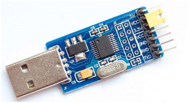
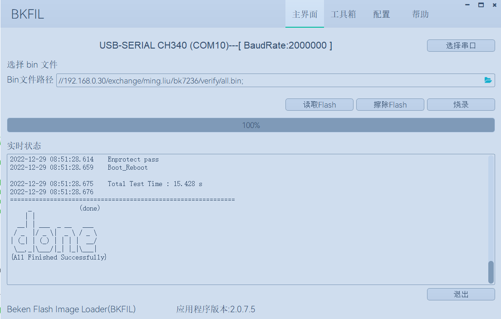

快速入门
=======================

:link_to_translation:`en:[English]`

本文档以 BK7236 开发板为例，通过一个简单的示例项目向您展示:

 - 代码下载；
 - 环境部署及编译；
 - 工程配置；
 - 固件编译与烧录；

概述
------------------------

BK7236 SoC 芯片支持以下功能:

 - 2.4G Wi-Fi 6
 - 低功耗蓝牙 5.4
 - ARMv8-M Star (M33F) MCU
 - 丰富的外设
 - 内置 TrustEngine 安全引擎

BK7236 采用 22 nm 工艺制成，具有最佳的功耗性能，射频性能，稳定性，通用性，可靠性，
和最高级别的安全（PSA Level 2），适用于各种应用场景和不同功耗，安全需求。

博通集成为用户提供完整的软，硬件资源，进行 BK7236 硬件设备开发。其中，软件开发环境
Armino 旨在协助用户快速开发物联网(IoT)应用，可满足用户对 Wi-Fi，蓝牙，低功耗，安全
等方面的要求。

准备工作
------------------------

硬件：

 - BK7236 开发板( :ref:`开发板简介 <bk7236>` )；
 - 串口烧录工具；
 - PC；

Armino SDK 代码下载
------------------------------------

您可从 gitlab 上下载 Armino::

    mkdir -p ~/armino
    cd ~/armino
    git clone https://gitlab.bekencorp.com/armino/bk_idk.git

	
您也可从 github 上下载 Armino::

	mkdir -p ~/armino
	cd ~/armino
	git clone https://github.com/bekencorp/bk_idk.git

 
然后切换到稳定分支Tag节点, 如v2.0.1.32::

    git checkout -B your_branch_name v2.0.1.32

.. warning::

 Windows下通过git clone拉取代码，存在软链接失效及换行符的问题，会导致编译失败，请按照以下方式解决:

 - 软链接失效问题:

   1. 下载代码前先配置git环境变量::
      
        git config --global core.symlinks true

   2. 在管理员权限下执行git clone命令

 - 换行符问题:

   1.下载代码前先配置git环境变量::

        git config --global core.autocrlf false

.. note::

    github代码相对于gitlab有滞后性，如果您想获取最新的SDK代码，请从gitlab拉取，相关账号找项目上审核申请。

环境部署及编译
------------------------

我们提供了一种基于Docker容器的环境部署与编译方案，支持在Linux、macOS及Windows系统上高效完成编译工作。
借助Docker容器化技术，您无需手动安装编译所需的各类库文件及工具链，从而显著简化了部署与编译流程。
该方案适用于熟悉Docker环境并了解其基本使用方法的用户，可帮助您快速实现环境的部署与编译。

对于不熟悉Docker技术或因网络条件限制无法使用Docker环境的用户，我们也提供了基于脚本命令的本地编译部署方案。本地部署方案目前仅支持Linux系统下的编译。

.. toctree::
    :maxdepth: 1

        本地部署 <env-manual>
        Docker部署 <env-docker>

配置工程
------------------------------------

您可以通过工程配置文件来进行更改 Armino 默认配置或者针对不同芯片进行差异化配置::

    工程配置文件 Override 芯片配置文件 Override 默认配置
    如： bk7236/config >> bk7236.defconfig >> KConfig
    + 工程配置文件示例：
        projects/app/config/bk7236/config
    + 芯片配置文件示例：
        middleware/soc/bk7236/bk7236.defconfig
    + KConfig 配置文件示例：
        middleware/arch/cm33/Kconfig
        components/bk_cli/Kconfig

点击 :ref:`Kconfig 配置 <bk_config_kconfig>` 进一步了解 Armino 配置。

新建工程
------------------------------------

BK7236 默认工程为 projects/app，新建工程可参考 projects/app工程

烧录代码
------------------------------------

Armino 支持在 Windows/Linux 平台进行固件烧录, 烧录方法参考烧录工具中指导文档。
以Windows 平台为例， Armino 目前支持 UART 烧录。
app工程在编译完成后，在build/app/bk7236目录下生成all-app.bin，使用此bin文件烧录即可。安全工程首次烧录时，需要先烧录bootloader.bin，再烧录all-app.bin。

通过串口烧录
********************

.. note::

    Armino 支持 UART 烧录，推荐使用 CH340 串口工具小板进行下载。

串口烧录工具如下图所示:

    UART

烧录工具（BKFIL）获取：

	https://dl.bekencorp.com/tools/flash/
	在此目录下获取最新版本，如：BEKEN_BKFIL_V2.1.6.0_20231123.zip

BKFIL.exe 界面及相关配置如下图所示：

    BKFIL GUI

选择烧录串口 DL_UART0，点击 ``烧录`` 进行版本烧录, 烧录完成之后掉电重启设备。

点击 :ref:`BKFIL <bk_tool_bkfil>` 进一步了解 Armino 烧录工具。
如果烧录过程无法获取设备，卡在 ``Getting Bus...`` 时，可以按一下重启键，恢复cpu状态。

串口 Log 及 Command Line
------------------------------------

目前 BK7236 平台，串口 Log 及 Cli 命令输入在 DL_UART0 口；可通过 help 命令查看支持命令列表。
