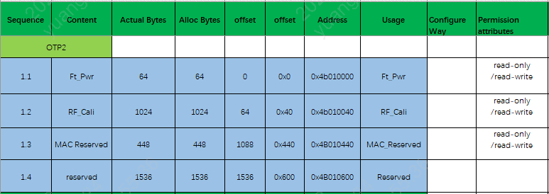
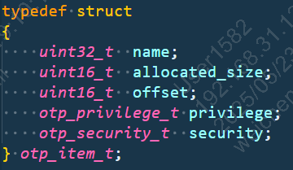
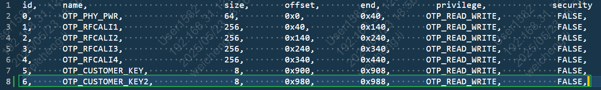

.. _bk_nosecure_version_of_otp_usage_instructions:

nosecure_version_of_otp_usage_instructions
============================================

:link_to_translation:`zh_CN:[中文]`

OTP
-----------------------------------------------------------

一、Overview
+++++++++++++++++++++++++++++

The detailed explanation of OTP, please refer to :ref:`config_otp_efuse <bk_config_otp_efuse>`.

.. note::

 Only the storage space of OTP2 is available for customer use, and the operation storage address range is [0x4B010600----0x4B010C00], which is a 1.5K byte space.

OTP2 Usage Layout
~~~~~~~~~~~~~~~~~~~

OTP2 Side
~~~~~~~~~~~~~~~~

OTP2: Readable and programmable OTP2 area, where 0x000~0x2FF is divided into 767 small partitions. Its storage address range is [0x4B010000----0x4B010C00]. Each partition can change permissions by modifying the LOCK OTP2 CELL: read/write -> read-only -> no access.

.. important::

    The first 1.5K byte space is already used internally by BEKEN, with the storage address range being [0x4B010000----0x4B010600]; this space is not available for customer use. The operable storage address range for customers is [0x4B010600----0x4B010C00], which is a 1.5K byte space.

二、Introduction to Otp2 Driver Usage
+++++++++++++++++++++++++++++++++++++++

- 1）Firstly, the driver code path for otp2 is located at bk_idk/middleware/driver/otp/otp_driver_v1_1.c;
- 2) If you need to add a specific size partition in otp2, take BK7258 as an example, you only need to add the corresponding content of [id, name, size, offset, end, privilege, security] in middleware/boards/bk7258/csv/otp2.csv. For reference, see the end of the article;
- 3) The tools in the SDK will automatically generate relevant header files during compilation. There is no need to manually modify the content in the header file. The generated header file content is as follows.

.. figure:: picture/otp_header.png
    :align: center
    :alt: 8
    :figclass: align-center

- 4) After configuring the above settings, customers can use CLI commands to test. The related test code path is: bk_idk/component/bk_cl/cli_otp.c (for example, the test command is otp_ahb read item size)

Structure Array otp_ahb_map Configuration Introduction
~~~~~~~~~~~~~~~~~~~~~~~~~~~~~~~~~~~~~~~~~~~~~~~~~~~~~~~

- 1) The structure of the structure array otp_ahb_map is as follows: specific path is bk_idk/middleware/driver/otp/otp_driver.h

.. note::

    - name: item_id of the access area, subsequent operations on this area can be accessed according to this item_id; d_size indicates the required allocated byte size space;
    - allocated_size: allocated byte size space
    - offset: offset from the base address
    - privilege: set the permissions of the access area

- 2) The name field is stored in otp2_id_t; specific path is ../_build/_otp.h

.. figure:: picture/otp2_id_t.png
    :align: center
    :alt: 8
    :figclass: align-center

.. note::

    - Take name=OTP_CUSTOMER_KEY2 as an example to introduce how to configure otp2
    - First, add id 6 to the opt2.csv file, and increase it in sequence; add a self-defined name field, such as OTP_CUSTOMER_KEY2;
    - Secondly, you need to configure the size, that is, the byte size space that needs to be allocated. If the size is 256 bytes, size is 256; (decimal size)
    - offset size is equal to (end of the previous name field) (hexadecimal)
    - permission is OTP_READ_WRITE, security is FALSE;

