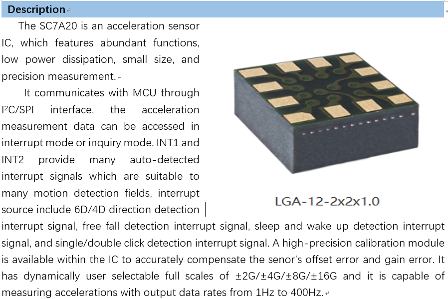

Gsensor Software User Guide
=============================================================

:link_to_translation:`zh_CN:[中文]`

Overview of Gsensor
------------------------------------------------------------
    Gsensor is a high-precision digital three-axis acceleration sensor, currently supporting the SC7A20 sensor. It uses I2C for data transmission and performs analysis on the collected data from the X, Y, and Z axes.

    Gsensor SC7A20

Definitions of Macros
------------------------------------------------------------
    CONFIG_GSENSOR_ENABLE: Master switch for the Gsensor function
    CONFIG_GSENSOR_DEMO_EN: A demo that has already been implemented. Customers can decide whether to use this demo based on their own situation.
    CONFIG_GSENSOR_ARITHEMTIC_DEMO_EN: Algorithm recognition demo. Performs parsing on the data received from the sensor.
    CONFIG_GSENSOR_SC7A20_ENABLE: The sensor being used is SC7A20
    CONFIG_GSENSOR_TEST_EN: Enables CLI test commands

    Default configuration of macro switches: 
    CONFIG_GSENSOR_ENABLE=y 
    CONFIG_GSENSOR_DEMO_EN=y 
    CONFIG_GSENSOR_ARITHEMTIC_DEMO_EN=y 
    CONFIG_GSENSOR_TEST_EN=n 
    CONFIG_GSENSOR_SC7A20_ENABLE=y

General Function Interfaces
------------------------------------------------------------
    These APIs are general-purpose interfaces designed for customer convenience, allowing for the adaptation of various types of Gsensors.

    void bk_gsensor_init(); 
    Initializes the Gsensor driver, hanging the name of the Gsensor used for subsequent operations. Designed for a universal interface for different types of Gsensors.

    void bk_gsensor_deinit(); 
    Unloads the Gsensor, unloading the pointer used during initialization.

    int bk_gsensor_open();
    Opens the Gsensor, completing basic register configurations for power supply.

    void bk_gsensor_close(); 
    Closes the Gsensor, stopping its operation.

    int bk_gsensor_setDatarate(); 
    Sets the data collection frequency of the Gsensor.

    int bk_gsensor_setMode(); 
    Sets the mode of the Gsensor, including normal operation mode and wake-up mode.

    int bk_gsensor_setDateRange(); 
    Sets the range of data collection for the Gsensor.

    int bk_gsensor_registerCallback(); 
    After receiving data, notifies the application layer through a callback function.

Gsensor Demo Interface Functions
------------------------------------------------------------
    bk_err_t gsensor_demo_init(void); 
    Initializes the demo, registers the callback function, initializes the sensor, and creates the demo thread.

    void gsensor_demo_deinit(void); 
    Unloads the demo thread and unloads the callback function.

    bk_err_t gsensor_demo_open(); 
    Opens the Gsensor, sends basic configurations to the sensor.

    bk_err_t gsensor_demo_close(); 
    Closes the Gsensor, sends shutdown configurations to the sensor.

    bk_err_t gsensor_demo_set_normal(); 
    Sets the mode to normal operation.

    bk_err_t gsensor_demo_set_wakeup(); 
    Sets the mode to wake-up.

    bk_err_t gsensor_demo_lowpower_wakeup(); 
    Sets the mode to low-power wake-up.

Gsensor Arithmetic Demo Interface Functions
------------------------------------------------------------
    void arithmetic_module_init(void); 
    Creates the algorithm processing thread.

    void arithmetic_module_deinit(void); 
    Unloads the algorithm processing thread.

    int arithmetic_module_copy_data_send_msg(); 
    Sends data to the algorithm processing thread through this interface.

    void arithmetic_module_register_status_callback(); 
    Registers a callback function for the status identified after algorithm processing.

    void shake_arithmetic_set_parameter(); 
    ets parameters for the shake recognition algorithm.

    PS: There are other algorithms available for reference. Since the data performance of various Gsensors varies, algorithm parameters need to be adjusted based on actual conditions.

