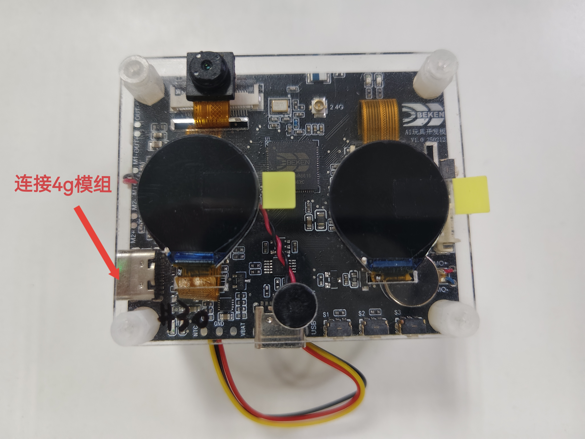
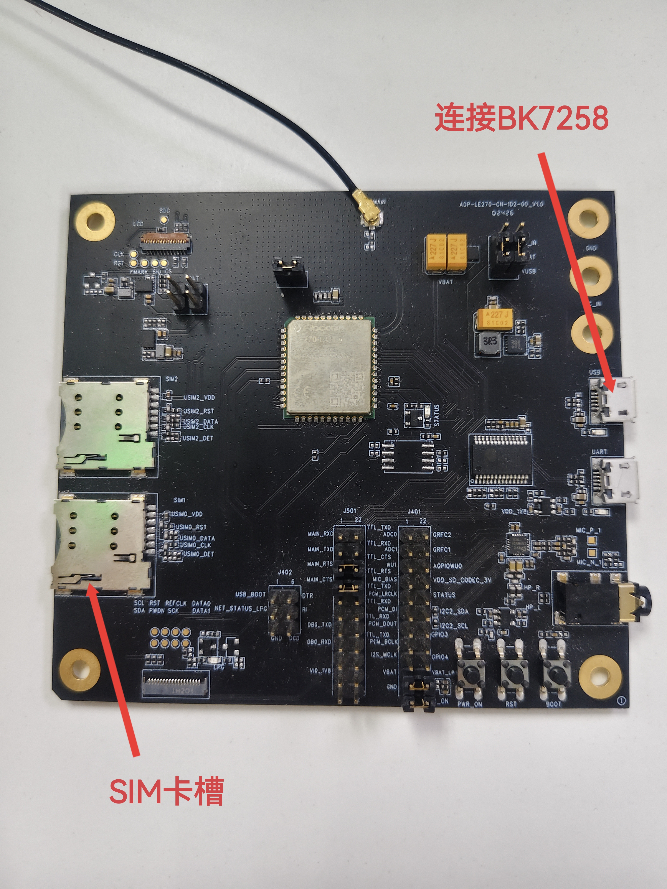
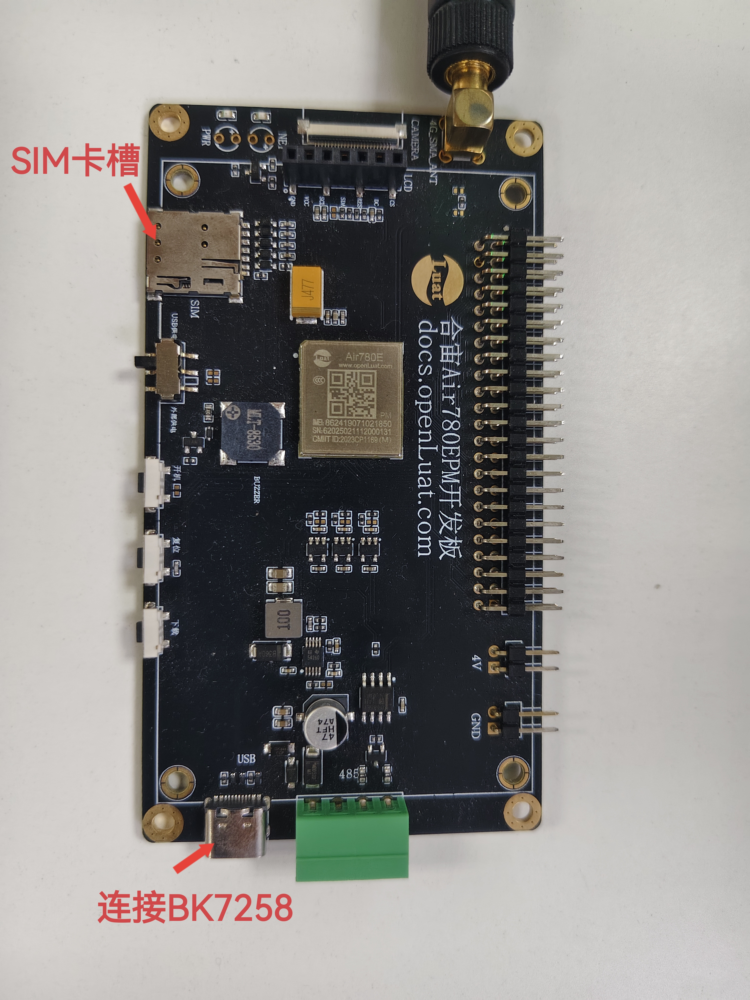

.. _Modem Griver Usage Guide:

Modem Driver Usage Guide
========================

:link_to_translation:`zh_CN:[中文]`

The modem modules and wiring methods that have been debuged with BK7258are shown below.

	
    BK7258 AI Toy Board

    FIBOCOM 4G module

    LUAT 4G module

.. figure:: ../../../../common/_static/quectel.png
    :align: center
    :alt: quectel module
    :figclass: align-center

    QUELTEL 4G module

.. figure:: ../../../../common/_static/tuya.png
    :align: center
    :alt: tuya module
    :figclass: align-center

    MobileTek 4G module
