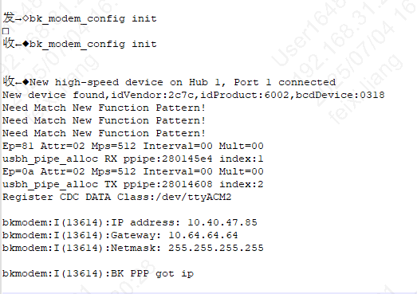
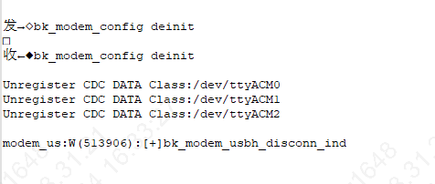

Modem Driver
================

:link_to_translation:`en:[English]`

Modem driver API
------------------

+---------------------------------------------+---------+
| API                                         | BK7258  |
+=============================================+=========+
| :cpp:func:`bk_modem_init`                   | Y       |
+---------------------------------------------+---------+
| :cpp:func:`bk_modem_deinit`                 | Y       |
+---------------------------------------------+---------+

基本使用
------------------

BK7258的AIDK支持与4g模组连接使用。

AIDK还可通过APP进行4G配网，并使用AI相关功能，具体可参考

https://docs.bekencorp.com/arminodoc/bk_aidk/bk7258/zh_CN/v2.0.1/projects/beken_genie/index.html#id23

测试示例
------------------

1、调用bk_modem_init()以后，BK7258会与4G模组建立连接，成功的log如下：

2、调用bk_modem_init()以后，BK7258会与4G模组断开连接，log如下：

注意：请确保BK7258和4G模组硬件的连接正确，连线请参考 :ref:`modem driver 使用指南 <Modem Griver Usage Guide>`

USB API Reference
---------------------

.. include:: ../../_build/inc/modem_driver.inc

