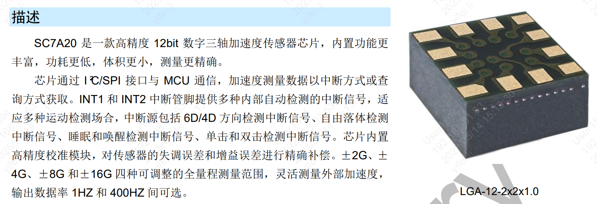

Gsensor 软件使用指南
====================================================================================

:link_to_translation:`en:[English]`

Gsensor概述
----------------------------------

Gsensor 是高精度数字三轴加速度传感器，当前已经适配了SC7A20传感器。使用I2C进行数据传输，对X、Y、Z轴的采集数据进行分析。

    Gsensor SC7A20

宏定义含义
---------------------------------------------------

   CONFIG_GSENSOR_ENABLE 功能的总开关
   CONFIG_GSENSOR_DEMO_EN 已经实现的一个DEMO，客户可以根据自己的情况决定是否使用该DEMO
   CONFIG_GSENSOR_ARITHEMTIC_DEMO_EN 算法识别DEMO，当前从传感器接收到的数据进行解析
   CONFIG_GSENSOR_SC7A20_ENABLE 适配的传感器是 SC7A20
   CONFIG_GSENSOR_TEST_EN CLI测试的命令行打开

宏开关的默认配置
    CONFIG_GSENSOR_ENABLE=y
    CONFIG_GSENSOR_DEMO_EN=y
    CONFIG_GSENSOR_ARITHEMTIC_DEMO_EN=y
    CONFIG_GSENSOR_TEST_EN=n
    CONFIG_GSENSOR_SC7A20_ENABLE=y

通用函数接口
--------------------------------------------------------------------------------------------------------------------------------------------------------------------------

    该部分的API为通用的接口，便于客户自行开发。可适配更多不同种类的Gsensor

   void* bk_gsensor_init();
   初始化gsensor驱动，将使用的Gsensor的名字进行挂在。为后续不同种类的Gsensor设计通用的接口

   void bk_gsensor_deinit();
   卸载gsensor，将初始化时使用的指针进行卸载。

   int bk_gsensor_open();
   打开gsensor，将传感器的供电等基本寄存器配置完成

   void bk_gsensor_close();
   关闭gsensor，停止工作

   int bk_gsensor_setDatarate();
   设置gsensor采集数据的频率

   int bk_gsensor_setMode();
   设置gsensor的模式，正常运行模式和唤醒模式

   int bk_gsensor_setDateRange();
   设置gsensor数据采集的量程

   int bk_gsensor_registerCallback();
   数据接收到后，通过回调函数通知到应用层

Gsensor Demo 接口函数
---------------------------------------------------------------------------------------------------------------------------------------------------------

   bk_err_t gsensor_demo_init(void);
   Demo初始化，注册回调函数、初始化传感器、创建demo线程

   void gsensor_demo_deinit(void);
   卸载Demo线程，卸载回调函数

   bk_err_t gsensor_demo_open();
   打开Gsensor，发送基本配置到传感器上

   bk_err_t gsensor_demo_close();
   Gsensor，发送关闭配置到传感器上

   bk_err_t gsensor_demo_set_normal();
   设置为正常运行模式

   bk_err_t gsensor_demo_set_wakeup();
   设置为唤醒模式

   bk_err_t gsensor_demo_lowpower_wakeup();
   设置为低功耗唤醒模式

Gsensor Arithemtic Demo接口函数
--------------------------------------------------------------------

   void arithmetic_module_init(void);
   创建算法处理线程

   void arithmetic_module_deinit(void);
   卸载算法处理线程

   int arithmetic_module_copy_data_send_msg();
   通过该接口将数据发送到算法处理线程中

   void arithmetic_module_register_status_callback();
   注册算法处理完成后识别到的当前状态

   void shake_arithmetic_set_parameter();
   设置晃动算法的参数

   PS：还有其他的算法可供参考，各种Gsensor的数据表现不一样。因此算法需要根据实际情况进行参数调整。

