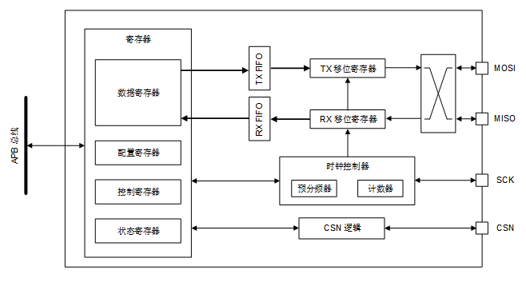
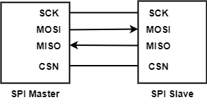
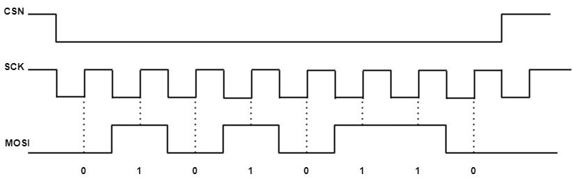

SPI 使用指南
==================

:link_to_translation:`en:[English]`

概述
------------------

    SPI (Serial Peripheral Interface, 串行外设接口) 是一种同步串行通信接口，被广泛应用在ADC、Flash等与MCU的通信过程中。
    该SPI 接口支持与外部设备的全双工通信。
    该接口可以配置为主模式或从模式。当配置为主器件时，它为外部从器件提供通信时钟(SCK)。

    - SPI相关demo和配置介绍: `SPI相关demo和配置介绍 <../../examples/peripheral/bk_spi.html>`_

1 SPI 特性
------------------

BK7258具有2路SPI控制器，其中SPI0对应3组PIN脚，SPI1对应1组PIN脚。
`SPI GPIO 分配情况 <../../examples/peripheral/bk_spi.html>`_

SPI 接口具有如下特性：
  - 基于三条线或四条线的全双工同步传输
  - 支持主模式或从模式工作方式
  - 数据位宽可为 8 位或16 位
  - 可编程的时钟极性和相位
  - 可编程的数据顺序，最先移位 MSB 或 LSB
  - 具有 DMA 功能的 64 深度的内置 RX FIFO 和 TX FIFO
  - 数据传输长度可配置，CPU方式单次最大传输长度是4096 Byte，DMA方式单次最大传输长度是65536 Byte
  - 可配置的 TX FIFO 和 RX FIFO 中断产生条件

2 SPI 功能说明
------------------

- SPI 框图

    Figure 1. SPI 框图

上图显示了 SPI 模块的概览。

 
- SPI 信号

下表列出了四个与外部进行通信的 SPI 引脚。
    +----------+---------------+--------------------------------------------------------------------------+
    | 信号名称 |    信号类型   |                                   描述                                   |
    +==========+===============+==========================================================================+
    |  SCK     | 数字输入/输出 |  串行时钟。SPI 主器件的串行时钟输出引脚和 SPI 从器件的串行时钟输入引脚。 |
    +----------+---------------+--------------------------------------------------------------------------+
    |  MOSI    | 数字输入/输出 |  主输出/从输入。该引脚用于在主模式下发送数据，在从模式下接收数据。       |
    +----------+---------------+--------------------------------------------------------------------------+
    |  MISO    | 数字输入/输出 |  主输入/从输出。该引脚用于在从模式下发送数据，在主模式下接收数据。       |
    +----------+---------------+--------------------------------------------------------------------------+
    |  CSN     | 数字输入/输出 |  芯片选择。低电平有效，主器件输出表示正在传输数据。                      |
    +----------+---------------+--------------------------------------------------------------------------+

- SPI 通信

    SPI 总线支持一个主器件与一个从器件进行通信。通信流使用全双工模式（3 或 4 线）。
    通信由主机发起和控制。主器件基于 SCK 线提供时钟信号，并通过 SCK 时钟同步从器件。CSN 信号默认启用。
    在单主/单从全双工通信中，主器件和从器件可以分别通过 MOSI 和 MISO 线同时发送数据。
    主器件通过 MOSI 线将待发送的数据发送给从器件，同时通过 MISO 线从从器件接收数据。
    主器件提供的串行时钟边沿同步数据的移位和采样。当数据帧传输完成（所有位均被移出）时，主机和从机之间信息交换完成。

    Figure 2. SPI全双工单主/单从应用示例

- 时钟速率

串行时钟 (SCK) 同步数据的移位和采样。可以通过 SPI_CKR 位配置 SCK 的输出频率。SCK 时钟频率(fSCK)从系统时钟分频得到的，具体公式如下：

                **f_SCK=(SYS_CLK)/(2×(SPI_CKR+1))**

其中，SYS_CLK 为系统时钟频率，SPI_CKR 为 SPI_CKR 位的 8 位值。SPI_CKR 可以为0 到 255 之间的任一值。
注意，SPI_CKR 在 SPI 使能期间 (SPIEN=1) 不能修改。

- 通信格式

SPI 通信过程中，数据发送和数据接收是同时进行的。串行时钟 (SCK) 同步数据的移位和采样。
通信格式由时钟相位、时钟极性和数据帧格式决定。要进行通信，主从器件必须正确同步并采用相同的通信格式。

1） 时钟相位和时钟极性
通过 CKPOL 和 CKPHA 位，可以用软件选择四种时序关系。
CKPOL（时钟极性）位设置空闲状态下时钟的极性。
如果复位 CKPOL 位，SCK 引脚在空闲时处于低电平。第一个边沿为上升沿，第二个边沿为下降沿。
如果将 CKPOL 置 1，则 SCK 引脚在空闲时状态处于高电平。第一个边沿为下降沿，第二个边沿为上升沿。

CKPHA 位决定是在上升沿还是在下降沿捕获数据。
如果复位 CKPHA 位，则会在 SCK 引脚的第一个边沿捕获传输的第一个数据位（如果将 CKPOL 位置 1，则为下降沿；如果复位 CKPOL 位，则为上升沿）。每次出现该时钟边沿时锁存数据。
如果将 CKPHA 位置 1，则会在 SCK 引脚的第二个边沿捕获传输的第一个数据位（如果将 CKPOL 位置 1，则为上升沿；如果复位 CKPOL 位，则为下降沿）。每次出现该时钟边沿时锁存数据。

根据极性和相位的组合，有四种 SPI 模式可用。

    +----------+------+------+----------------------+---------------------------------------+
    | SPI 模式 | CPOL | CPHA | 空闲状态下 SCK 引脚  |  用于采样和/或移位数据的时钟相位      |
    +==========+======+======+======================+=======================================+
    |    0     |  0   |   0  |        低电平        | 在上升沿采样数据，在下降沿移出数据    |
    +----------+------+------+----------------------+---------------------------------------+
    |    1     |  0   |   1  |        低电平        | 在下降沿采样数据，在上升沿移出数据    |
    +----------+------+------+----------------------+---------------------------------------+
    |    2     |  1   |   0  |        高电平        | 在下降沿采样数据，在上升沿移出数据    |
    +----------+------+------+----------------------+---------------------------------------+
    |    3     |  1   |   1  |        高电平        | 在上升沿采样数据，在下降沿移出数据    |
    +----------+------+------+----------------------+---------------------------------------+

2）数据帧格式
LSB_FIRST 位决定以 MSB 在前或 LSB 在前的方式移出数据。BIT_WDTH 位可以设置发送和接收的数据长度为 8 位或 16 位。

- SPI 配置

    ::

        主器件和从器件的配置过程几乎相同。请执行以下步骤对通信进行初始化：
        A）	选择 SPI 工作时钟源，并开启 SPI 工作时钟。
        B）	开启 SPI 接口相应 I/O的复用功能，并设置对应 I/O 的功能选择。

        C）	对配置寄存器 (0x0) 进行写操作，为所有非保留位配置合适的值，以下为特殊情况：

            a）仅在主模式下才需要配置BYTE_INTLVAL位
            b）仅在四线从模式下才需要设置SLV_RELEASE_INTEN位

        D）	对 RX_TRANS_LEN 和 TX_TRANS_LEN 位域进行写操作，以选择传输的长度。

- RX FIFO 和 TX FIFO

SPI 数据传输均通过按字节组织的嵌入式 FIFO。发送和接收方向的 FIFO 分别被称为 TX FIFO 和 RX FIFO。TX FIFO 和 RX FIFO 均为 64 x 16 位。
对数据寄存器 SPI_DAT 执行读访问时，会返回尚未读取的 RX FIFO 中存储的最早的值。
对数据寄存器 SPI_DAT执行写访问时，会在发送队列结束时将写入的数据存储到 TX FIFO 中。
RX FIFO 和 TX FIFO 的阈值可分别通过 RXFIFO_INT_LEVEL 和 TXFIFO_INT_LEVEL 字段进行编程。
如果 RX FIFO 中的数据个数超过 RXFIFO_INT_LEVEL 设置的阈值，会产生 RX FIFO中断，中断标志位 RXFIFO_INT 置 1。
如果 TX FIFO 数据个数小于 TXFIFO_INT_LEVEL 设置的阈值，会产生 TX FIFO 中断，中断标志位 TXFIFO_INT 置 1。
需要将接收到的数据写入 RX FIFO 中，而 RX FIFO 已满时，RXOVF 标志置 1，某些传入的数据会丢失。
在发送模式下，需要将新数据载入移位寄存器中，而 TX FIFO 已空时，TXUDF 标志置 1。
只要 TX FIFO 未满，TXFIFO_WR_READY 就会置 1。只要 RX FIFO 不为空，RXFIFO_RD_READY 就会置 1。

3 SPI时序示例
------------------

    SPI Timing

上图为 master 传输 0x56(0b0101 0110) 数据给 slave 时序(CPOL = 1, CPHA = 1，MSB first)
 
 - CS 拉低，选中对应的 slave
 - 在每个 SCK 时钟周期，MOSI 输出对应的电平，先输出数据的高 bit
 - slave 会在每个时钟周期的上升沿读取 MOSI 上的电平

