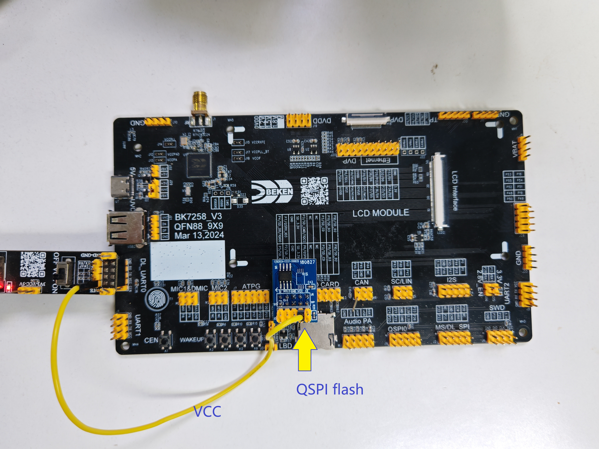

QSPI
==========================

:link_to_translation:`en:[English]`

1 功能概述
-------------------------------------

    ::

        QSPI 作为主设备 (Master) 用于对通用的从设备 (Slave)（如 Flash、PSRAM 或者显示屏）进行读写操作，
        支持单线、双线或四线（数据线）SPI 操作；
        BK7258具有2路QSPI控制器，用户可以根据硬件实际情况进行使用；
        可以在如下两种模式下工作：
        a) 间接模式：使用 QSPI 寄存器执行全部操作
        b) 内存映射模式：外部设备映射到内部存储地址空间，从而系统将其视为内部存储器

    - QSPI功能具体描述参考: `QSPI驱动工作原理 <../../developer-guide/peripheral/bk_qspi.html>`_

2 代码路径
-------------------------------------
    - demo路径：
        | ``components\bk_cli\cli_qspi.c``
    - 驱动源码路径：
        | ``middleware\driver\qspi\qspi_driver.c``
        | ``middleware\driver\qspi\qspi_flash.c``

3 QSPI相关宏配置
-------------------------------------
        +-----------------------+---------------------------------------------------+--------------------------------------------+---------+
        |NAME                   |                     Description                   | File                                       |  value  |
        +=======================+===================================================+============================================+=========+
        |CONFIG_QSPI            | QSPI驱动及其测试命令使能配置                      | ``middleware\soc\bk7258\bk7258.defconfig`` |    y    |
        +-----------------------+---------------------------------------------------+--------------------------------------------+---------+
        |CONFIG_QSPI_FLASH      | QSPI flash驱动使能配置                            | ``middleware\soc\bk7258\bk7258.defconfig`` |    y    |
        +-----------------------+---------------------------------------------------+--------------------------------------------+---------+
        |CONFIG_QSPI_FLASH_GD=y |用于QSPI flash驱动区分不同类型的flash厂商，写状态寄| ``middleware\soc\bk7258\bk7258.defconfig`` |         |
        |                       |存器01H命令作用域为S0~7时使能，作用域为S0~15时关闭 |                                            |    y    |
        +-----------------------+---------------------------------------------------+--------------------------------------------+---------+

4 QSPI PIN脚描述
-------------------------------------
    - QSPI GPIO驱动能力相关配置在 bk_idk/middleware/driver/qspi/qspi_driver.c 的 QSPI_SET_PIN()宏定义中;

    - QSPI PIN脚编号配置在 bk_idk/middleware/soc/bk7258/hal/qspi_ll.h 中;

    - QSPI0 和 QSPI1 各对应1组PIN脚，描述如下：
        +------------------+---------+
        | QSPI0功能        | 组0     |
        +==================+=========+
        | QSPI0_SCK(IOZ)   | GPIO22  |
        +------------------+---------+
        | QSPI0_CS(O)      | GPIO23  |
        +------------------+---------+
        | QSPI0_DAT[0](IO) | GPIO24  |
        +------------------+---------+
        | QSPI0_DAT[1](IO) | GPIO25  |
        +------------------+---------+
        | QSPI0_DAT[2](IO) | GPIO26  |
        +------------------+---------+
        | QSPI0_DAT[3](IO) | GPIO27  |
        +------------------+---------+

    - QSPI1对应1组PIN脚，对应管脚如下：
        +------------------+---------+
        | QSPI1功能        | 组0     |
        +==================+=========+
        | QSPI1_SCK(IOZ)   | GPIO2   |
        +------------------+---------+
        | QSPI1_CS(O)      | GPIO3   |
        +------------------+---------+
        | QSPI1_DAT[0](IO) | GPIO4   |
        +------------------+---------+
        | QSPI1_DAT[1](IO) | GPIO5   |
        +------------------+---------+
        | QSPI1_DAT[2](IO) | GPIO6   |
        +------------------+---------+
        | QSPI1_DAT[3](IO) | GPIO7   |
        +------------------+---------+

5 QSPI demo 配置
-------------------------------------

    - demo支持的命令如下表：

    +--------------------------------------------+------------------------------------------------+----------------------------------------------------+
    |             Command                        |            Param                               |              Description                           |
    +============================================+================================================+====================================================+
    | **qspi_driver**  **{init|deinit}**         | {init|deinit}:                                 | Init/deinit the qspi resoure common                |
    +--------------------------------------------+------------------------------------------------+----------------------------------------------------+
    | **qspi {id} init {src_clock}**             | {id}: qspi device id, range 0 ~ 1              | Enable qspi and set the qspi clock                 |
    | **{src_clk_div} {qspi_clk_div}**           | {src_clock}: qspi source clock, 0 means        |                                                    |
    |                                            | QSPI_CLK_320M, 1 means QSPI_CLK_480M           | qspi_actual_clock =                                |
    |                                            | {src_clk_div}: qspi source clock divider       | {src_clock_value}/{1+src_clk_div}/{2*qspi_clk_div} |
    |                                            | {qspi_clk_div}: qspi internal clock divider    |                                                    |
    +--------------------------------------------+------------------------------------------------+----------------------------------------------------+
    | **qspi_flash {id} get_id {addr} {len}**    | {id}: qspi device id, range 0 ~ 1              | Send 9fH cmd to get flash vendor id                |
    |                                            | {addr}: any value would be ok                  | this get id cmd would unprotect the flash and set  |
    |                                            | {len}: any value would be ok                   | QE (quad enable) status register                   |
    +--------------------------------------------+------------------------------------------------+----------------------------------------------------+
    | **qspi_flash {id} read {addr} {len}**      | {id}: qspi device id, range 0 ~ 1              | Send ebH cmd to read flash data with 4 bus wide,   |
    |                                            | {addr}: the flash offset to access             | Remember to enable the flash QE bit firstly.       |
    |                                            | {len}: the data length to access               |                                                    |
    +--------------------------------------------+------------------------------------------------+----------------------------------------------------+
    | **qspi_flash {id} erase {addr} {len}**     | {id}: qspi device id, range 0 ~ 1              | Send 20H cmd to erase flash                        |
    |                                            | {addr}: the flash offset to access             |                                                    |
    |                                            | {len}: the data length to access               |                                                    |
    +--------------------------------------------+------------------------------------------------+----------------------------------------------------+
    | **qspi_flash {id} write {addr} {len}**     | {id}: qspi device id, range 0 ~ 1              | Send 32H cmd to write flash                        |
    |                                            | {addr}: the flash offset to access             |                                                    |
    |                                            | {len}: the data length to access               |                                                    |
    +--------------------------------------------+------------------------------------------------+----------------------------------------------------+
    | **qspi {id} flash_test {addr} {len}**      | {id}: qspi device id, range 0 ~ 1              | Auto test the flash, such as get id, erase, write, |
    |                                            | {addr}: the flash offset to access             | and read, once meet fail, it will report error.    |
    |                                            | {len}: the data length to access               |                                                    |
    +--------------------------------------------+------------------------------------------------+----------------------------------------------------+

6 QSPI demo 命令行演示
-------------------------------------

  a) bk7258开发板直连带底座的外置flash，按照下图进行连接并3.3V供电：

    Figure 1. 开发板通过QSPI外接Flash
 
b) 启动开发板，对开发板分别输入初始化命令，分别设置QSPI系统时钟源，系统时钟分频和QSPI时钟分频。

    - master： **cpu1 qspi 1 init 5 5 5**

       ::
    
        [19:52:59.261]发→◇cpu1 qspi 1 init 5 5 5
        [19:52:59.307]收←◆cpu1 qspi 1 init 5 5 5
        $cpu1:cli:I(2832):qspi_id:00000001
        (2964):cp0_mb_rx_isr 1 104 0 0 0
        pwr_core:I(2964):LP event:5
        cpu1:cli:I(2832):qspi init

  c) 获取flash vendor id

    - master： **cpu1 qspi_flash 1 get_id  0  100**

       ::

        [20:11:43.441]发→◇cpu1 qspi_flash 1 get_id  0  100
        [20:11:43.478]收←◆cpu1 qspi_flash 1 get_id  0  100
        $cpu1:qspi:I(1127010):[bk_qspi_flash_write_s0_s7]: status_reg_data to be writen is 0x0.
        cpu1:qspi:I(1127010):[bk_qspi_flash_write_s8_s15]: status_reg_data to be writen is 0x2.

  d) 对flash指定地址和长度，进行擦除。

    - master： **cpu1 qspi_flash 1 erase 0 4096**

       ::

        [19:53:09.405]发→◇cpu1 qspi_flash 1 erase 0 4096
        [19:53:09.446]收←◆cpu1 qspi_flash 1 erase 0 4096
        [19:53:09.489]收←◆
        $

  e) 对flash指定地址和长度的区域，在擦除后进行读写。

    - master： **cpu1 qspi_flash 1 read 0 512**

       ::

        [19:53:11.077]发→◇cpu1 qspi_flash 1 read 0 512
        [19:53:11.121]收←◆cpu1 qspi_flash 1 read 0 512
        ff ff ff ff ff ff ff ff ff ff ff ff ff ff ff ff 
        ff ff ff ff ff ff ff ff ff ff ff ff ff ff ff ff 
        ff ff ff ff ff ff ff ff ff ff ff ff ff ff ff ff 
        ff ff ff ff ff ff ff ff ff ff ff ff ff ff ff ff 
        ff ff ff ff ff ff ff ff ff ff ff ff ff ff ff ff 
        ff ff ff ff ff ff ff ff ff ff ff ff ff ff ff ff 
        ff ff ff ff ff ff ff ff ff ff ff ff ff ff ff ff 
        ff ff ff ff ff ff ff ff ff ff ff ff ff ff ff ff 
        ff ff ff ff ff ff ff ff ff ff ff ff ff ff ff ff 
        ff ff ff ff ff ff ff ff ff ff ff ff ff ff ff ff 
        ff ff ff ff ff ff ff ff ff ff ff ff ff ff ff ff 
        ff ff ff ff ff ff ff ff ff ff ff ff ff ff ff ff 
        ff ff ff ff ff ff ff ff ff ff ff ff ff ff ff ff 
        ff ff ff ff ff ff ff ff ff ff ff ff ff ff ff ff 
        ff ff ff ff ff ff ff ff ff ff ff ff ff ff ff ff 
        ff ff ff ff ff ff ff ff ff ff ff ff ff ff ff ff 
        ff ff ff ff ff ff ff ff ff ff ff ff ff ff ff ff 
        ff ff ff ff ff ff ff ff ff ff ff ff ff ff ff ff 
        ff ff ff ff ff ff ff ff ff ff ff ff ff ff ff ff 
        ff ff ff ff ff ff ff ff ff ff ff ff ff ff ff ff 
        ff ff ff ff ff ff ff ff ff ff ff ff ff ff ff ff 
        ff ff ff ff ff ff ff ff ff ff ff ff ff ff ff ff 
        ff ff ff ff ff ff ff ff ff ff ff ff ff ff ff ff 
        ff ff ff ff ff ff ff ff ff ff ff ff ff ff ff ff 
        ff ff ff ff ff ff ff ff ff ff ff ff ff ff ff ff 
        ff ff ff ff ff ff ff ff ff ff ff ff ff ff ff ff 
        ff ff ff ff ff ff ff ff ff ff ff ff ff ff ff ff 
        ff ff ff ff ff ff ff ff ff ff ff ff ff ff ff ff 
        ff ff ff ff ff ff ff ff ff ff ff ff ff ff ff ff 
        ff ff ff ff ff ff ff ff ff ff ff ff ff ff ff ff 
        ff ff ff ff ff ff ff ff ff ff ff ff ff ff ff ff 

  f) 对flash指定地址和长度，进行写入。

    - master： **cpu1 qspi_flash 1 write 0x0 256**

       ::

        [19:53:12.573]发→◇cpu1 qspi_flash 1 write 0x0 256
        [19:53:12.614]收←◆cpu1 qspi_flash 1 write 0x0 256
        [19:53:12.654]收←◆
    

  g) 对flash指定地址和长度，进行读取。

    - master： **cpu1 qspi_flash 1 read 0 512**

       ::

        [19:53:06.117]发→◇cpu1 qspi_flash 1 read 0 512
        [19:53:06.157]收←◆cpu1 qspi_flash 1 read 0 512
        00 01 02 03 04 05 06 07 08 09 0a 0b 0c 0d 0e 0f 
        10 11 12 13 14 15 16 17 18 19 1a 1b 1c 1d 1e 1f 
        20 21 22 23 24 25 26 27 28 29 2a 2b 2c 2d 2e 2f 
        30 31 32 33 34 35 36 37 38 39 3a 3b 3c 3d 3e 3f 
        40 41 42 43 44 45 46 47 48 49 4a 4b 4c 4d 4e 4f 
        50 51 52 53 54 55 56 57 58 59 5a 5b 5c 5d 5e 5f 
        60 61 62 63 64 65 66 67 68 69 6a 6b 6c 6d 6e 6f 
        70 71 72 73 74 75 76 77 78 79 7a 7b 7c 7d 7e 7f 
        80 81 82 83 84 85 86 87 88 89 8a 8b 8c 8d 8e 8f 
        90 91 92 93 94 95 96 97 98 99 9a 9b 9c 9d 9e 9f 
        a0 a1 a2 a3 a4 a5 a6 a7 a8 a9 aa ab ac ad ae af 
        b0 b1 b2 b3 b4 b5 b6 b7 b8 b9 ba bb bc bd be bf 
        c0 c1 c2 c3 c4 c5 c6 c7 c8 c9 ca cb cc cd ce cf 
        d0 d1 d2 d3 d4 d5 d6 d7 d8 d9 da db dc dd de df 
        e0 e1 e2 e3 e4 e5 e6 e7 e8 e9 ea eb ec ed ee ef 
        f0 f1 f2 f3 f4 f5 f6 f7 f8 f9 fa fb fc fd fe ff 
        ff ff ff ff ff ff ff ff ff ff ff ff ff ff ff ff 
        ff ff ff ff ff ff ff ff ff ff ff ff ff ff ff ff 
        ff ff ff ff ff ff ff ff ff ff ff ff ff ff ff ff 
        ff ff ff ff ff ff ff ff ff ff ff ff ff ff ff ff 
        ff ff ff ff ff ff ff ff ff ff ff ff ff ff ff ff 
        ff ff ff ff ff ff ff ff ff ff ff ff ff ff ff ff 
        ff ff ff ff ff ff ff ff ff ff ff ff ff ff ff ff 
        ff ff ff ff ff ff ff ff ff ff ff ff ff ff ff ff 
        ff ff ff ff ff ff ff ff ff ff ff ff ff ff ff ff 
        ff ff ff ff ff ff ff ff ff ff ff ff ff ff ff ff 
        ff ff ff ff ff ff ff ff ff ff ff ff ff ff ff ff 
        ff ff ff ff ff ff ff ff ff ff ff ff ff ff ff ff 
        ff ff ff ff ff ff ff ff ff ff ff ff ff ff ff ff 
        ff ff ff ff ff ff ff ff ff ff ff ff ff ff ff ff 
        ff ff ff ff ff ff ff ff ff ff ff ff ff ff ff ff 
        ff ff ff ff ff ff ff ff ff ff ff ff ff ff ff ff 

    h） QSPI flash一键测试命令
    - master： **cpu1 qspi 1 flash_test 0 256**

       ::

        [19:53:01.253]发→◇cpu1 qspi 1 flash_test 0 256
        [19:53:01.291]收←◆cpu1 qspi 1 flash_test 0 256

7 QSPI flash调试常见问题：
-------------------------------------

    A） QSPI支持位宽是多少？
        Ans:支持1、2、4线半双工读写，QSPI 驱动API中封装了1线和4线两种接口，默认4线读写。

    B） 获取flash ID失败原因？
        Ans:a）检查flash供电，通常接3.3V VBAT;
             b）检查QSPI是否初始化成功，时钟是否过高，最大支持80MHz。

    C） 读flash id正确，但是擦写读失败？
        Ans:检查flash状态寄存器，是否解保护，是否使能QE 4线使能bit位。不同厂家的flash，写状态寄存器的命令及范围会有所区别，
            有的是S0~7和S8~15，有的是S0~15，写状态寄存器的API中，两种类型都有提供，可根据flash厂家spec按需使用。

8 VFS文件系统：
-------------------------------------

    1)	BK_VFS简介
    BK VFS是BK提供的虚拟文件系统组件，全称为Virtual File System，文件系统接口采用posix接口形式，应用程序调用“bk_posix.h”头文件，即可使用mount、open、read、write、close接口进行文件操作。

    2)  相关配置

        +------------------------------+---------------------------------------------------+
        |NAME                          |                     Description                   |
        +==============================+===================================================+
        |CONFIG_VFS                    | bk_vfs使能配置                                    |
        +------------------------------+---------------------------------------------------+
        |CONFIG_VFS_MAX_FD_NUM         | bk_vfs同时打开文件的最大个数                      |
        +------------------------------+---------------------------------------------------+
        |CONFIG_LITTLEFS               | littlefs使能配置                                  |
        +------------------------------+---------------------------------------------------+
        |CONFIG_LITTLEFS_QSPI_FLASH_ID | QSPI flash使用的QSPI设备号                        |
        +------------------------------+---------------------------------------------------+
        |CONFIG_QSPI                   | QSPI驱动及其测试命令使能配置                      |
        +------------------------------+---------------------------------------------------+
        |CONFIG_QSPI_FLASH             | QSPI flash驱动使能配置                            |
        +------------------------------+---------------------------------------------------+
        |CONFIG_VFS_TEST               | VFS测试命令使能配置                               |
        +------------------------------+---------------------------------------------------+

    3)  VFS参考示例及命令

        bk_idk/components/bk_cli/cli_vfs.c

        VFS测试命令：

        **vfs format qspi_lfs**

        **vfs mount qspi_lfs  <mount_path>**

        **vfs write <file_path>  <file_content_to_write>**

        **vfs read < file_path >**

       ::

        CPU1 上Test LOG示例( CPU1命令需要前缀， CPU0命令不需要前缀):
        [14:25:15.368]发→◇cpu1 vfs format qspi_lfs
        [14:25:15.373]收←◆cpu1 vfs format qspi_lfs
        cpu1:qspi:I(6620):[bk_qspi_flash_write_s0_s7]: status_reg_data to be writen is 0x0.
        cpu1:qspi:I(6624):[bk_qspi_flash_write_s8_s15]: status_reg_data to be writen is 0x1a.
        [14:25:15.477]收←◆cpu1:(6718):format ret=0
        $
        
        [14:26:07.542]发→◇cpu1 vfs mount qspi_lfs /
        [14:26:07.548]收←◆cpu1 vfs mount qspi_lfs /
        $cpu1:vfs:I(58790):fs extra count +1
        cpu1:(58790):mount ret=0
        $
        
        [14:26:09.526]发→◇cpu1 vfs write /filename BK725888888
        [14:26:09.533]收←◆cpu1 vfs write /filename BK725888888
        $cpu1:(60782):write ret=12
        
        $
        [14:26:10.286]发→◇cpu1 vfs read /filename
        [14:26:10.293]收←◆cpu1 vfs read /filename
        $cpu1:(61534):BK725888888
        cpu1:(61538):read ret=12

    4)  Littlefs文件系统打包工具

       ::

        mklittlefs 是在linux下用于制作littlefs 的映像文件工具。文件系统打包制作步骤：
        文件系统打包工具路径：{ai_sdk}/bk_avdk/bk_idk/components/littlefs/mkimg/mklittlefs
        a） 将要制作的源文件放置到mklittlefs所在的同一级目录下，比如bk/ 目录。
        b） 输入打包命令：储介质block size 4096字节,page size 256字节,文件系统镜像像size 1048576字节

    **./mklittlefs -c bk/ -b 4096 -p 256 -s 1048576 littlefs.bin**

        c） 生成的映像文件为 littlefs.bin（名称可改）
		
    5)  Remote_VFS实现多核访问VFS

        ::
    
            AIDK上多媒体默认在CPU1上访问文件资源，CPU0无法挂载文件系统。为了支持多核文件系统，aidk上添加了Remote_VFS功能。
            通过mailbox由CPU0向CPU1发起消息请求，实现CPU0上VFS接口的支持。
            两个CPU上API调用方式一致，但是真正挂载VFS的是CPU1，CPU0只是发起VFS请求让CPU1去执行。

    - 相关宏配置：

    +------------------------------+---------------------------------------------------+
    |配置名                        |                       说明                        |
    +==============================+===================================================+
    |CONFIG_REMOTE_VFS_CLIENT      | 在CPU0使能该宏，使能远程VFS                       |
    +------------------------------+---------------------------------------------------+
    |CONFIG_REMOTE_VFS_SERVER      | 在CPU1使能该宏，用于执行client侧发起的VFS请求     |
    +------------------------------+---------------------------------------------------+

