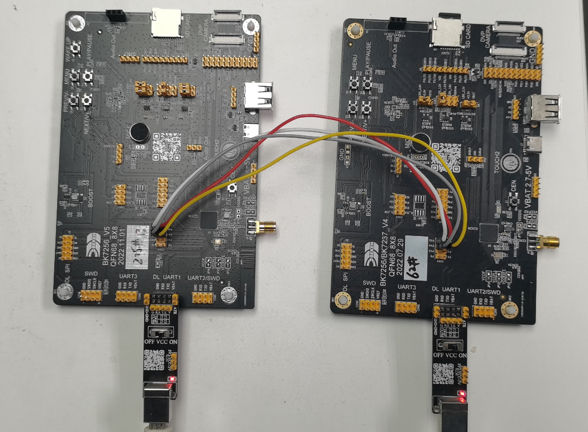

SPI
==========================

:link_to_translation:`en:[English]`

1 功能概述
-------------------------------------

    ::

        BK7258具有2路SPI控制器，其中SPI0对应3组PIN脚，SPI1对应1组PIN脚，用户可以根据硬件实际情况，进行PIN脚的划分；
        SPI支持主模式或从模式工作方式，基于三线或四线的全双工同步传输，三线模式相比四线模式少了一个CS片选管脚；
        SPI管脚通常可用于驱动外置flash，LCD屏或摄像头。

    - SPI功能具体描述参考: `SPI驱动工作原理 <../../developer-guide/peripheral/bk_spi.html>`_

2 代码路径
-------------------------------------
    - demo路径：
        | ``components\bk_cli\cli_spi.c``
    - 驱动源码路径：
        | ``middleware\driver\spi\spi_driver.c``
        | ``middleware\driver\spi\spi_flash.c``

3 SPI相关宏配置
-------------------------------------
        +--------------------------------------+-------------------------------------------------+--------------------------------------------+---------+
        |                 NAME                 |      Description                                |                  File                      |  value  |
        +======================================+=================================================+============================================+=========+
        |CONFIG_SPI                            | SPI使能配置                                     | ``middleware\soc\bk7258\bk7258.defconfig`` |    y    |
        +--------------------------------------+-------------------------------------------------+--------------------------------------------+---------+
        |CONFIG_SPI_DMA                        | SPI使能DMA配置                                  | ``middleware\soc\bk7258\bk7258.defconfig`` |    y    |
        +--------------------------------------+-------------------------------------------------+--------------------------------------------+---------+
        |CONFIG_SPI_STATIS                     | SPI DEBUG使能，用于命令行dump spi寄存器信息     | ``middleware\soc\bk7258\bk7258.defconfig`` |    y    |
        +--------------------------------------+-------------------------------------------------+--------------------------------------------+---------+
        |CONFIG_SPI_SUPPORT_TX_FIFO_WR_READY   | SPI使能TX Fifo中断检测配置，一般建议使能        | ``middleware\soc\bk7258\bk7258.defconfig`` |    y    |
        +--------------------------------------+-------------------------------------------------+--------------------------------------------+---------+
        |CONFIG_SPI_PM_CB_SUPPORT              | SPI使能低功耗投票功能                           | ``middleware\soc\bk7258\bk7258.defconfig`` |    n    |
        +--------------------------------------+-------------------------------------------------+--------------------------------------------+---------+
        |CONFIG_SPI_MST_FLASH                  | SPI flash使能配置                               | ``middleware\soc\bk7258\bk7258.defconfig`` |    n    |
        +--------------------------------------+-------------------------------------------------+--------------------------------------------+---------+

4 SPI PIN脚描述
-------------------------------------
    - SPI GPIO相关配置在 bk_idk/middleware/driver/spi/spi_driver.c 的 SPI_SET_PIN()宏定义中;

    - SPI PIN脚编号配置在 bk_idk/middleware/soc/bk7258/hal/spi_ll.h 中;

    - SPI0对应3组PIN脚，用户可以根据硬件分布情况，使用其中一组：

        +-----------+---------+---------+---------+
        | SPI0功能  | 组0     | 组1     | 组2     |
        +===========+=========+=========+=========+
        | SPI0_CLK  | GPIO14  | GPIO44  | GPIO33  |
        +-----------+---------+---------+---------+
        | SPI0_CS   | GPIO15  | GPIO45  | GPIO34  |
        +-----------+---------+---------+---------+
        | SPI0_MOSI | GPIO16  | GPIO46  | GPIO35  |
        +-----------+---------+---------+---------+
        | SPI0_MISO | GPIO17  | GPIO47  | GPIO36  |
        +-----------+---------+---------+---------+

    - SPI1对应1组PIN脚，对应管脚如下：
        +-----------+---------+
        | SPI1功能  | 组0     |
        +===========+=========+
        | SPI1_CLK  | GPIO2   |
        +-----------+---------+
        | SPI1_CS   | GPIO3   |
        +-----------+---------+
        | SPI1_MOSI | GPIO4   |
        +-----------+---------+
        | SPI1_MISO | GPIO5   |
        +-----------+---------+

-----------------------------------------------------

    - 对于SPI0，默认使用 GPIO14~17 PIN脚组合，用户可以通过./middleware/soc/<bk72xx>/hal/spi_ll.h修改选用的PIN脚组合。

        ::

            #define SPI0_LL_CSN_PIN     GPIO_15
            #define SPI0_LL_SCK_PIN     GPIO_14
            #define SPI0_LL_MOSI_PIN    GPIO_16
            #define SPI0_LL_MISO_PIN    GPIO_17

            #if 0
            #define SPI0_LL_CSN_PIN     GPIO_45
            #define SPI0_LL_SCK_PIN     GPIO_44
            #define SPI0_LL_MOSI_PIN    GPIO_46
            #define SPI0_LL_MISO_PIN    GPIO_47
            #endif

            #define SPI1_LL_SCK_PIN     GPIO_2
            #define SPI1_LL_CSN_PIN     GPIO_3
            #define SPI1_LL_MOSI_PIN    GPIO_4
            #define SPI1_LL_MISO_PIN    GPIO_5

-----------------------------------------------------

5 SPI demo 配置
-------------------------------------

    - demo支持的命令如下表：

	+----------------------------------------+------------------------------------------------+----------------------------------------+
	|             Command                    |            Param                               |              Description               |
	+========================================+================================================+========================================+
	| spi_driver {init|deinit}               | {init|deinit}:                                 |  init/deinit the spi resoure common    |
	+----------------------------------------+------------------------------------------------+----------------------------------------+
	|                                        | {id}:spi id,value range 0 ~ 1                  |                                        |
	| spi {id} init [role] [bit_width]       +------------------------------------------------+                                        |
	|                                        | {role}:master or slave                         | init spi and set working parameters    |
	| [polarity] [phase] [wire_mode]         +------------------------------------------------+                                        |
	|                                        | {bit_width}: support 8 or 16 bits              |                                        |
	| [baud_rate] [bit_order] [dma_mode]     +------------------------------------------------+                                        |
	|                                        | {polarity}: CPOL support 0 or 1                |                                        |
	|                                        +------------------------------------------------+                                        |
	|                                        | {phase}:CPHA support 0 or 1                    |                                        |
	|                                        +------------------------------------------------+                                        |
	|                                        | {wire_mode}: support 3 or 4 wire mode          |                                        |
	|                                        +------------------------------------------------+                                        |
	|                                        | {baud_rate}:spi baud rate                      |                                        |
	|                                        +------------------------------------------------+                                        |
	|                                        | {bit_order}: support LSB or MSB                |                                        |
	|                                        +------------------------------------------------+                                        |
	|                                        | {dma_mode}: support DMA                        |                                        |
	+------------+---------------------------+------------------------------------------------+----------------------------------------+
	|            | baud_rate {value}         | {value}:support baud rate                      |                                        |
	|            +---------------------------+------------------------------------------------+                                        |
	| spi_config | mode {value}              | {value}:spi spi mode 0~3                       |                                        |
	|            +---------------------------+------------------------------------------------+                                        |
	| {id}       | bit_width {value}         | {value}: support 8 or 16 bits                  |   set spi working parameters           |
	|            +---------------------------+------------------------------------------------+                                        |
	|            | wire_mode {value}         | {value}:support 3 or 4 wire mode               |                                        |
	|            +---------------------------+------------------------------------------------+                                        |
	|            | bit_order {value}         | {value}:support LSB or MSB                     |                                        |
	+------------+---------------------------+------------------------------------------------+----------------------------------------+
	|                                        | {id}:spi id,value range 0 ~ 1                  |                                        |
	| spi {id} {read|write}                  +------------------------------------------------+                                        |
	|                                        | {read|write}: read|write operation             | read specified length of data through  |
	| {length}                               +------------------------------------------------+ spi                                    |
	|                                        | {length}: length to be read|write              |                                        |
	+----------------------------------------+------------------------------------------------+----------------------------------------+

    - SPI 支持的波特率如下：

        ::

            static const uint32_t s_spi_clk_list[] = {
            26000000, /**< DIV1 */
            13000000, /**< DIV2 */
            6500000,  /**< DIV4 */
            5200000,  /**< DIV5 */
            3250000,  /**< DIV8 */
            2600000,  /**< DIV10 */
            2000000,  /**< DIV13 */
            1625000,  /**< DIV16 */
            1300000,  /**< DIV20 */
            1040000,  /**< DIV25 */
            1000000,  /**< DIV26 */
            };

    - SPI模式和极性、相位的对应关系：
        通常的，Mode表示工作模式，CPOL表示时钟极性，CPHA表示时钟相位。

        +-------------+------------+-----------+
        |    Mode     |   CPOL     |  CPHA     |
        +=============+============+===========+
        |     0       |    0       |  0        |
        +-------------+------------+-----------+
        |     1       |    0       |  1        |
        +-------------+------------+-----------+
        |     2       |    1       |  0        |
        +-------------+------------+-----------+
        |     3       |    1       |  1        |
        +-------------+------------+-----------+

6 SPI demo 命令行演示
-------------------------------------

  A) bk7258开发板在con4中将SPI引出，使用2块bk7258开发板，按照下图进行连接（建议两个板子共地，以免数据采样不准确）：

    Figure 1. 将2块开发板通过SPI对接

对应的GPIO：

	+-----------------+-------------------+
	|     GPIO        |      FUNC         |
	+=================+===================+
	| P44             | SCK               |
	+-----------------+-------------------+
	| P45             | CSN               |
	+-----------------+-------------------+
	| P46             | MOSI              |
	+-----------------+-------------------+
	| P47             | MISO              |
	+-----------------+-------------------+

  B) 启动开发板，对2块开发板分别输入初始化命令，分别设置为master和slave

    以下命令是基于CP的，AP侧可在命令前添加“cpu1”字段。

    - master： **spi 0 init master 8 1 1 4 10000000 MSB 1**  //主机输入命令

       ::
    
    	[15:47:52.552]发→◇spi_driver init
    	[15:47:52.567]收←◆spi_driver init
    	cli:I(87880284):spi driver init
    	$
    	$
    	[15:50:51.443]发→◇spi 0 init master 8 1 1 4 10000000 MSB 1
    	[15:50:51.443]收←◆spi 0 init master 8 1 1 4 10000000 MSB 1
    	hal:I(88059168):spi select src_clk xtal
    	cli:I(88059168):spi init, spi_id=0
    
    - slave： **spi 0 init slave 8 1 1 4 10000000 MSB 1**  //从机输入命令

       ::
    
    	[15:47:48.942]发→◇spi_driver init
    	[15:47:48.957]收←◆spi_driver init
    	cli:I(1085932):spi driver init
    	$
    	$
    	[15:52:33.910]发→◇spi 0 init slave 8 1 1 4 10000000 MSB 1
    	[15:52:33.910]收←◆spi 0 init slave 8 1 1 4 10000000 MSB 1
    	hal:I(1370886):spi select src_clk xtal
    	cli:I(1370888):spi init, spi_id=0
    
    C） 从机进入接收状态，主机发送数据
    
    - slave： **spi 0 read 1024**    //从机准备接收数据

    - master： **spi 0 write 1024**    //主机发送数据

       ::
    
    	[15:54:01.239]发→◇spi 0 write 1024
    	[15:54:01.255]收←◆spi 0 write 1024
    	cli:I(88248974):spi write bytes, spi_id=0, data_len=1024
    	$cli:I(88248984):spi Tx finish! UART send OK!
    
    d）从机接收到数据

       ::
    
    	I(1458228):spi read, spi_id=0, size:1024
    	cli:I(1458228):recv_buffer[0]=0x0
    	cli:I(1458230):recv_buffer[1]=0x1
    	cli:I(1458230):recv_buffer[2]=0x2
    	cli:I(1458230):recv_buffer[3]=0x3
    	......
    	cli:I(1458230):recv_buffer[3]=0xff
