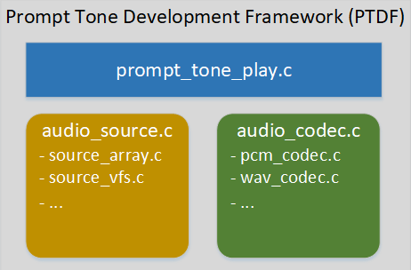

Aud_Intf API User Guide
==============================================

:link_to_translation:`zh_CN:[中文]`

.. important::

    The audio components used in AIDK have functional differences compared to other ``bk_avdk`` branches. New features have been added specifically for AI conversation scenarios, including:
    - G.722 codec support
    - Prompt tone playback support (PCM, WAV, MP3 formats)
    - ASR offline voice wake-up functionality
    - Speaker playback source switching capability

This document provides detailed explanations of AIDK's new features. For standard recording, playback, and voice call functionalities, please refer to:

https://docs.bekencorp.com/arminodoc/bk_avdk/bk7258/en/v2.0.1/api-reference/multi_media/bk_aud_intf.html

1. G.722 Codec
-----------------------------------------

    Enable G.722 codec by setting the macro ``CONFIG_AUD_INTF_SUPPORT_G722=y`` on CPU1.

2. Speaker Playback Source Switching
------------------------------------------

    For scenarios requiring prompt tone interruptions during AI voice conversations, AIDK's audio components support dynamic playback source switching via API.

    Relevant APIs:

    - ``bk_err_t aud_tras_drv_voc_set_spk_source_type(spk_source_type_t type)``    // Set playback source
    - ``spk_source_type_t aud_tras_drv_get_spk_source_type(void)``                 // Get current playback source

.. important::

    These APIs are only supported on CPU1. Currently three playback sources are supported:
    - ``SPK_SOURCE_TYPE_VOICE``: Voice call
    - ``SPK_SOURCE_TYPE_PROMPT_TONE``: Prompt tone
    - ``SPK_SOURCE_TYPE_A2DP``: Bluetooth music

3. Prompt Tone Playback
------------------------------------------

    Source path: ``<source code>/bk_avdk/components/multimedia/prompt_tone_play/``

    As shown below:
    The prompt tone framework adopts a modular design with three main components: playback module (``prompt_tone_play``), source module (``audio_source``), and decoding module (``audio_codec``).

    1. Playback Module
        - Provides upper-layer application interface, integrating source and decoding modules to configure and control playback.

    2. Source Module
        - Abstracted as a class for extensibility, with implementations for different sources.
        - Current implementations: array-based (``audio_array.c``) and VFS filesystem (``audio_vfs.c``).
        - Default uses SD NAND with VFS. Select implementation via macros.

    3. Decoding Module
        - Abstracted as a class with format-specific implementations.
        - Current implementations: PCM (``pcm_codec.c``), WAV (``wav_codec.c``), MP3 (``mp3_codec.c``).
        - Default uses WAV format. Select via macros.

    Figure 2. Prompt Tone Development Framework

    Macro configurations:

    +----------------------------------------+----------------+---------------+----------------+--------------------+
    | Macro                                  |   CPU          |    Type       |      Value     |   Description      |
    +----------------------------------------+----------------+---------------+----------------+--------------------+
    |CONFIG_AUD_INTF_SUPPORT_PROMPT_TONE     |   CPU1         |   bool        |        y       | Enable prompt tone |
    +----------------------------------------+----------------+---------------+----------------+--------------------+
    |CONFIG_AUD_PROMPT_TONE_SOURCE_ARRAY     |   CPU1         |   bool        |        y       | Use global array   |
    +----------------------------------------+----------------+---------------+----------------+--------------------+
    |CONFIG_AUD_PROMPT_TONE_SOURCE_VFS       |   CPU1         |   bool        |        y       | Use SD NAND        |
    +----------------------------------------+----------------+---------------+----------------+--------------------+
    |CONFIG_PROMPT_TONE_CODEC_PCM            |   CPU1         |   bool        |        y       | PCM format         |
    +----------------------------------------+----------------+---------------+----------------+--------------------+
    |CONFIG_PROMPT_TONE_CODEC_WAV            |   CPU1         |   bool        |        y       | WAV format         |
    +----------------------------------------+----------------+---------------+----------------+--------------------+
    |CONFIG_PROMPT_TONE_CODEC_MP3            |   CPU1         |   bool        |        y       | MP3 format         |
    +----------------------------------------+----------------+---------------+----------------+--------------------+

.. important::

    Prompt tone functionality depends on speaker source switching. Ensure this feature is enabled when using prompt tones.

.. note::

    Prompt tone files must meet:
        - Mono channel
        - 16-bit depth
        - 16kHz sample rate

.. important::

    - The WAV format prompt tone file must strictly follow the format of ``44-byte header + valid PCM audio data`` and must not contain additional information such as author or album details.  
    - The MP3 format prompt tone file must not include an ``ID3v1 header`` or other metadata such as author or album information.

4. ASR Offline Voice Wake-up
------------------------------------------

    AIDK supports ASR offline wake-up for AI conversations. The ASR algorithm runs on CPU2 (enable via ``CONFIG_AI_ASR_MODE_CPU2=y``).

    When enabled, the device requires a wake word before processing microphone data for AI Agent.