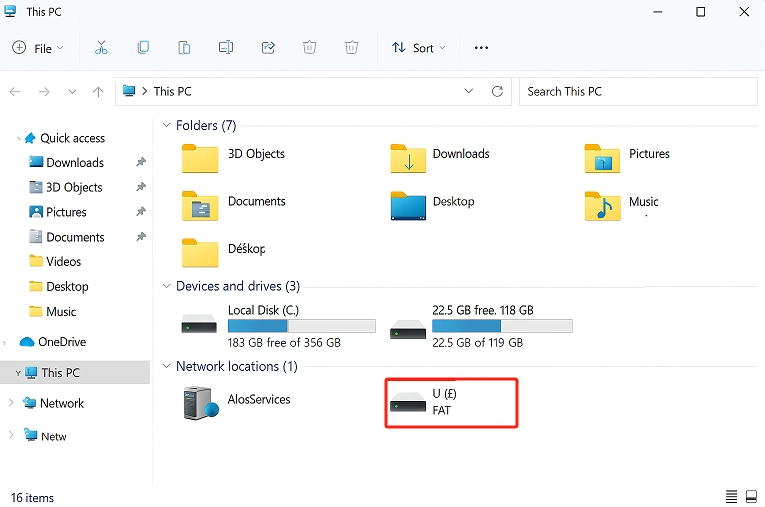
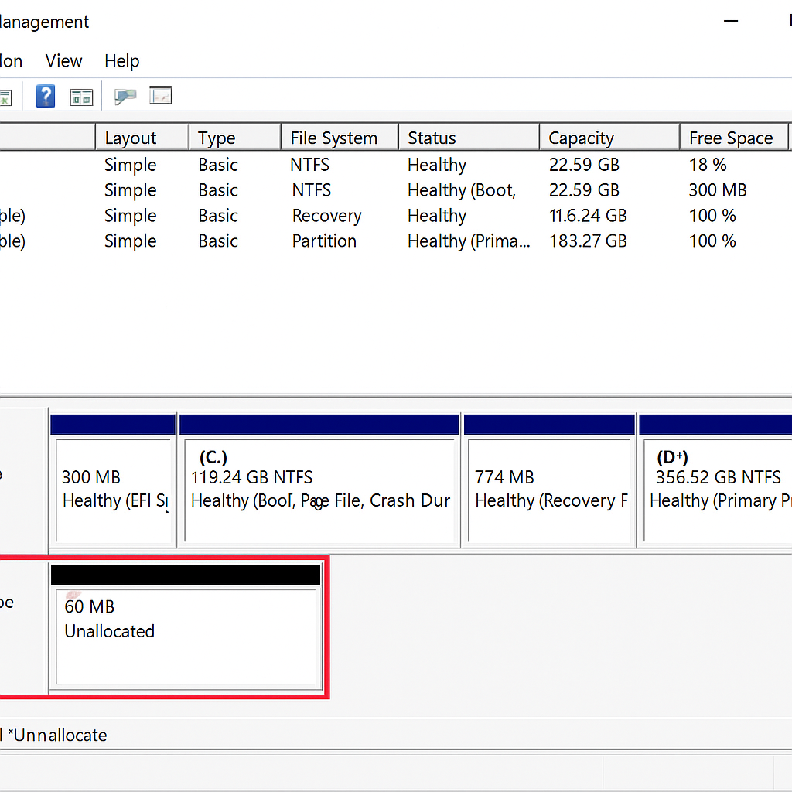
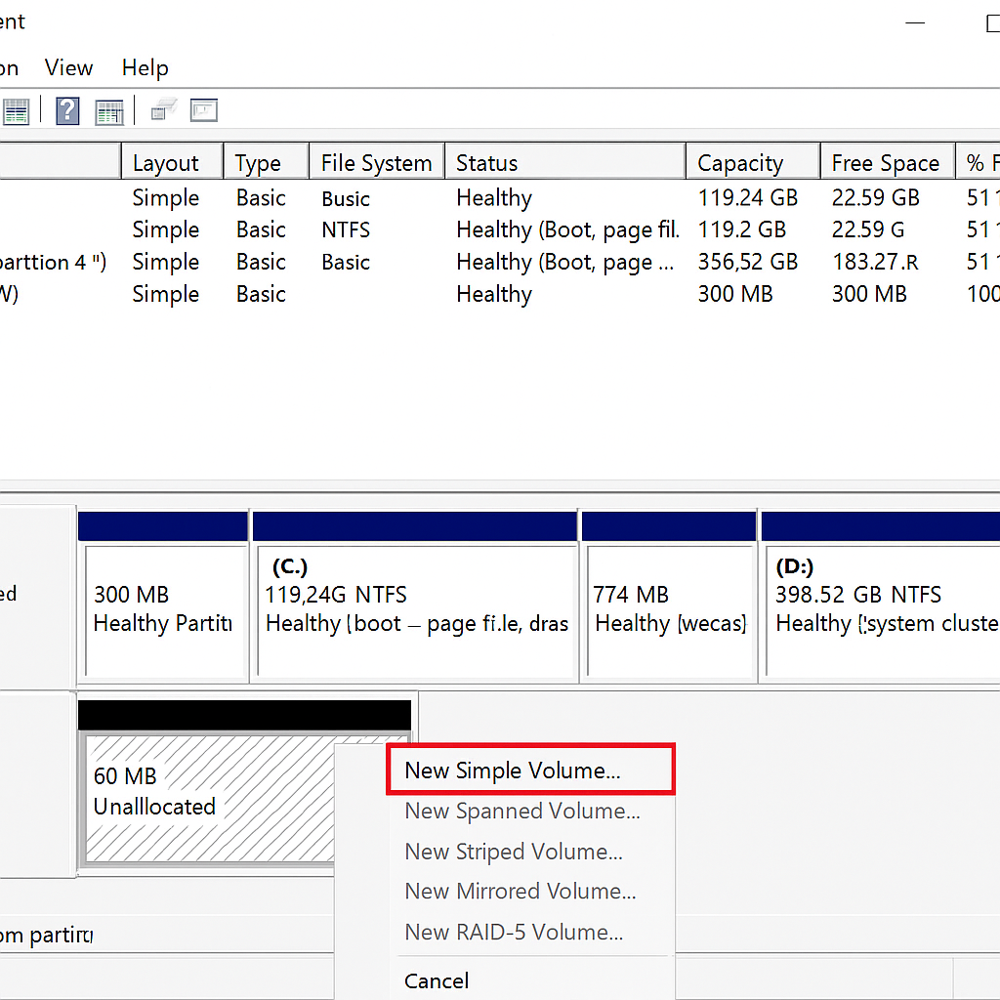
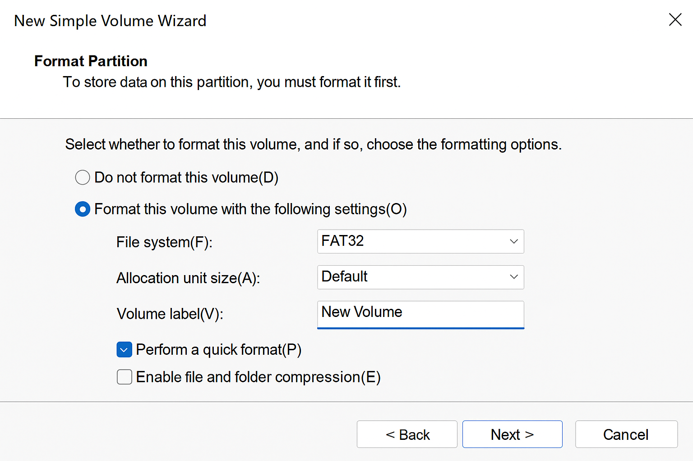
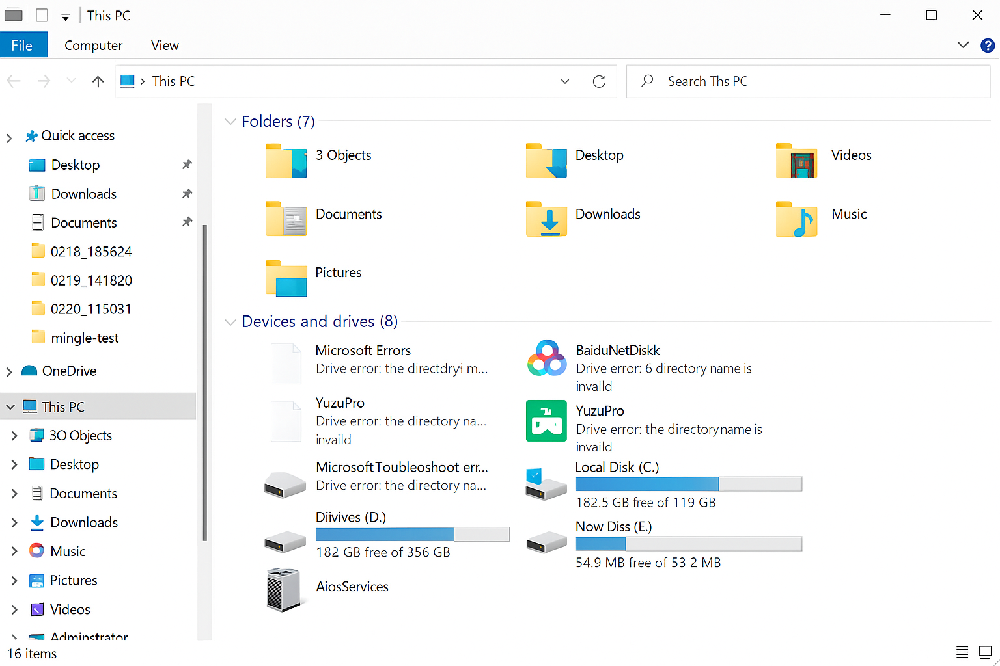

Notes on using Nand disk
============================================

:link_to_translation:`zh_CN:[中文]`

Notes on Nand disk connection
------------------------------

When the USB cable is first connected to the development board through the Type-C cable, due to the default USB DP/DN data cable detection device of the Type-C cable, the USB driver of the board is not initialized, causing the USB Host (computer) to be unable to directly communicate with the board. You can refresh the USB device again in the PC device manager to recognize the USB drive function of the board.

Notes on Nand disk format
---------------------------

On the Windows platform, when formatting the NAND disk for the first time, it may not be possible to format it directly due to the lack of a file system. Only the drive letter appears in the file browser and cannot be formatted, as shown below.

    nand disk not formatted

When this situation occurs, you need to open the disk management window and locate the Nand disk, as shown in the following figure.

    disk management windows

Format the disk by creating a new volume, select FAT32 file system format, and set the drive letter and allocation unit size.

    add disk for nand disk

    set file system format for nand disk

Afterwards, the nand disk can be used normally in the file manager, as shown below.

    normal nand disk
