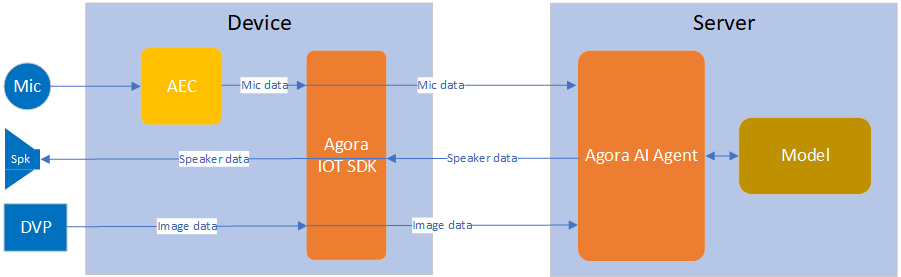
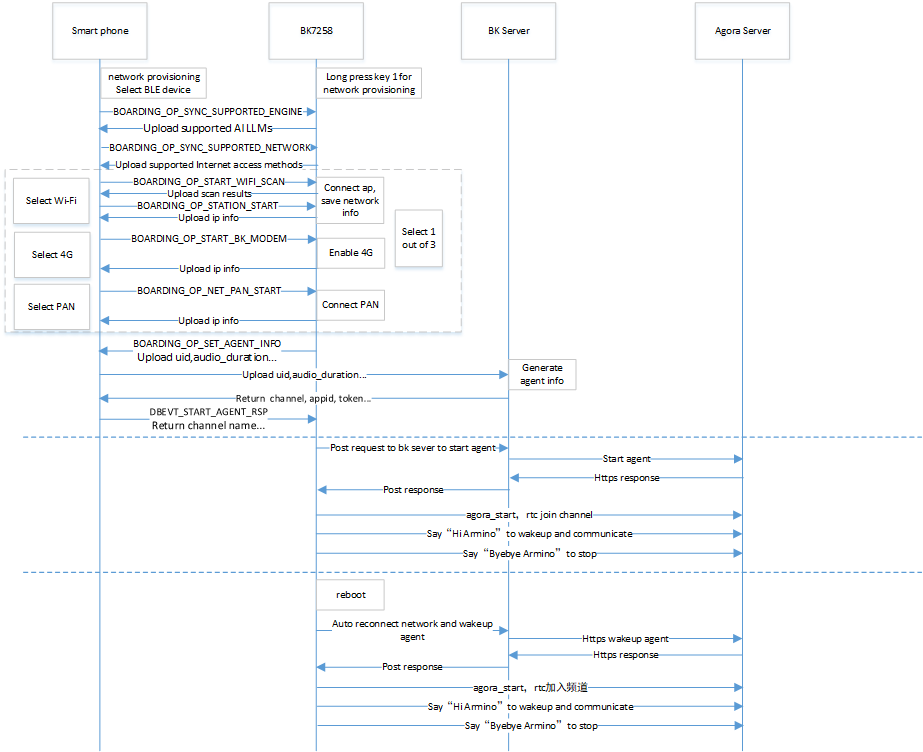

Beken Genie AI
=================================

:link_to_translation:`zh_CN:[中文]`

1. Overview
---------------------------------

This project is based on an end-to-cloud and cloud-to-large-model design solution.

It supports dual-screen display, providing a visual and voice companionship experience along with emotional value.

The solution enables seamless edge-to-cloud integration, supporting various general-purpose large model designs that can directly connect with platforms like OpenAI, DouBao, and DeepSeek.

It effectively leverages cloud-based distributed deployment to reduce network latency and enhance interaction experience.

The solution supports edge-side AEC (Acoustic Echo Cancellation) and NS (Noise Suppression) audio processing algorithms, as well as G711/G722 codec formats. It also supports KWS (Keyword Spotting) wake-up functions and prompt tone playback functions.

The design includes reference solutions and demos for common peripherals, such as gyroscopes, NFC, buttons, vibration motors, Nand Flash, LED light effects, power management, DVP cameras, and dual QPSI screens.

1.1 Hardware Reference
,,,,,,,,,,,,,,,,,,,,,,,,,,,,,,,,,

   * `AI Toy Dev Board SCH <https://docs.bekencorp.com/HW/BK7258/AIDK_AI_TOY_DEV_BOARD_SCH.pdf>`_
   * `AI Toy Dev Board Bottom <https://docs.bekencorp.com/HW/BK7258/AIDK_AI_TOY_DEV_BOARD_BOTTOM.pdf>`_
   * `AI Toy Dev Board Top <https://docs.bekencorp.com/HW/BK7258/AIDK_AI_TOY_DEV_BOARD_TOP.pdf>`_

1.2 Features
,,,,,,,,,,,,,,,,,,,,,,,,,,,,,,,,,

    * Hardware:
        * SPI LCD X2 (GC9D01 160x160)
        * MIC
        * Speaker
        * SD NAND 128MB
        * NFC (MFRC522)
        * G-Sensor (SC7A20H)
        * PMU (ETA3422)
        * Battery
        * DVP (gc2145)

    * Software:
        * AEC
        * NS
        * ASR
        * WIFI Station
        * BLE
        * BT PAN

.. figure:: ../../../_static/beken_genie_pic.jpg
    :align: center
    :alt: Hardware Development Board
    :figclass: align-center

    Figure 1. Hardware Development Board

1.3 Button
,,,,,,,,,,,,,,,,,,,,,,,,,,,,,,,,,,,,
1.3.1 Button Function Description
++++++++++++++++++++++++++++++++++++
There are three button on the lower right side of the board, corresponding to the silk screen markings S1, S2, and S3; and there is one button K1 on the right side.

    power on/off
        - 1.power on: Long press(>= 3 seconds) the button ``S2`` to power on.
        - 2.power off: When the system is in the powered - on state, long press(>= 3 seconds) the button ``S2`` to power off.

    LLMs Switch
        - 1.Fisrt time boot and wakeup, default use Large Language Model
        - 2.click the button ``S2`` to switch to Image Recognition Large Model
        - 3.click the button ``S2`` again to switch to Large Language Model
        - 4.Loop operation between step 2 and step 3

    Network Provisioning
        - 1.Network Provisioning: When the system is in the powered - on state, long press(>= 3 seconds) the button ``S1`` to enter the state of waiting for network configuration.

    Speaker volume control
        - 1.Increase the volume: Single - click the ``S1`` button to turn up the volume.
        - 2.Decrease the volume: Single - click the ``S3`` button to turn down the volume.

    restore to factory settings
        - 1.restore to factory settings: Long press the ``S3`` button to restore the device to its factory settings.

    reset button ``K1``
        - 1.Reset in shutdown state: Single - click the ``K1`` button to power on the system from the shutdown state.
        - 2.Reset in the powered-on state: Single - click the ``K1`` button, and the system will perform a hard restart while it is powered-on.

1.3.2 Guide to Button Development
++++++++++++++++++++++++++++++++++++
    1.GPIO Button
        - Button Function Configuration, Refer to projects/common_components/bk_key_app/key_app_config.h and key_app_service.c, the developer can fill in the corresponding IO pins and the callback function events for the buttons in the table.
        - The configuration for the long button press duration should refer to the LONG_TICKS macro defined in the multi_button.h header file.
        - All button events are moved to be executed in a task. If the program executing the button event is blocked or takes too long, it will affect the button response speed.

    2.Precautions for GPIO buttons
        - Ensure that GPIO pins are exclusively used for button functions; otherwise, conflicting functions on the same GPIO pin may result in ineffective button operation.
        - If the developer's board is different from the bekan_genie development board, please reconfigure the GPIOs according to the hardware design of your development board.
          For details on GPIO usage, refer to the documents in the bk_avdk/bk_idk/docs/bk7258/zh_CN/api-reference/peripheral/bk_gpio.rst.

1.4 LED
,,,,,,,,,,,,,,,,,,,,,,,,,,,,,,,,,

The development board features red and green status indicator lights. Important information is indicated by red light blinking, general notifications by green light blinking,
and special reminders are signaled by alternating red and green light blinking. For reference code for LED effects development, see led_blink.c.

    Green light remains on or continuously off as an indicator
        - 1.When power is turned on, the green light remains on until the user performs an operation or the next event begins.
        - 2.When a conversation starts, the green light turns off.

    Blinking of red and green lights indicates specific information
        - 1.User network configuration: User is configuring the network.

    Green light blinking status information
        - 1.During power-on networking: Green light blink quickly.
        - 2.Large model server connection successful: Green light blink slowly.
        - 3.Conversation stopped: Green light blink slowly.

    Red light blinking status information
        - 1.Network configuration failed / network reconnection failed: Red light blink quickly.
        - 2.WEBRTC connection disconnected: Red light blink quickly.
        - 3.Large model server connection disconnected: Red light blink quickly.
        - 4.Battery level below 20%: Red light flashes slowly for 30 seconds and then automatically stops; if charging, the red light does not blink.
        - 5.No important reminder events: When there are no important reminder events, the red light is in an off state.

1.5 SD-NAND  Memory
,,,,,,,,,,,,,,,,,,,,,,,,,,,,,,,,,
        - 1.The SD-NAND stores local resource files, such as image resource files on the display screen.
        - 2.The SD-NAND storage device defaults to using the FAT32 file system, allowing applications to indirectly invoke the open-source FATFS program interface through the VFS interface for file access.
        - 3.On the PC side, files on the SD-NAND can be accessed for reading and writing via the USB interface.(The USB port located on the left side of the development board.)
        - 4.Please note that files deleted on the PC side may still be in use by the local application, which can lead to system anomalies. It is essential to ensure that deleted files are no longer being accessed.

1.6 Gsensor
,,,,,,,,,,,,,,,,,,,,,,,,,,,,,,,,,
        - 1.Local G-sensor supports wake-up function. Users can wake up the system by shaking the development board in an S-shape trajectory.

1.7 Charging management
,,,,,,,,,,,,,,,,,,,,,,,,,,,,,,,,,
        - 1.The charging management chip model used in the current development board is ETA3422.
        - 2.When the battery is fully charged, the red light near the charging port will turn off, and the green light will turn on. The red light being on indicates that charging is in progress.
        - 3.Note: During the charging process or when an external power source is connected, the system switches to the external input voltage source for voltage detection instead of using the battery voltage. At this time, the voltage obtained through commands will be the external input voltage.
        - 4.Charging status monitoring depends on GPIO51 and GPIO26.
            - GPIO51 is responsible for detecting the charging status. When GPIO51 is high, there is an external power supply input; otherwise, there is none.
            - GPIO26 indicates whether the battery is charging. When GPIO26 is high, the battery is charging; when it is low, the battery is fully charged.
            - Note: This function requires confirming whether the R14 resistor is soldered on the hardware. If not, additional soldering is needed.
            - The specific hardware information is subject to the schematic diagram of the project.
        - 5.To enable the charging management function, configure CONFIG_BAT_MONITOR=y. To enable the test cases for charging management, configure CONFIG_BATTERY_TEST=y.
        - 6.After enabling the battery test commands, battery information can be obtained using the battery command:
            - "battery init" initializes the battery monitoring task.
            - "battery get_battery_info" retrieves basic battery information.
            - "battery get_voltage" checks the current battery voltage.
            - "battery get_level" checks the current battery level.
            - Note: When using the above commands, ensure that the system is not powered by an external power source; otherwise, the detected voltage will be the external power voltage.
            - For other specific commands, simply enter "battery" to print the supported commands. For further details, refer to the definitions in cli_battery.c.
        - 7.When the battery level is equal to or below 20%, a low battery warning event will be triggered:
            - The warning is triggered only when the device is not plugged in; it will not be triggered when connected to external power or charging.
            - The warning is sent only once per low-battery occurrence.
            - At this time, the red LED on the other side will blink slowly for 30 seconds.
        - 8.When charging, the charging management task will print "Device is charging...".
        - 9.When fully charged, it will print "Battery is full.".
        - 10.Although the battery has low-voltage protection, users are advised to charge the battery promptly when the battery is low to extend its lifespan.
        - 11.If users use batteries from other manufacturers, they need to modify the charge interpolation table (s_chargeLUT) and the battery information in iot_battery_open accordingly.
        - 12.In our SDK, we provide API functions for current, voltage, and battery level. Currently, the battery only supports voltage and battery level detection.
            - Note: Although the API interface for current detection is retained, it has not been implemented yet. If the user's device supports current detection, they need to implement the current detection API themselves.
        - 13.Since the hardware currently only supports battery level detection in a non-charging state, hardware modifications are needed to detect voltage during charging:
            - Removing the D6 diode and R21 resistor will enable voltage detection during charging.
        - 14.The USB port next to the button serves as both a charging port and a serial port for interaction.
        - 15.The ADC interface for power sampling is the ADC0 inside the chip, and there is no need to connect the resistor voltage divider circuit and add ADC channel acquisition externally. ADC0 is directly connected to the VBAT monitoring channel, which is a dedicated interface within the chip, and there is no external connection.
        - 16.Note: The maximum detection voltage of the battery is 4.35V. Above this voltage there is a risk of burning out the system.

1.8 ASR
,,,,,,,,,,,,,,,,,,,,,,,,,,,,,,,,,

    1. ``Hi Armino`` is used to wake up, enabling interaction between local and cloud AI, while the LCD lights up and displays eye animations.

        Response phrase: ``A Ha``

    2. ``byebye armino`` is used to turn off, enabling interaction between local and cloud AI, while closing the LCD and no longer displaying eye animations.

        Response phrase: ``Byebye``

1.9 MOTOR
,,,,,,,,,,,,,,,,,,,,,,,,,,,,,,,,,
        - 1.The LDO is connected to the positive terminal of the motor, while the PWM is connected to the negative terminal. The motor's vibration strength can be controlled by adjusting the duty cycle of the PWM signal.
        - 2.When the power is turned on by long-pressing the button, the motor will vibrate.
        - 3.Detailed usage examples for PWM can be found in cli_pwm.c.

1.10 Prompt Tone
,,,,,,,,,,,,,,,,,,,,,,,,,,,,,,,,,
1.10.1 Prompt Tone Function Description
++++++++++++++++++++++++++++++++++++++++++++++++++++

    The development board plays corresponding prompt tones during operation based on different events. Below are the prompt tones associated with each event:

    Provision network Over Bluetooth LE
        - 1.Provision Network Over Bluetooth LE: ``Please use Bluetooth LE for network provision``
        - 2.Provision Network fail: ``Network provision over Bluetooth LE failed, please reprovision the network.``
        - 3.Provision Network success: ``Network provision over Bluetooth LE successed``

    Reconnect Network
        - 1.Connecting to Network: ``The network is connecting, please wait.``
        - 2.Reconnect Network fail: ``The network connection has failed, please check the network.``
        - 3.Reconnect Network success: ``The network connection successful.``

    Wake-Up and Shutdown
        - 1.Wake-Up: ``A Ha``
        - 2.Shutdown: ``Byebye``

    AI Entity
        - 1.AI Entity Connected Successfully: ``AI entity has been connected``
        - 2.AI Entity Disconnected: ``AI entity has been disconnected``

    Device Disconnection
        - 1.Device Disconnected: ``Device disconnected``

    Battery Level
        - 1.Low Battery: ``Battery level is low. Please charge.``

1.10.2 Prompt Tone Development Guide
+++++++++++++++++++++++++++++++++++++++++

    Please refer to the document: `Aud_Intf API User Guide <../../api-reference/bk_aud_intf.html>`_

    The default path for the prompt tone file resources: ``<source code>/projects/common_components/resource/``

1.11 countdown
,,,,,,,,,,,,,,,,,,,,,,,,,,,,,,,,,
        - 1.The network configuration countdown is 5 minutes. If the network is not configured within 5 minutes, the chip will enter deep sleep mode(Shutdown).
        - 2.The network error countdown is 5 minutes. If a network error occurs and the network is not restored within 5 minutes, the chip will enter deep sleep mode.
        - 3.The standby state countdown is 3 minutes. After the system powers on, it defaults to standby mode. When you say ``byebye armino``, the system will also enter standby mode. If no other events occur, the chip will enter deep sleep mode after 3 minutes.
        - 4.You can modify the countdown time in the s_ticket_durations[COUNTDOWN_TICKET_MAX] array in countdown_app.c.

2. Development Guide
---------------------------------

2.1 Module Diagram
,,,,,,,,,,,,,,,,,,,,,,,,,,,,,,,,,

    This AI demo solution is similar to the door lock solution,

    featuring two-way voice communication between the device and the AI large model,

     while the device also transmits images unidirectionally to the AI large model.

     In this solution, the counterpart APK on the other end in the door lock solution has been transformed into an AI Agent robot.

    The software module architecture is as shown in the figure below.

    Figure 3. software module architecture

..

   For voice interaction::

    * The device collects voice through the microphone.
    * The voice data is transmitted to Agora's servers using the Agora SDK.
    * Agora's servers handle communication with the AI Agent large model.
    * The server sends the voice to the AI Agent, receives a response, and forwards the voice response to the device's speaker for playback.

    For image processing::

    * The device captures image data.
    * Each frame of the image is sent to Agora's servers via the Agora SDK.
    * The server then transmits the image to the AI Agent large model for recognition.

2.2 Network Provisioning and Communication
,,,,,,,,,,,,,,,,,,,,,,,,,,,,,,,,,,,,,,,,,,

    Figure 4. Operation Flow Sequence

2.3 AI Work state machine
,,,,,,,,,,,,,,,,,,,,,,,,,,,,,,,,,

.. figure:: ../../../_static/bk_genie_statemachine.png
    :align: center
    :alt: State Machine Overview
    :figclass: align-center

    Figure 5. module state diagram

::

    1/2 Green light stays on.
    3/4 Green and red lights flash alternately
    5/6 Green light flashes quickly.
    7 Green light flashes quickly.
    8 LCD on, LED off.
    9 LCD off
    12/13 Red light flashes quickly

2.4 Kconfig
,,,,,,,,,,,,,,,,,,,,,,,,,,,,,,,,,

    To enable the Agora function library, the following configurations need to be enabled on cpu0:

    +----------------------------------------+----------------+---------------+----------------+
    |Kconfig                                 |   CPU          |   Format      |      Value     |
    +----------------------------------------+----------------+---------------+----------------+
    |CONFIG_AGORA_IOT_SDK                    |   CPU0         |   bool        |        y       |
    +----------------------------------------+----------------+---------------+----------------+

    To enable Network Provisioning and start agent, the following configurations need to be enabled on cpu0:

    +----------------------------------------+----------------+---------------+----------------+
    |Kconfig                                 |   CPU          |   Format      |      Value     |
    +----------------------------------------+----------------+---------------+----------------+
    |CONFIG_BK_SMART_CONFIG                  |   CPU0         |   bool        |        y       |
    +----------------------------------------+----------------+---------------+----------------+

    To enable dual screen display and avi play function, the following configurations need to be enabled:

    +----------------------------------------+----------------+---------------+----------------+
    |Kconfig                                 |   CPU          |   Format      |      Value     |
    +----------------------------------------+----------------+---------------+----------------+
    |CONFIG_LCD_SPI_GC9D01                   |   CPU1         |   bool        |        y       |
    +----------------------------------------+----------------+---------------+----------------+
    |CONFIG_LCD_SPI_DEVICE_NUM               |   CPU1         |   int         |        2       |
    +----------------------------------------+----------------+---------------+----------------+
    |CONFIG_AVI_PLAY                         |   CPU1         |   bool        |        y       |
    +----------------------------------------+----------------+---------------+----------------+
    |CONFIG_DUAL_SCREEN_AVI_PLAY             |   CPU0 & CPU1  |   bool        |        y       |
    +----------------------------------------+----------------+---------------+----------------+
    |CONFIG_LVGL                             |   CPU1         |   bool        |        y       |
    +----------------------------------------+----------------+---------------+----------------+
    |CONFIG_LV_IMG_UTILITY_CUSTOMIZE         |   CPU1         |   bool        |        y       |
    +----------------------------------------+----------------+---------------+----------------+
    |CONFIG_LV_COLOR_DEPTH                   |   CPU1         |   int         |        16      |
    +----------------------------------------+----------------+---------------+----------------+
    |CONFIG_LV_COLOR_16_SWAP                 |   CPU1         |   bool        |        y       |
    +----------------------------------------+----------------+---------------+----------------+

2.5 BLE Network Provisioning and Agent Policy Customization Guide
,,,,,,,,,,,,,,,,,,,,,,,,,,,,,,,,,,,,,,,,,,,,,,,,,,,,,,,,,,,,,,,,,,,

 The BLE Network Provisioning and Agent-Startup code are mainly distributed in the directory:"projects/common_components/bk_boarding_service" and "projects/common_components/bk_smart_config". Customers can refer to the following instructions to customize their own solutions.

1.bk_sconf_prepare_for_smart_config: Entering BLE Network Provisioning mode

.. code::

    void bk_sconf_prepare_for_smart_config(void)
    {
        smart_config_running = true;
        first_time_for_network_reconnect = true;
    #if CONFIG_STA_AUTO_RECONNECT
        first_time_for_network_provisioning = true;
    #endif
        app_event_send_msg(APP_EVT_NETWORK_PROVISIONING, 0);//Enter Network Provisioning – indicated by alternating red and green lights.
        network_reconnect_stop_timeout_check();             //Disable reconnect timeout check
        bk_sconf_trans_stop();                              //Close Rtc on device and Multimedia Services
        bk_wifi_sta_stop();                                 //Stop wifi
    #if CONFIG_BK_MODEM
    extern bk_err_t bk_modem_deinit(void);
      bk_modem_deinit();                                    //If support 4G, disable 4G
    #endif
    #if !CONFIG_STA_AUTO_RECONNECT                          //CONFIG_STA_AUTO_RECONNECT default n, use beken reconnect policy
        demo_erase_network_auto_reconnect_info();
        bk_sconf_erase_agent_info();
    #endif

    #if CONFIG_NET_PAN && !CONFIG_A2DP_SINK_DEMO && !CONFIG_HFP_HF_DEMO
        bk_bt_enter_pairing_mode(0);                        //Reset BT to initial state
    #else
        BK_LOGW(TAG, "%s pan disable !!!\n", __func__);
    #endif
    extern bool ate_is_enabled(void);

        if (!ate_is_enabled())
        {
            bk_genie_boarding_init();                       //BLE Network Provisioning init
            wifi_boarding_adv_start();                      //BLE broadcasting enabled
        }
        ......
    }

2.bk_genie_message_handle: Responsible for BLE interaction with mobile app during network provisioning. Customer can disable below code to implement their own solutions.

.. code::

    static void bk_genie_message_handle(void)
    {
            ……
        case DBEVT_START_AGORA_AGENT_START:
        {
            LOGI("DBEVT_START_AGORA_AGENT_START\n");
            char payload[256] = {0};
            __maybe_unused uint16_t len = 0;
            //Uploads module UID and related information to Beken's server. Customers who have deployed their own servers may:
            //1.Remove this code section entirely
            //2.Modify the implementation by referring to Section 3's bk_sconf_send_agent_info as a reference.
            len = bk_sconf_send_agent_info(payload, 256);
            bk_genie_boarding_event_notify_with_data(BOARDING_OP_SET_AGENT_INFO, 0, payload, len);
        }
        break;
        case DBEVT_START_AGORA_AGENT_RSP:
        {
            LOGI("DBEVT_START_AGORA_AGENT_RSP\n");
            //Receives channel name and other configuration data from Beken's server. For customers operating their own servers, they may:
            //1.Disable this code section entirely
            //2.Modify the implementation by referring to Section 4's bk_sconf_prase_agent_info function
            bk_sconf_prase_agent_info((char *)msg.param, 1);
        }
        break;
            ……
    }

3.bk_sconf_send_agent_info: Responsible for transmitting agent configuration parameters to the mobile app (APK) during network provisioning.

  code directory: projects/common_components/bk_smart_config/src/adapter/agora/bk_smart_config_agora_adapter.c

.. code::

    uint16_t bk_sconf_send_agent_info(char *payload, uint16_t max_len)
    {
        unsigned char uid[32] = {0};
        char uid_str[65] = {0};
        uint16 len = 0;

        bk_uid_get_data(uid);
        for (int i = 0; i < 24; i++)
        {
            sprintf(uid_str + i * 2, "%02x", uid[i]);
        }
        //The following parameters require configuration when the Beken server initializes the agent. Customers may customize these according to their own solution requirements.
        len = os_snprintf(payload, max_len, "{\"channel\":\"%s\",\"agent_param\": {", uid_str);
    #if CONFIG_AUDIO_FRAME_DURATION_MS
        len += os_snprintf(payload+len, max_len, "\"audio_duration\": %d,", CONFIG_AUDIO_FRAME_DURATION_MS);
    #endif
    #if CONFIG_AUD_INTF_SUPPORT_OPUS
        len += os_snprintf(payload+len, max_len, "\"out_acodec\": \"OPUS\"");
    #else
        len += os_snprintf(payload+len, max_len, "\"out_acodec\": \"G722\"");
    #endif
        len += os_snprintf(payload+len, max_len, "}}");
        BK_LOGI(TAG, "ori channel name:%s, %s, %d\r\n", uid_str, payload, len);
        return len;
    }

4.bk_sconf_prase_agent_info: Responsible for parsing server response parameters (e.g., app_id, channel_name) after agent initialization during provisioning, and activating device-side RTC accordingly.

  code directory: projects/common_components/bk_smart_config/src/adapter/agora/bk_smart_config_agora_adapter.c

.. code::

    void  bk_sconf_prase_agent_info(char *payload, uint8_t reset)
    {
        ......
        //parse app_id and channel_name
        cJSON *app_id = cJSON_GetObjectItem(json, "app_id");
        if (app_id && ((app_id->type & 0xFF) == cJSON_String))
        {
           app_id_record = os_strdup(app_id->valuestring);
        }
        else
        {
            BK_LOGE(TAG, "[Error] not find msg\n");
        }

        cJSON *channel_name = cJSON_GetObjectItem(json, "channel_name");
        if (channel_name && ((channel_name->type & 0xFF) == cJSON_String))
        {
            channel_name_record = os_strdup(channel_name->valuestring);
            BK_LOGI(TAG, "real channel name:%s\r\n", channel_name_record);
        }
        ......
        if (app_id_record && channel_name_record)
        {
            //save agent info to easy flash
            bk_sconf_save_agent_info(app_id_record, channel_name_record);
            BK_LOGI(TAG, "begin agora_auto_run\n");
            //sync agent info to easy flash
            ret = bk_config_sync_flash_safely();
            if (ret)
                BK_LOGE(TAG, "sync flash fail!!!\r\n");
            //start agora agent and RTC
            agora_auto_run(reset);
            ......
    }

5.bk_sconf_wakeup_agent: Manages Agent initialization, supporting two deployment models:Server-Startup Agent (default, requires customer-hosted server for customization) and Device-Startup Agent.(Beken's default implementation uses server-side initialization)

.. code::

    int bk_sconf_wakeup_agent(void)
    {
    #if CONFIG_BK_DEV_STARTUP_AGENT
        agora_ai_agent_start_conf_t agent_conf = BK_AGORA_AGENT_DEFAULT_CONFIG();
        __maybe_unused agent_type_t agent_type = DOUBAO_AGENT;
        unsigned char uid[32] = {0};
        char uid_str[65] = {0}, chan_name[65] = {0};
        int chan_len;

        //The Beken solution generates agent channel names based on the large model name and device UID. Customers may choose to modify this and implement their own naming scheme.
        bk_uid_get_data(uid);
        for (int i = 0; i < 24; i++)
        {
            sprintf(uid_str + i * 2, "%02x", uid[i]);
        }
        if (agent_type == OPEN_AI_AGENT)
            chan_len = os_snprintf(chan_name, 65, "Openai_%s", uid_str);
        else
            chan_len = os_snprintf(chan_name, 65, "Doubao_%s", uid_str);
        agent_conf.channel = os_zalloc(chan_len+1);
        os_strcpy(agent_conf.channel, chan_name);
        //Customers must enter their own authentication tokens in:CUSTOM_LLM_DEFAULT_OPENAI_TOKEN and CUSTOM_LLM_DEFAULT_DOUBAO_TOKEN
        agent_conf.custom_llm = custom_llm_default_conf(agent_type);
        //Customers must configure their own Agora credentials:AGORA_DEBUG_APPID[Your Agora App ID], AGORA_DEBUG_AUTH: [Your Agora RESTful Key], Agora Token: [Optional, configure as needed]
        //Enter your TTS service keys in:tts_str_openai (for OpenAI TTS),tts_str_doubao (for Doubao TTS)
        bk_agora_ai_agent_start(&agent_conf, agent_type);
        ......
    #else
        struct webclient_session *session = NULL;
        char *buffer = NULL, *post_data = NULL;
        char generate_url[256] = {0};
        int url_len = 0, data_len = 0, bytes_read = 0, resp_status = 0, ret = 0;
        uint32_t rand_flag = 0;

        /* create webclient session and set header response size */
        session = webclient_session_create(SEND_HEADER_SIZE);
        if (session == NULL)
        {
            ret = -1;
            goto __exit;
        }
        //Customers using private servers must replace bk_get_bk_server_url() with their own server URL string.
        //#define BK_CUSTOMER_SERVER_URL "xxx"
        //eg:url_len = os_snprintf(generate_url, MAX_URL_LEN, "%s", BK_CUSTOMER_SERVER_URL);
        url_len = os_snprintf(generate_url, MAX_URL_LEN, "%s/activate_agent/", bk_get_bk_server_url());
        if ((url_len < 0) || (url_len >= MAX_URL_LEN))
        {
            BK_LOGE(TAG, "URL len overflow\r\n");
            ret = -1;
            return ret;
        }
        ......
        //Generates POST requests while allowing customers to define their own JSON message format.
        data_len = os_snprintf(post_data, POST_DATA_MAX_SIZE, "{\"channel\":\"%s\",", channel_name_record);
        data_len += os_snprintf(post_data+data_len, POST_DATA_MAX_SIZE, "\"reset\":%u,\"agent_param\": {", reset);
    #if CONFIG_AUDIO_FRAME_DURATION_MS
        data_len += os_snprintf(post_data+data_len, POST_DATA_MAX_SIZE, "\"audio_duration\": %d,", CONFIG_AUDIO_FRAME_DURATION_MS);
    #endif
    #if CONFIG_AUD_INTF_SUPPORT_OPUS
        data_len += os_snprintf(post_data+data_len, POST_DATA_MAX_SIZE, "\"out_acodec\": \"OPUS\"");
    #else
        data_len += os_snprintf(post_data+data_len, POST_DATA_MAX_SIZE, "\"out_acodec\": \"G722\"");
    #endif
        rand_flag = bk_rand();
        data_len += os_snprintf(post_data+data_len, POST_DATA_MAX_SIZE, "},\"rand_flag\":\"%u\"}", rand_flag);
        BK_LOGI(TAG, "%s, %s\r\n", __func__, post_data);
        ......
        //Customers using private servers must either implement this function themselves or comment it out.
        ret = bk_sconf_rsp_parse_update(buffer);
    }

6.bk_sconf_netif_event_cb: Manages post-WiFi connection processes including:Agent initialization, WiFi/agent information storage, Post-provisioning agent wakeup,(Customizable - customers may replace with their own implementation)

7.bk_sconf_erase_agent_info,bk_sconf_save_agent_info,bk_sconf_get_agent_info: These are all Beken agent background maintenance solutions. Customers may replace them with their own implementations.

8.ir_mode_switch_main: Handles multimodal switching. For custom implementations, customers must either: Implement their own bk_sconf_update_agent_info function, or Adapt Beken's solution by replacing bk_get_bk_server_url() with their private server endpoint

.. code::

    void ir_mode_switch_main(void)
    {
        if (!agora_runing) {
            BK_LOGW(TAG, "Please Run AgoraRTC First!");
            goto exit;
        }

        ir_mode_switching = 1;

        if (!video_started) {
            //Switch to image recognition large model
            bk_sconf_upate_agent_info("text_and_image");
            while (g_agent_offline)
            {
                if (!agora_runing)
                {
                    goto exit;
                }
                rtos_delay_milliseconds(100);
            }
            //open camera
            video_turn_on();

    #if (CONFIG_DUAL_SCREEN_AVI_PLAY)
            if (lvgl_app_init_flag == 1) {
                media_app_lvgl_switch_ui(LVGL_UI_DISP_IN_TEXT_AND_IMAGE);
            }
    #endif
        } else {
            //close camera
            video_turn_off();
            //Switch to large language model
            bk_sconf_upate_agent_info("text");

    #if (CONFIG_DUAL_SCREEN_AVI_PLAY)
            if (lvgl_app_init_flag == 1) {
                media_app_lvgl_switch_ui(LVGL_UI_DISP_IN_TEXT);
            }
    #endif
        }

    exit:
        config_ir_mode_switch_thread_handle = NULL;
        ir_mode_switching = 0;
        rtos_delete_thread(NULL);
    }

9.bk_sconf_start_agora_rtc: Manages initialization of both the Agora agent and device-side RTC. The 'reset' parameter determines whether to force revert to initial agent configuration on Beken's server.

3. Demonstration instructions
---------------------------------

3.1 Source code download & build
,,,,,,,,,,,,,,,,,,,,,,,,,,,,,,,,,

    * `AIDK download <../../get-started/index.html#armino-aidk-sdk>`_

    * `Set Up SDK Build Environment <https://docs.bekencorp.com/arminodoc/bk_idk/bk7258/zh_CN/v2.0.1/get-started/index.html>`_

    * Compile Code:: ``make bk7258 PROJECT=beken_genie``

        * Compile in the source code root directory
        * The project directory is located at``<source code>/project/beken_genie``

    * `Program Code <https://docs.bekencorp.com/arminodoc/bk_idk/bk7258/zh_CN/v2.0.1/get-started/index.html>`_

        * The binary file for programming is located at ``<source code>/build/beken_genie/bk7258/all-app.bin``

3.2 UI Resource Replacement
,,,,,,,,,,,,,,,,,,,,,,,,,,,,,,,,,

    - 1. Convert the avi video files to be used using the format conversion tool located at ``<bk_aidk source code path>/bk_avdk/components/multimedia/tools/aviconvert/bk_avi.7z`` in the SDK. For detailed usage instructions, please refer to the readme.txt file included with the tool.

    - 2. Place the converted files back into the SD NAND and rename them to contain only English letters or numbers.

    - 3. Modify the file name passed to the function ``bk_avi_play_open()`` in the file ``<bk_aidk source code path>/project/common_components/dual_screen_avi_play/lvgl_ui.c``.

3.3 UI Resource Switching
,,,,,,,,,,,,,,,,,,,,,,,,,,,,,,,,,

    - 1. Follow the instructions in section 3.2 to convert the avi video flie and put it into the SD Nand.

    - 2. Call function ``bk_avi_play_stop()`` and function ``bk_avi_play_close()`` to stop playing the avi file.

    - 3. Call function ``bk_avi_play_open()`` to open new avi file.

    - 4. Call function ``bk_avi_play_start()`` to start playing the new avi file.

3.4 APP Registration and Download
,,,,,,,,,,,,,,,,,,,,,,,,,,,,,,,,,

    APP download: https://docs.bekencorp.com/arminodoc/bk_app/app/zh_CN/v2.0.1/app_download/index.html

    Registration: use email

3.5 Firmware Burning and Resource File Burning
,,,,,,,,,,,,,,,,,,,,,,,,,,,,,,,,,,,,,,,,,,,,,,

	- 1. Store the avi video file to be played in the SD NAND. For specific usage of SD NAND, refer to Nand Disk Usage Notes <../../api-reference/nand_disk_note.html>_.
	- 2. Store the file <bk_aidk source code path>/project/beken_genie/main/resource/genie_eye.avi from the SDK into the SD NAND.
	- 3. Burn the compiled all-app.bin file and power on to execute.

3.6 Operation Steps
,,,,,,,,,,,,,,,,,,,,,,,,,,,,,,,,,

3.6.1 Beken App
+++++++++++++++++++++++++++++++++

    a)operate beken app as follow pictures:

    .. figure:: ../../../_static/add_device_en.png
        :scale: 30%

    .. figure:: ../../../_static/add_devcie_ai_toy_en.png
        :scale: 30%

    .. figure:: ../../../_static/device_info_en.png
        :scale: 30%

    b)long press Key 2 for 3s to enter network provisioning mode:

    .. figure:: ../../../_static/add_ai_device_9.png
        :scale: 70%

    c)click the device scan by smart phone

    .. figure:: ../../../_static/ble_scan_en.png
        :scale: 30%

    .. figure:: ../../../_static/select_model_en.png
        :scale: 30%

    .. figure:: ../../../_static/ai_activate_type_en.png
        :scale: 30%

    .. figure:: ../../../_static/wifi_select_en.png
        :scale: 30%

    .. figure:: ../../../_static/activating_en.png
        :scale: 30%

    .. figure:: ../../../_static/added_en.png
        :scale: 30%

    d)Say the wake-up word ``hi armino`` to the onboard mic, the device will play the prompt tone ``aha`` after waking up,
    and then you can have an AI conversation

      Say the key word ``byebye armino`` to the onboard mic, the device will play the prompt tone ``byebye`` after detecting it,
      then go to sleep and stop talking to the AI

3.6.2 Reconfiguring the Network
+++++++++++++++++++++++++++++++++

.. warning::

    Before reconfiguring the network, you need to remove the device from the original network configuration on your phone, and then repeat the steps in the previous chapter.

    To remove the device, follow these steps:

..

    a) Long press the indicated area, and a prompt box will pop up.

    .. figure:: ../../../_static/added_en.png
        :scale: 30%

    b) Click OK to complete the operation.

    .. figure:: ../../../_static/del_en.png
        :scale: 30%

.. note::

    For more APP operations, please refer to the APP documentation:

    https://docs.bekencorp.com/arminodoc/bk_app/app/zh_CN/v2.0.1/app_usage/app_usage_guide/index.html#ai

..

4. Debugging Commands
---------------------------------
.. warning::

	Notes for Reading This Chapter:

	Debugging commands are intended solely for developers who have a good understanding of the code.

	If you are not familiar with the code and process, please first go through the demonstration steps below to familiarize yourself with and understand the code before deciding whether to

..

4.1 Command List:
,,,,,,,,,,,,,,,,,,,,,,,,,,,,,,,,,

    +-------------------------------------------------------+-------------------------------------+
    |Command                                                |Description                          |
    +-------------------------------------------------------+-------------------------------------+
    |agora_test {start|stop appid video_en channel_name}    | Voice call + image recognition      |
    +-------------------------------------------------------+-------------------------------------+

4.2 Start Command
,,,,,,,,,,,,,,,,,,,,,,,,,,,,,,,,,

    +----------------+-------------+-------------------------------------------------+
    |agora_test      |  Mandatory  | Command                                         |
    +----------------+-------------+-------------------------------------------------+
    |start           |  Mandatory  | Parameter, enables connection to RTC Channel    |
    +----------------+-------------+-------------------------------------------------+
    |appid           |  Mandatory  | Parameter, Agora's APPID                        |
    +----------------+-------------+-------------------------------------------------+
    |video_en        |  Mandatory  | Parameter, image recognition feature toggle:    |
    |                |             |   - 1: ``Enable``                               |
    |                |             |   - 0: ``Disable``                              |
    +----------------+-------------+-------------------------------------------------+
    |channel_name    |  Mandatory  | Parameter, channel name                         |
    +----------------+-------------+-------------------------------------------------+

.. note::

    Before using this command, start the AI Agent on your PC end.

    - 1. Register on Agora's official website and obtain the following parameters `Beken Agora Registration Document <../../thirdparty/agora/index.html#id1>`_

        * AGORA_APPID
        * AGORA_RESTFUL_TOKEN

    - 2. According to the operation manual provided by Agora AI Agent, start the AI Agent on the server side.

        a. Currently, the AI Agent on the PC end is started, and the POST command reference please refer to the user manual provided by Agora ``<bk_aidk source code path>/docs/thirdparty/agora_ai_agent``

        b. You can also refer to `Beken AI Agent Start Document <../../thirdparty/agora/index.html#ai-agent>`_

4.2 Stop Command
,,,,,,,,,,,,,,,,,,,,,,,,,,,,,,,,,

    +----------------+------------+-------------------------------------------------+
    |agora_test      |  Mandatory | Command                                         |
    +----------------+------------+-------------------------------------------------+
    |stop            |  Mandatory | Parameter, disconnects the current RTC Channel  |
    +----------------+------------+-------------------------------------------------+

5. Q&A
---------------------------------

Q: Why doesn't the application layer report mic data?

A: Currently, beken_genie defaults to supporting command word-based voice wake-up functionality. Only after wake-up will it report the mic-collected data to the application layer, which then sends the data to AI for conversation. If the customer does not need voice wake-up functionality, they can disable this feature by defining the macro "CONFIG_AUD_INTF_SUPPORT_AI_DIALOG_FREE".

Q: Why UI resource display abnormally?

A: In this project, the UI resource used must be in AVI format, with a resolution of 320x160, and must be converted using an AVI conversion tool before they can be used. Please check if the UI resource meet the above requirements first.

Q: Which 4G Cat1 modules are already adapted for USB interface?

A: Fibocom LE270/370, luat Air780E, Quectel EC-800M, MobileTek I511

Note: When using the Quectel EC-800M, some additional modifications are required for the adaptation code. The specific patch can be obtained from this link: https://armino.bekencorp.com/article/34.html

Q: How does beken genie connect an external 4G module through USB interface?

A: Please refer to https://docs.bekencorp.com/arminodoc/bk_idk/bk7258/en/v_ai_2.0.1/developer-guide/peripheral/bk_modem.html#modem-griver-usage-guide

Q: How to confirm that the 4G module has been successfully connected?

A: Please refer to https://docs.bekencorp.com/arminodoc/bk_idk/bk7258/en/v_ai_2.0.1/api-reference/peripheral/bk_modem.html. After successful connection, you can verify it by using the ping command.