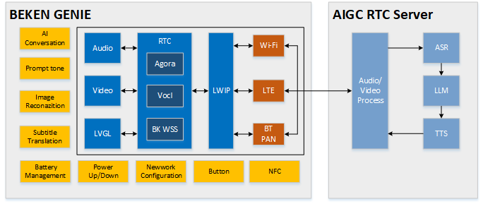

Beken Genie with Volcengine RTC
=================================

:link_to_translation:`zh_CN:[中文]`

**1. Overview**
---------------------------------

This project is based on an end-to-cloud and cloud-to-large-model design solution.

It supports dual-screen display, providing a visual and voice companionship experience along with emotional value.

The solution enables seamless edge-to-cloud integration, supporting various general-purpose large model designs that can directly connect with platforms like OpenAI, DouBao, and DeepSeek.

It effectively leverages cloud-based distributed deployment to reduce network latency and enhance interaction experience.

The solution supports edge-side AEC (Acoustic Echo Cancellation) and NS (Noise Suppression) audio processing algorithms, as well as G711/G722 codec formats. It also supports KWS (Keyword Spotting) wake-up functions and prompt tone playback functions.

The design includes reference solutions and demos for common peripherals, such as gyroscopes, NFC, buttons, vibration motors, Nand Flash, LED light effects, power management, DVP cameras, and dual QPSI screens.

**This project is powered by Volcengine RTC**

**1.1 Hardware Reference**
,,,,,,,,,,,,,,,,,,,,,,,,,,,,,,,,,

   * `AI Toy Dev Board SCH <https://docs.bekencorp.com/HW/BK7258/AIDK_AI%E7%8E%A9%E5%85%B7%E5%BC%80%E5%8F%91%E6%9D%BF_%E5%8E%9F%E7%90%86%E5%9B%BE.pdf>`_
   * `AI Toy Dev Board Bottom <https://docs.bekencorp.com/HW/BK7258/AIDK_AI%E7%8E%A9%E5%85%B7%E5%BC%80%E5%8F%91%E6%9D%BF_%E5%BA%95%E5%B1%82%E4%BD%8D%E5%8F%B7%E5%9B%BE.pdf>`_
   * `AI Toy Dev Board Top <https://docs.bekencorp.com/HW/BK7258/AIDK_AI%E7%8E%A9%E5%85%B7%E5%BC%80%E5%8F%91%E6%9D%BF_%E9%A1%B6%E5%B1%82%E4%BD%8D%E5%8F%B7%E5%9B%BE.pdf>`_

**1.2 Features**
,,,,,,,,,,,,,,,,,,,,,,,,,,,,,,,,,

    * Hardware:
        * SPI LCD X2 (GC9D01 160x160)
        * MIC
        * Speaker
        * SD NAND 128MB
        * NFC (MFRC522)
        * G-Sensor (SC7A20H)
        * PMU (ETA3422)
        * Battery
        * DVP (gc2145)

    * Software:
        * AEC
        * NS
        * ASR
        * WIFI Station
        * BLE
        * BT PAN

.. figure:: ../../../_static/beken_genie_pic.jpg
    :align: center
    :alt: Hardware Development Board
    :figclass: align-center

    Figure 1. Hardware Development Board

**1.3 Button**
,,,,,,,,,,,,,,,,,,,,,,,,,,,,,,,,,
There are three button on the lower right side of the board, corresponding to the silk screen markings S1, S2, and S3; and there is one button K1 on the right side.

    power on/off
        - 1.power on: Long press(>= 3 seconds) the button ``S2`` to power on.
        - 2.power off: When the system is in the powered - on state, long press(>= 3 seconds) the button ``S2`` to power off.

    Network Provisioning
        - 1.Network Provisioning: When the system is in the powered - on state, long press(>= 3 seconds) the button ``S1`` to enter the state of waiting for network configuration.

    Speaker volume control
        - 1.Increase the volume: Single - click the ``S1`` button to turn up the volume.
        - 2.Decrease the volume: Single - click the ``S3`` button to turn down the volume.

    restore to factory settings
        - 1.restore to factory settings: Long press the ``S3`` button to restore the device to its factory settings.

    reset button ``K1``
        - 1.Reset in shutdown state: Single - click the ``K1`` button to power on the system from the shutdown state.
        - 2.Reset in the powered-on state: Single - click the ``K1`` button, and the system will perform a hard restart while it is powered-on.

**1.4 LED**
,,,,,,,,,,,,,,,,,,,,,,,,,,,,,,,,,

The development board features red and green status indicator lights. Important information is indicated by red light blinking, general notifications by green light blinking,
and special reminders are signaled by alternating red and green light blinking. For reference code for LED effects development, see led_blink.c.

    Green light remains on or continuously off as an indicator
        - 1.When power is turned on, the green light remains on until the user performs an operation or the next event begins.
        - 2.When a conversation starts, the green light turns off.

    Blinking of red and green lights indicates specific information
        - 1.User network configuration: User is configuring the network.

    Green light blinking status information
        - 1.During power-on networking: Green light blink quickly.
        - 2.Large model server connection successful: Green light blink slowly.
        - 3.Conversation stopped: Green light blink slowly.

    Red light blinking status information
        - 1.Network configuration failed / network reconnection failed: Red light blink quickly.
        - 2.WEBRTC connection disconnected: Red light blink quickly.
        - 3.Large model server connection disconnected: Red light blink quickly.
        - 4.Battery level below 20%: Red light flashes slowly for 30 seconds and then automatically stops; if charging, the red light does not blink.
        - 5.No important reminder events: When there are no important reminder events, the red light is in an off state.

Please refer to led_blink.c to get more development guide.

**1.5 SD-NAND  Memory**
,,,,,,,,,,,,,,,,,,,,,,,,,,,,,,,,,
        - 1.The SD-NAND stores local resource files, such as image resource files on the display screen.
        - 2.The SD-NAND storage device defaults to using the FAT32 file system, allowing applications to indirectly invoke the open-source FATFS program interface through the VFS interface for file access.
        - 3.On the PC side, files on the SD-NAND can be accessed for reading and writing via the USB interface.(The USB port located on the left side of the development board.)
        - 4.Please note that files deleted on the PC side may still be in use by the local application, which can lead to system anomalies. It is essential to ensure that deleted files are no longer being accessed.

**1.6 Gsensor**
,,,,,,,,,,,,,,,,,,,,,,,,,,,,,,,,,
        - 1.Local G-sensor supports wake-up function. Users can wake up the system by shaking the development board in an S-shape trajectory.

**1.7 Charging management**
,,,,,,,,,,,,,,,,,,,,,,,,,,,,,,,,,
        - 1.The charging management chip model used in the current development board is ETA3422.
        - 2.When the battery is fully charged, the red light near the charging port will turn off, and the green light will turn on. The red light being on indicates that charging is in progress.
        - 3.Note: During the charging process or when an external power source is connected, the system switches to the external input voltage source for voltage detection instead of using the battery voltage. At this time, the voltage obtained through commands will be the external input voltage.
        - 4.Charging status monitoring depends on GPIO51 and GPIO26.
            - GPIO51 is responsible for detecting the charging status. When GPIO51 is high, there is an external power supply input; otherwise, there is none.
            - GPIO26 indicates whether the battery is charging. When GPIO26 is high, the battery is charging; when it is low, the battery is fully charged.
            - Note: This function requires confirming whether the R14 resistor is soldered on the hardware. If not, additional soldering is needed.
            - The specific hardware information is subject to the schematic diagram of the project.
        - 5.To enable the charging management function, configure CONFIG_BAT_MONITOR=y. To enable the test cases for charging management, configure CONFIG_BATTERY_TEST=y.
        - 6.After enabling the battery test commands, battery information can be obtained using the battery command:
            - "battery init" initializes the battery monitoring task.
            - "battery get_battery_info" retrieves basic battery information.
            - "battery get_voltage" checks the current battery voltage.
            - "battery get_level" checks the current battery level.
            - Note: When using the above commands, ensure that the system is not powered by an external power source; otherwise, the detected voltage will be the external power voltage.
            - For other specific commands, simply enter "battery" to print the supported commands. For further details, refer to the definitions in cli_battery.c.
        - 7.When the battery level is equal to or below 20%, a low battery warning event will be triggered:
            - The warning is triggered only when the device is not plugged in; it will not be triggered when connected to external power or charging.
            - The warning is sent only once per low-battery occurrence.
            - At this time, the red LED on the other side will blink slowly for 30 seconds.
        - 8.When charging, the charging management task will print "Device is charging...".
        - 9.When fully charged, it will print "Battery is full.".
        - 10.Although the battery has low-voltage protection, users are advised to charge the battery promptly when the battery is low to extend its lifespan.
        - 11.If users use batteries from other manufacturers, they need to modify the charge interpolation table (s_chargeLUT) and the battery information in iot_battery_open accordingly.
        - 12.In our SDK, we provide API functions for current, voltage, and battery level. Currently, the battery only supports voltage and battery level detection.
            - Note: Although the API interface for current detection is retained, it has not been implemented yet. If the user's device supports current detection, they need to implement the current detection API themselves.
        - 13.Since the hardware currently only supports battery level detection in a non-charging state, hardware modifications are needed to detect voltage during charging:
            - Removing the D6 diode and R21 resistor will enable voltage detection during charging.
        - 14.The USB port next to the button serves as both a charging port and a serial port for interaction.
        - 15.The ADC interface for power sampling is the ADC0 inside the chip, and there is no need to connect the resistor voltage divider circuit and add ADC channel acquisition externally. ADC0 is directly connected to the VBAT monitoring channel, which is a dedicated interface within the chip, and there is no external connection.
        - 16.Note: The maximum detection voltage of the battery is 4.35V. Above this voltage there is a risk of burning out the system.

**1.8 ASR**
,,,,,,,,,,,,,,,,,,,,,,,,,,,,,,,,,

    1. ``Hi Armino`` is used to wake up, enabling interaction between local and cloud AI, while the LCD lights up and displays eye animations.

        Response phrase: ``A Ha``

    2. ``byebye armino`` is used to turn off, enabling interaction between local and cloud AI, while closing the LCD and no longer displaying eye animations.

        Response phrase: ``Byebye``

**1.9 MOTOR**
,,,,,,,,,,,,,,,,,,,,,,,,,,,,,,,,,
        - 1.The LDO is connected to the positive terminal of the motor, while the PWM is connected to the negative terminal. The motor's vibration strength can be controlled by adjusting the duty cycle of the PWM signal.
        - 2.When the power is turned on by long-pressing the button, the motor will vibrate.
        - 3.Detailed usage examples for PWM can be found in cli_pwm.c.

**1.10 Prompt Tone**
,,,,,,,,,,,,,,,,,,,,,,,,,,,,,,,,,

    The development board plays corresponding prompt tones during operation based on different events. Below are the prompt tones associated with each event:

    Provision network Over Bluetooth LE
        - 1.Provision Network Over Bluetooth LE: ``Please use Bluetooth LE for network provision``
        - 2.Provision Network fail: ``Network provision over Bluetooth LE failed, please reprovision the network.``
        - 3.Provision Network success: ``Network provision over Bluetooth LE successed``

    Reconnect Network
        - 1.Connecting to Network: ``The network is connecting, please wait.``
        - 2.Reconnect Network fail: ``The network connection has failed, please check the network.``
        - 3.Reconnect Network success: ``The network connection successful.``

    Wake-Up and Shutdown
        - 1.Wake-Up: ``A Ha``
        - 2.Shutdown: ``Byebye``

    AI Entity
        - 1.AI Entity Connected Successfully: ``AI entity has been connected``
        - 2.AI Entity Disconnected: ``AI entity has been disconnected``

    Device Disconnection
        - 1.Device Disconnected: ``Device disconnected``

    Battery Level
        - 1.Low Battery: ``Battery level is low. Please charge.``

    More detail please refer to: :doc:`Aud_Intf API User Guide <../../api-reference/bk_aud_intf>`
    The default path for the prompt tone file resources: ``/projects/common_componets/resource/``

**1.11 Counter Down**
,,,,,,,,,,,,,,,,,,,,,,,,,,,,,,,,,
        - 1.The network configuration countdown is 5 minutes. If the network is not configured within 5 minutes, the chip will enter deep sleep mode(Shutdown).
        - 2.The network error countdown is 5 minutes. If a network error occurs and the network is not restored within 5 minutes, the chip will enter deep sleep mode.
        - 3.The standby state countdown is 3 minutes. After the system powers on, it defaults to standby mode. When you say ``byebye armino``, the system will also enter standby mode. If no other events occur, the chip will enter deep sleep mode after 3 minutes.
        - 4.You can modify the countdown time in the s_ticket_durations[COUNTDOWN_TICKET_MAX] array in countdown_app.c.

**1.12 Volcengene RTC**
,,,,,,,,,,,,,,,,,,,,,,,,,,,,,,,,,

Volcengene RTC reference doc: :doc:`../../thirdparty/volc/index`

**2. Demo Project Introducation**
---------------------------------

**2.1 Source code download & build**
,,,,,,,,,,,,,,,,,,,,,,,,,,,,,,,,,

    * `AIDK download <../../get-started/index.html#armino-aidk-sdk>`_

    * `Set Up SDK Build Environment <https://docs.bekencorp.com/arminodoc/bk_idk/bk7258/en/v2.0.1/get-started/index.html>`_

    * Program Code: ``make bk7258 PROJECT=volc_rtc``

        * Compile in the source code root directory
        * The project directory is located at ``<source code>/project/volc_rtc``

**2.2 APP Download and Register**
,,,,,,,,,,,,,,,,,,,,,,,,,,,,,,,,,

    APP download: https://docs.bekencorp.com/arminodoc/bk_app/app/en/v2.0.1/app_download/index.html
    Registration: use email

**2.3 Firmware Burning and Resource File Burning**
,,,,,,,,,,,,,,,,,,,,,,,,,,,,,,,,,

2.3.1 Firmware Burning
+++++++++++++++++++++++++++++++++
Please refer to below document for detail `Firmware Burning <https://docs.bekencorp.com/arminodoc/bk_idk/bk7258/en/v2.0.1/get-started/index.html>`_

.. note::

    The bin for burning is located at ``<source code>/build/volc_rtc/bk7258/all-app.bin``

2.3.2 Resource Copy
+++++++++++++++++++++++++++++++++

Copy video and audio files at ``<source code>/project/common_components/resource`` to SD-Nand。
More detail about SD-Nand please refer to `Guide for SD-Nand <../../api-reference/nand_disk_note.html>`_

2.3.3 Power Up
+++++++++++++++++++++++++++++++++

Power up system after burning。

**2.4 Network Provisioning**
,,,,,,,,,,,,,,,,,,,,,,,,,,,,,,,,,

2.4.1 Configuring the Network
+++++++++++++++++++++++++++++++++

    a)operate beken app as follow pictures:

    .. figure:: ../../../_static/add_device_en.png
        :scale: 30%

    .. figure:: ../../../_static/add_devcie_ai_toy_en.png
        :scale: 30%

    .. figure:: ../../../_static/device_info_en.png
        :scale: 30%

    b)long press Key 2 for 3s to enter network provisioning mode:

    .. figure:: ../../../_static/add_ai_device_8.png
        :scale: 70%

    c)click the device scan by smart phone

    .. figure:: ../../../_static/ble_scan_en.png
        :scale: 30%

    .. figure:: ../../../_static/select_model_en.png
        :scale: 30%

    .. figure:: ../../../_static/ai_activate_type_en.png
        :scale: 30%

    .. figure:: ../../../_static/wifi_select_en.png
        :scale: 30%

    .. figure:: ../../../_static/activating_en.png
        :scale: 30%

    .. figure:: ../../../_static/added_en.png
        :scale: 30%

2.4.1 Reconfiguring the Network
+++++++++++++++++++++++++++++++++

.. warning::

    Before reconfiguring the network, you need to remove the device from the original network configuration on your phone, and then repeat the steps in the previous chapter.

    To remove the device, follow these steps:

..

    a) Long press the indicated area, and a prompt box will pop up.

    .. figure:: ../../../_static/added_en.png
        :scale: 30%

    b) Click OK to complete the operation.

    .. figure:: ../../../_static/del_en.png
        :scale: 30%

.. note::

    For more APP operations, please refer to the APP documentation:

    https://docs.bekencorp.com/arminodoc/bk_app/app/en/v2.0.1/app_usage/app_usage_guide/index.html#ai

**2.5 AI Conversation**
,,,,,,,,,,,,,,,,,,,,,,,,,,,,,,,,,

    Say the wake-up word ``hi armino`` to the onboard mic, the device will play the prompt tone ``aha`` after waking up,
    and then you can have an AI conversation

    Say the key word ``byebye armino`` to the onboard mic, the device will play the prompt tone ``byebye`` after detecting it,
    then go to sleep and stop talking to the AI

**3.Development Guide**
---------------------------------

**3.1 Module Diagram**
,,,,,,,,,,,,,,,,,,,,,,,,,,,,,,,,,

    This AI demo solution is similar to the door lock solution,

    featuring two-way voice communication between the device and the AI large model,

     while the device also transmits images unidirectionally to the AI large model.

     In this solution, the counterpart APK on the other end in the door lock solution has been transformed into an AI Agent robot.

    The software module architecture is as shown in the figure below.

    Figure 3. software module architecture

..

   For voice interaction::

    * The device collects voice through the microphone.
    * The voice data is transmitted to Volc's servers using the Volc SDK.
    * Volc's servers handle communication with the AI Agent large model.
    * The server sends the voice to the AI Agent, receives a response, and forwards the voice response to the device's speaker for playback.

    For image processing::

    * The device captures image data.
    * Each frame of the image is sent to Volc's servers via the Volc SDK.
    * The server then transmits the image to the AI Agent large model for recognition.

**3.2 Network Provisioning and Communication**
,,,,,,,,,,,,,,,,,,,,,,,,,,,,,,,,,

.. figure:: ../../../_static/volc_demo_flow_sequence.png
    :align: center
    :alt: State Machine Overview
    :figclass: align-center

    Figure 4. Operation Flow Sequence

**3.3 AI Work state machine**
,,,,,,,,,,,,,,,,,,,,,,,,,,,,,,,,,

.. figure:: ../../../_static/bk_genie_statemachine.png
    :align: center
    :alt: State Machine Overview
    :figclass: align-center

    Figure 5. module state diagram

::

    1/2 Green light stays on.
    3/4 Green and red lights flash alternately
    5/6 Green light flashes quickly.
    7 Green light flashes quickly.
    8 LCD on, LED off.
    9 LCD off
    12/13 Red light flashes quickly

**3.4 Kconfig**
,,,,,,,,,,,,,,,,,,,,,,,,,,,,,,,,,

    To enable the Volc function library, the following configurations need to be enabled on cpu0:

    +----------------------------------------+----------------+---------------+----------------+
    |Kconfig                                 |   CPU          |   Format      |      Value     |
    +----------------------------------------+----------------+---------------+----------------+
    |CONFIG_VOLC_RTC_EN                      |   CPU0         |   bool        |        y       |
    +----------------------------------------+----------------+---------------+----------------+

    To enable Network Provisioning and start agent, the following configurations need to be enabled on cpu0:

    +----------------------------------------+----------------+---------------+----------------+
    |Kconfig                                 |   CPU          |   Format      |      Value     |
    +----------------------------------------+----------------+---------------+----------------+
    |CONFIG_BK_SMART_CONFIG                  |   CPU0         |   bool        |        y       |
    +----------------------------------------+----------------+---------------+----------------+

    To enable dual screen display and avi play function, the following configurations need to be enabled:

    +----------------------------------------+----------------+---------------+----------------+
    |Kconfig                                 |   CPU          |   Format      |      Value     |
    +----------------------------------------+----------------+---------------+----------------+
    |CONFIG_LCD_SPI_GC9D01                   |   CPU1         |   bool        |        y       |
    +----------------------------------------+----------------+---------------+----------------+
    |CONFIG_LCD_SPI_DEVICE_NUM               |   CPU1         |   int         |        2       |
    +----------------------------------------+----------------+---------------+----------------+
    |CONFIG_AVI_PLAY                         |   CPU1         |   bool        |        y       |
    +----------------------------------------+----------------+---------------+----------------+
    |CONFIG_DUAL_SCREEN_AVI_PLAY             |   CPU0 & CPU1  |   bool        |        y       |
    +----------------------------------------+----------------+---------------+----------------+
    |CONFIG_LVGL                             |   CPU1         |   bool        |        y       |
    +----------------------------------------+----------------+---------------+----------------+
    |CONFIG_LV_IMG_UTILITY_CUSTOMIZE         |   CPU1         |   bool        |        y       |
    +----------------------------------------+----------------+---------------+----------------+
    |CONFIG_LV_COLOR_DEPTH                   |   CPU1         |   int         |        16      |
    +----------------------------------------+----------------+---------------+----------------+
    |CONFIG_LV_COLOR_16_SWAP                 |   CPU1         |   bool        |        y       |
    +----------------------------------------+----------------+---------------+----------------+

**3.5 Button Development Description**
,,,,,,,,,,,,,,,,,,,,,,,,,,,,,,,,,,,,,,,,,,,,,,,,,,,,,,,,,,,,,,,,,,
GPIO Button Usage Instructions
    - To configure Button functions, refer to ``/projects/common_components/bk_key_app/key_app_config.h`` and  ``key_app_service.c``, developers can fill in the corresponding IO pins and keypad callback function events in this table.
    - The long press duration configuration is referenced in multi_button.h by the LONG_TICKS macro definition.
    - All Button events are currently executed in the task, and if the keypad event execution program is blocked or takes too long, it will affect the keypad response speed.

GPIO Button Precautions
    - Please confirm that the GPIO pins are only used for the keypad. If the same GPIO pin has multiple functions, it may cause a conflict, leading to keypad malfunction.
    - If the developer's board is different from the Bekken Genie development board, please reconfigure the GPIO according to the development board's hardware design. For GPIO usage methods, refer to ``bk_avdk/bk_idk/docs/bk7258/zh_CN/api-reference/peripheral/bk_gpio.rst``

**3.6 BLE Configuration and Agent Customization Guide**
,,,,,,,,,,,,,,,,,,,,,,,,,,,,,,,,,,,,,,,,,,,,,,,,,,,,,,,,,,,,,,,,,,

The BLE network configuration and agent-related code are mainly distributed in the  ``/projects/common_components/bk_boarding_service`` directory and the ``/projects/common_components/bk_smart_config`` directory, Customers can refer to the following instructions to customize their own scheme.

Core code:
 - To enter BLE network configuration mode, please refer to the implementation of  ``bk_sconf_prepare_for_smart_config(void)``
 - The mobile app interacts with the BLE configuration information, referencing the code ``bk_genie_message_handle(void)``
 - Send Agent configuration parameters to the mobile app, referencing the code ``bk_sconf_send_agent_info(char *payload, uint16_t max_len)``
 - Parse server startup Agent parameters, referencing the code ``bk_sconf_prase_agent_info(char *payload, uint8_t reset)``
 - Start Agent and RTC, referencing the code ``bk_sconf_wakeup_agent(uint8_t reset)``
 - After WiFi connection, start Agent, save WiFi and Agent information, and configure the network, referencing the code ``bk_sconf_netif_event_cb``
 - Functions for maintaining (saving to flash)/erasing/getting Agent information ``bk_sconf_erase_agent_info`` ``bk_sconf_save_agent_info`` ``bk_sconf_get_agent_info``
 - Press the key to switch between multiple modes, referencing the code ``ir_mode_switch_main``
 - Start the Volcano agent and device-side RTC, referencing the code ``bk_sconf_start_volc_rtc``. The reset parameter is used to notify the Beken server whether to force a switch back to the initial Agent configuration.

**3.7 Volcengine Related Function Development**
,,,,,,,,,,,,,,,,,,,,,,,,,,,,,,,,,
For Volcengine related function development, please refer to `Volcengine RTC Functions <../../thirdparty/volc/index.html#id6>`_

**4. Q&A**
---------------------------------

Q: Why doesn't the application layer report mic data?

A: Currently, beken_genie defaults to supporting command word-based voice wake-up functionality. Only after wake-up will it report the mic-collected data to the application layer, which then sends the data to AI for conversation. If the customer does not need voice wake-up functionality, they can disable this feature by defining the macro "CONFIG_AUD_INTF_SUPPORT_AI_DIALOG_FREE".

Q: Why UI resource display abnormally?

A: In this project, the UI resource used must be in AVI format, with a resolution of 320x160, and must be converted using an AVI conversion tool before they can be used. Please check if the UI resource meet the above requirements first.