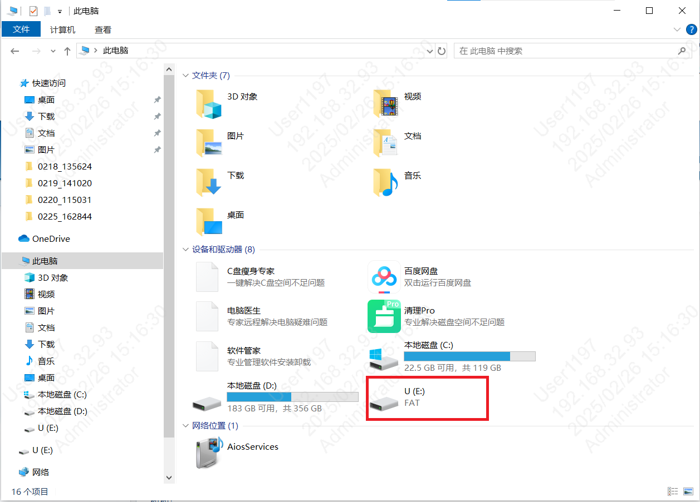
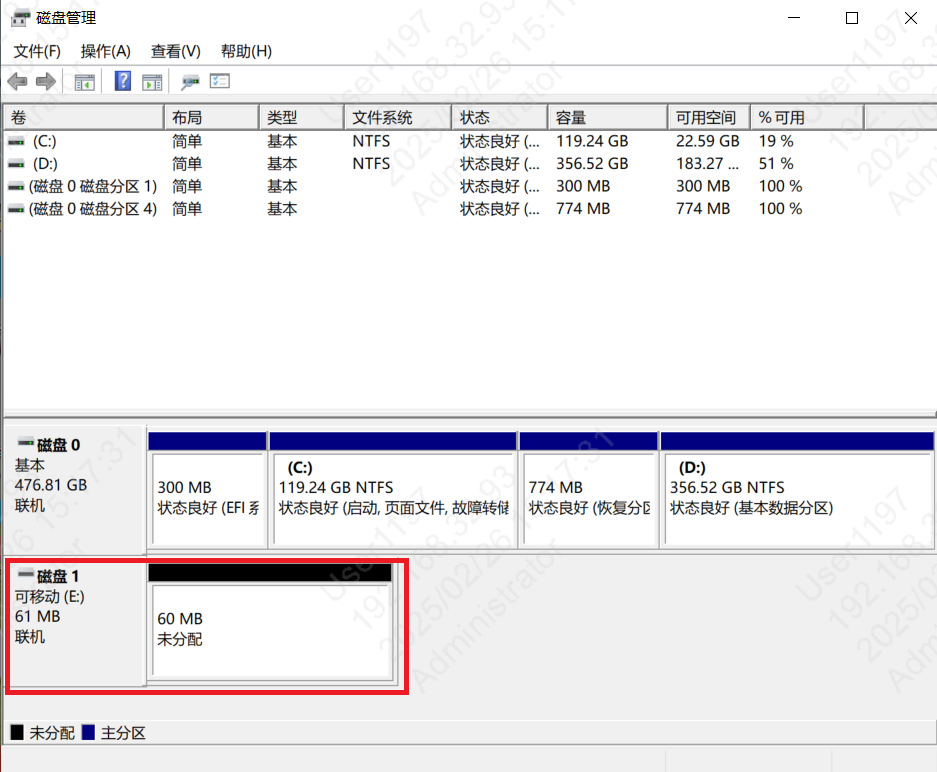
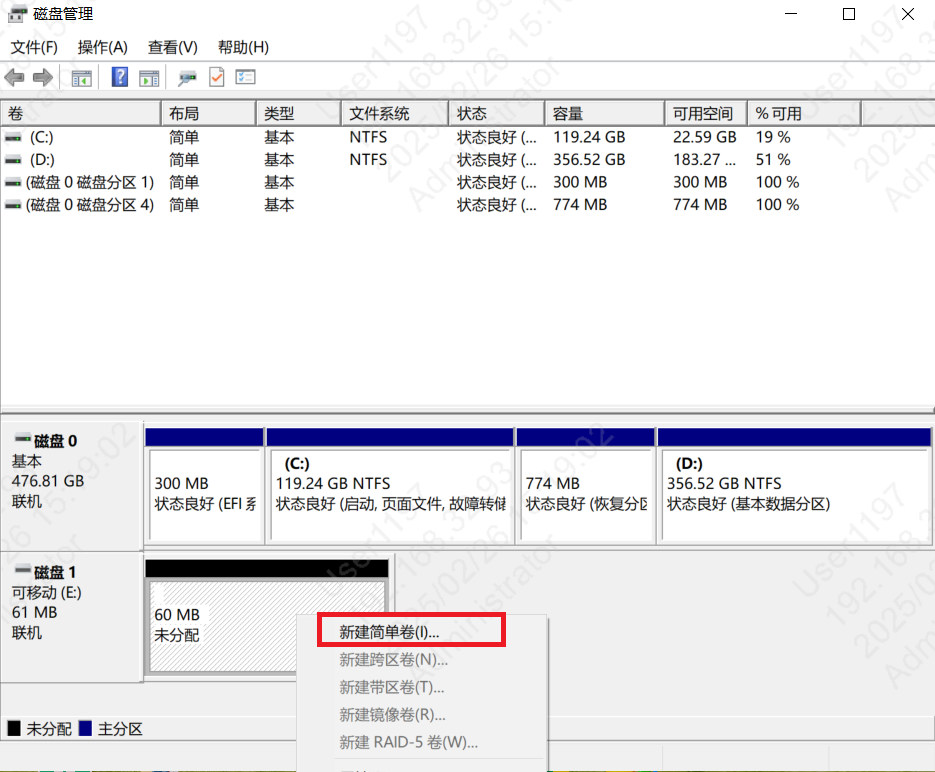
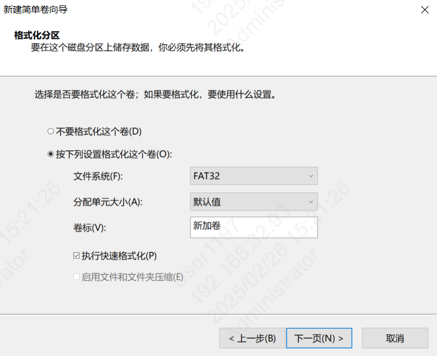
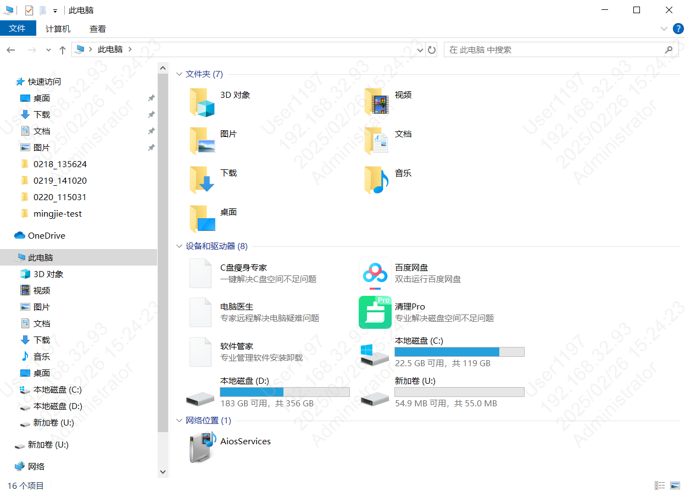

Nand磁盘使用注意事项
=======================

:link_to_translation:`en:[English]`

nand磁盘连接注意事项
---------------------------

当USB线通过Type-C线先连接开发板时，因Type-C线默认的USB DP/DN数据线检测设备时，此时板子的USB驱动未初始化，导致USB Host(计算机)无法直接与板子连接通信，可以在PC端设备管理器中再次刷新USB设备，识别出板子的U盘功能。

磁盘格式化注意事项
---------------------------

在windows平台上，第一次对nand磁盘进行格式化时，可能由于没有文件系统，没有办法直接格式化。在文件浏览器中只出现盘符，而无法格式化，如下图。

    nand disk not formatted

出现这种情况时，需要打开磁盘管理窗口，并找到nand磁盘，如下图。

    disk management windows

通过新建卷来进行格式化磁盘，文件系统格式选择FAT32，并设置盘符和分配单元大小。

    add disk for nand disk 

    set file system format for nand disk

之后再文件管理器中即可正常使用nand磁盘，如下图。

    normal nand disk
