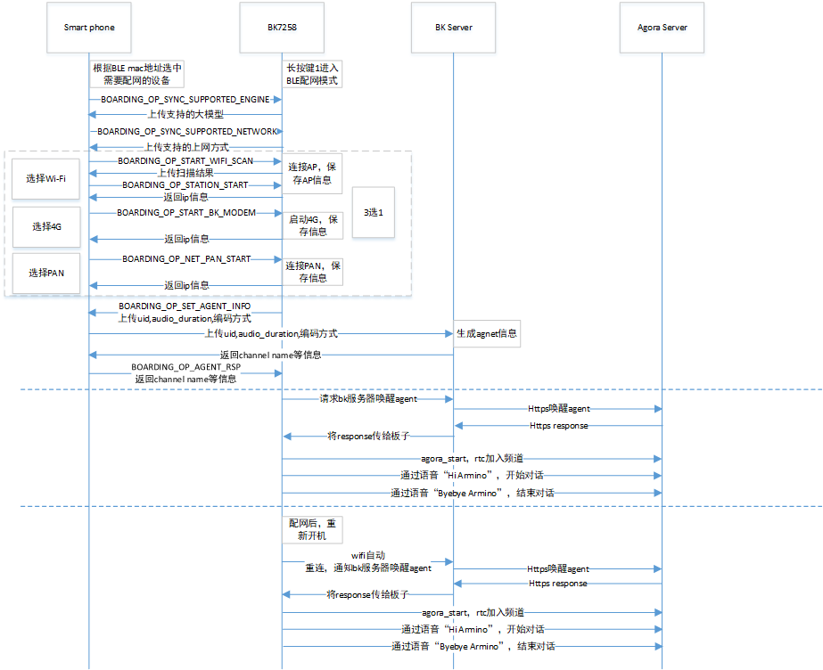

Beken Genie AI
=================================

:link_to_translation:`en:[English]`

1. 简介
---------------------------------

    本工程是基于，端对云，云对大模型的设计方案。

    支持双屏显示，提供视觉加语音的陪伴体验和情绪价值。

    支持端侧打通，各种通用大模型的设计方案，直接对接Open AI、豆包、DeepSeek等。

    并且能够有效，利用云的分布式部署，降低网络延迟，提高交互体验。

    支持端侧AEC，NS等音频处理算法，支持G711/G722编码格式，支持KWS关键字打断唤醒，支持提示音播放。

    包含常用外设的参考设计以及Demo，比如，陀螺仪，NFC，按键，震动马达，Nand Flash，LED灯效，充电管理，DVP camera，双QPSI屏。

1.1 硬件原理图
,,,,,,,,,,,,,,,,,,,,,,,,,,,,,,,,,

   * `AI玩具开发板 原理图 <https://docs.bekencorp.com/HW/BK7258/AIDK_AI%E7%8E%A9%E5%85%B7%E5%BC%80%E5%8F%91%E6%9D%BF_%E5%8E%9F%E7%90%86%E5%9B%BE.pdf>`_
   * `AI玩具开发板_底层位号图 <https://docs.bekencorp.com/HW/BK7258/AIDK_AI%E7%8E%A9%E5%85%B7%E5%BC%80%E5%8F%91%E6%9D%BF_%E5%BA%95%E5%B1%82%E4%BD%8D%E5%8F%B7%E5%9B%BE.pdf>`_
   * `AI玩具开发板_顶层位号图 <https://docs.bekencorp.com/HW/BK7258/AIDK_AI%E7%8E%A9%E5%85%B7%E5%BC%80%E5%8F%91%E6%9D%BF_%E9%A1%B6%E5%B1%82%E4%BD%8D%E5%8F%B7%E5%9B%BE.pdf>`_

1.2 规格
,,,,,,,,,,,,,,,,,,,,,,,,,,,,,,,,,

    * 硬件配置：
        * SPI LCD X2 (GC9D01 160x160)
        * 麦克
        * 喇叭
        * SD NAND 128MB
        * NFC (MFRC522)
        * 陀螺仪 (SC7A20H)
        * 充电管理芯片 (ETA3422)
        * 锂电池
        * DVP (gc2145)

    * 软件特性：
        * AEC
        * NS
        * G722 / G711u
        * 唤醒词定制
        * WIFI Station
        * BLE
        * BT PAN

.. figure:: ../../../_static/beken_genie_pic.jpg
    :align: center
    :alt: Hardware Development Board
    :figclass: align-center

    Figure 1. Hardware Development Board

1.3 按键
,,,,,,,,,,,,,,,,,,,,,,,,,,,,,,,,,
1.3.1 按键功能说明
+++++++++++++++++++++++++++++++++

开发板下边靠右三个按键，对应丝印S1,S2,S3;右边一个按键K1

    开关机
        - 1.开机：长按(>=3秒) ``S2`` 开机
        - 2.关机：当系统处于开机状态时，长按(>=3秒) ``S2`` 关机

    多模态切换
        - 1.当系统首次上电，默认使用大语言模型
        - 2.当系统处于唤醒状态，单击 ``S2`` 切换成图像识别大模型
        - 3.当系统处于唤醒状态，再次单击 ``S2`` 切换成大语言模型
        - 4.系统没有下电并处于唤醒状态，重复单击 ``S2`` ，重复步骤2和3

    配网
        - 1.配网：当系统处于开机状态时，长按(>=3秒) ``S1`` 进入等待配网状态

    喇叭音量控制
        - 1.调大音量：单击 ``S1`` 按钮调大音量
        - 2.调小音量：单击 ``S3`` 按钮调小音量

    恢复出厂设置
        - 1.恢复出厂设置：长按 ``S3`` 按钮恢复出厂设置

    复位按键K1
        - 1.关机状态复位：单击 ``K1`` 按钮，系统从关机状态开机
        - 2.开机状态复位：单击 ``K1`` 按钮，系统从开机状态硬重启

1.3.2 按键开发说明
+++++++++++++++++++++++++++++++++
    1.GPIO按键
        - 按键功能配置，参考projects/common_components/bk_key_app/key_app_config.h和key_app_service.c，开发者在该表中填写对应的IO管脚和按键对应的回调函数事件即可
        - 长按键时长配置参考multi_button.h中的LONG_TICKS宏定义
        - 当前所有的按键事件转到任务中执行，如果按键事件执行程序被阻塞或执行时间过长，会影响按键响应速度
    2.GPIO按键注意事项
        - 请确认GPIO管脚只供按键使用，否则同一个GPIO管脚功能冲突，会引起按键无效问题
        - 如果开发者开发板与beken_genie开发板不同，请根据开发板硬件设计重新配置GPIO。关于GPIO使用方法，请参考bk_avdk/bk_idk/docs/bk7258/zh_CN/api-reference/peripheral/bk_gpio.rst。

1.4 灯效
,,,,,,,,,,,,,,,,,,,,,,,,,,,,,,,,,
开发板上边有红绿两个状态指示灯，重要信息红灯闪烁，一般性提示绿灯闪烁，以及特殊性提醒红绿灯交替闪烁。
灯效开发参考代码led_blink.c。

    绿灯常亮/长灭提示信息
        - 1.开机时，绿灯长亮，等待用户操作或下一个事件开始
        - 2.对话开始，绿灯灭

    红绿灯交替闪烁提示信息
        - 1.用户配网：用户配网

    绿灯闪烁提示信息
        - 1.上电联网中：绿灯快闪
        - 2.大模型服务器连接成功：绿灯慢闪
        - 3.对话停止：绿灯慢闪

    红灯闪烁提示信息
        - 1.配网失败/网络重连失败：红灯快闪
        - 2.WEBRTC连接断开：红灯快闪
        - 3.大模型服务器连接断开：红灯快闪
        - 4.电池电量低于20%：红灯慢闪30秒后自动停止闪烁；如果充电中，则红灯不闪烁
        - 5.无重要提醒事件：当无重要提醒事件时，红灯处于关闭状态

1.5 SD-NAND存储器
,,,,,,,,,,,,,,,,,,,,,,,,,,,,,,,,,
        - 1.SD-NAND存放本地资源文件，比如显示屏上的图片资源文件
        - 2.SD-NAND存储器默认使用FAT32文件系统，供应用程序通过VFS接口间接调用FATFS开源程序接口访问文件
        - 3.PC端，通过USB接口，读写访问开发板SD-NAND文件(开发板左边USB接口)
        - 4.请注意PC端删除的文件，不要同时被本地应用程序使用，防止系统异常

1.6 陀螺仪-Gsensor
,,,,,,,,,,,,,,,,,,,,,,,,,,,,,,,,,
        - 1.本地Gsensor支持唤醒系统功能，用户可以S形轨迹晃动开发板，将系统唤醒

1.7 充电管理
,,,,,,,,,,,,,,,,,,,,,,,,,,,,,,,,,
        - 1.当前开发板使用充电管理芯片型号为 (ETA3422)
        - 2.充电满时，充电口边上的红灯会关闭，绿灯亮；红灯亮表示在充电
        - 3.注意：在充电过程中或者外部电源接入的情况下，系统切换至外部输入电压源进行电压检测，而非使用电池电压，此时用命令获取的电压为外部输入电压。
        - 4.充电状态监测取决于GPIO51和GPIO26。
            - GPIO51负责检测是否为充电状态，GPIO51为高时，存在外部供电输入，反之，则没有。
            - GPIO26为高时，则表示电池正在充电中。为低时，则表示电池已经充满电。
            - 注意：该功能需要确认硬件上R14电阻是否已经焊接，如无焊接，需额外焊接。
        - 5.使能充电管理功能需配置CONFIG_BAT_MONITOR=y，使能充电管理的测试用例需配置CONFIG_BATTERY_TEST=y。
        - 6.配置电池测试命令使能后，可以通过battery命令对电池的信息进行获取。
            - 比如“battery init”可以对电池监控任务进行初始化。
            - “battery get_battery_info”可以查看电池的基本信息。
            - “battery get_voltage”可以查看电池当前的电压值。
            - “battery get_level”可以查看电池当前的电量。
            - 如上命令使用时，需注意是否为外部电源供电情况下，否则检测电压信息为外部供电电压。
            - 具体其他命令，可以只发送“battery”，打印相关命令支持。更进一步信息，可参考cli_battery.c中的定义。
        - 7.当电量等于或小于20%时，会发送低电量告警事件。
            - 只有不插电的时候会触发，外部供电或者充电时，不会发送低电量告警。
            - 每次进入低电量状态时，只会发送一次。
            - 此时，另一侧的红灯慢闪30s。
        - 8.充电管理任务在充电时，会打印“Device is charging...”信息。
        - 9.在充满电时，会打印“Battery is full.”信息。
        - 10.尽管电池存在低压保护功能，但建议用户在低电量的时候及时充电，可延长电池的寿命。
        - 11.用户如果使用其他厂家的电池，需要根据具体电池的信息修改电量插值表s_chargeLUT以及iot_battery_open中电池基本信息的内容。
        - 12.在我们的SDK中，我们提供了电流、电压和电量的API函数。目前，电池仅支持电压和电量的检测功能。需要注意的是，电流检测的API接口虽然已保留，但目前尚未实现，因此如果用户的设备支持电流检测，需要自行对电流的API进行实现。
        - 13.由于目前硬件仅支持非充电状态下的电量检测，若用户需要充电期间检测电压，硬件上需要进行改造。
            - 仅去除D6二极管和R21电阻即可。
        - 14 按键旁边的USB口既是充电口又是串口。
        - 15.电量采样的ADC接口为芯片内部的ADC0，外部不需要接电阻分压电路再加ADC通道采集。ADC0与VBAT监控通道直连，该接口为芯片内部专用接口，没有外部连线。
        - 16.注意：电池最高检测电压为4.35V。高于该电压存在烧坏系统的风险。

1.8 唤醒词
,,,,,,,,,,,,,,,,,,,,,,,,,,,,,,,,,

    1. ``hi armino`` 或 ``嗨阿米诺`` 用于唤醒，本地端侧和云端AI互动，同时LCD亮起，展示眼睛动画。

        响应词为 ``A Ha``

    2. ``byebye armino`` 或 ``拜拜阿米诺`` 用于关闭，本地端侧和云端AI互动，同时关闭LCD，眼睛动画不再展示。

        响应词为 ``Byebye``

1.9 马达
,,,,,,,,,,,,,,,,,,,,,,,,,,,,,,,,,
        - 1.LDO连接马达的正极，PWM连接马达的负极，通过调节PWM的占空比来控制马达的振动强度。
        - 2.通过长按按键开机时，马达会振动。
        - 3.PWM详细使用例程见cli_pwm.c。

1.10 提示音
,,,,,,,,,,,,,,,,,,,,,,,,,,,,,,,,,
1.10.1 提示音功能说明
+++++++++++++++++++++++++++++++++

开发板工作过程中会根据事件播放对应提示音，事件对应的提示音内容如下：

    蓝牙配网：
        - 1.开始蓝牙配网： ``请使用蓝牙配网``
        - 2.蓝牙配网： ``蓝牙配网失败，请重新配网。``
        - 3.蓝牙配网成功： ``蓝牙配网成功``

    连网
        - 1.连网中： ``网络连接中，请稍后。``
        - 2.连网失败： ``网络连接失败，请检查网络。``
        - 3.连网成功： ``网络连接成功``

    唤醒和关闭
        - 1.唤醒： ``A Ha``
        - 2.关闭： ``Byebye``

    AI智能体
        - 1.AI智能体连接成功： ``AI智能体已连接``
        - 2.AI智能体断开连接： ``AI智能体已断开``

    设备断连
        - 1.设备断开连接： ``设备断开连接``

    电池电量
        - 1.电池低电量： ``电池电量低，请充电。``

1.10.2 提示音开发指南
+++++++++++++++++++++++++++++++++

    请参考文档：`音频组件开发指南 <../../api-reference/bk_aud_intf.html>`_

    默认提示音文件资源路径：``<source code>/projects/common_components/resource/``

1.11 倒计时
,,,,,,,,,,,,,,,,,,,,,,,,,,,,,,,,,
        - 1.配网事件倒计时为五分钟，五分钟未配网，则芯片会进入深度睡眠(类似于关机)。
        - 2.网络错误倒计时为五分钟，若发生网络错误，五分钟内网络未恢复，则芯片会进入深度睡眠。
        - 3.待机状态倒计时为三分钟，系统上电后默认状态为待机状态，当您喊 ``byebye armino`` 或 ``拜拜阿米诺`` 之后，系统也会处于待机状态，若无其他事件发生，三分钟后芯片会进入深度睡眠。
        - 4.您可以在countdown_app.c的s_ticket_durations[COUNTDOWN_TICKET_MAX]数组里修改倒计时时间。

2. 开发指南
---------------------------------

2.1 模块架构图
,,,,,,,,,,,,,,,,,,,,,,,,,,,,,,,,,

    此AI demo方案和门锁方案类似，设备端和和AI大模型端双向语音通话，同时设备端向AI大模型端单向图传，门锁方案中的对端apk变为了AI Agent机器人。
	软件模块架构如下图所示：

.. figure:: ../../../_static/agora_wanson_ai_arch.png
    :align: center
    :alt: module architecture Overview
    :figclass: align-center

    Figure 3. software module architecture

..

    * 方案中，设备端采集mic语音，通过agora sdk将语音数据发送至声网服务器，声网服务器负责和AI Agent大模型的交互，将mic语音发送至AI Agent并获取回复，再将语音回复发送至设备端喇叭播放。
    * 方案中，设备端采集图像，通过agora sdk将每帧图像发送至声网服务器，声网服务器再将图像送至AI Agent大模型进行识别。

2.2 配网及对话时序图
,,,,,,,,,,,,,,,,,,,,,,,,,,,,,,,,,

    Figure 4. Operation Flow Sequence

2.3 工作状态机
,,,,,,,,,,,,,,,,,,,,,,,,,,,,,,,,,

.. figure:: ../../../_static/bk_genie_statemachine.png
    :align: center
    :alt: State Machine Overview
    :figclass: align-center

    Figure 5. module state diagram

::

    1/2 Green light stays on.
    3/4 Green and red lights flash alternately
    5/6 Green light flashes quickly.
    7 Green light flashes quickly.
    8 LCD on, LED off.
    9 LCD off
    12/13 Red light flashes quickly

2.4 主要配置
,,,,,,,,,,,,,,,,,,,,,,,,,,,,,,,,,

    打开声网功能库需要在 ``cpu0`` 上打开以下配置:

    +----------------------------------------+----------------+---------------+----------------+
    |Kconfig                                 |   CPU          |   Format      |      Value     |
    +----------------------------------------+----------------+---------------+----------------+
    |CONFIG_AGORA_IOT_SDK                    |   CPU0         |   bool        |        y       |
    +----------------------------------------+----------------+---------------+----------------+

    打开Beken配网及agent启动需要在 ``cpu0`` 上打开以下配置:

    +----------------------------------------+----------------+---------------+----------------+
    |Kconfig                                 |   CPU          |   Format      |      Value     |
    +----------------------------------------+----------------+---------------+----------------+
    |CONFIG_BK_SMART_CONFIG                  |   CPU0         |   bool        |        y       |
    +----------------------------------------+----------------+---------------+----------------+

    打开双屏显示及AVI播放需要打开以下配置:

    +----------------------------------------+----------------+---------------+----------------+
    |Kconfig                                 |   CPU          |   Format      |      Value     |
    +----------------------------------------+----------------+---------------+----------------+
    |CONFIG_LCD_SPI_GC9D01                   |   CPU1         |   bool        |        y       |
    +----------------------------------------+----------------+---------------+----------------+
    |CONFIG_LCD_SPI_DEVICE_NUM               |   CPU1         |   int         |        2       |
    +----------------------------------------+----------------+---------------+----------------+
    |CONFIG_AVI_PLAY                         |   CPU1         |   bool        |        y       |
    +----------------------------------------+----------------+---------------+----------------+
    |CONFIG_DUAL_SCREEN_AVI_PLAY             |   CPU0 & CPU1  |   bool        |        y       |
    +----------------------------------------+----------------+---------------+----------------+
    |CONFIG_LVGL                             |   CPU1         |   bool        |        y       |
    +----------------------------------------+----------------+---------------+----------------+
    |CONFIG_LV_IMG_UTILITY_CUSTOMIZE         |   CPU1         |   bool        |        y       |
    +----------------------------------------+----------------+---------------+----------------+
    |CONFIG_LV_COLOR_DEPTH                   |   CPU1         |   int         |        16      |
    +----------------------------------------+----------------+---------------+----------------+
    |CONFIG_LV_COLOR_16_SWAP                 |   CPU1         |   bool        |        y       |
    +----------------------------------------+----------------+---------------+----------------+

2.5 BLE配网及agent定制指南
,,,,,,,,,,,,,,,,,,,,,,,,,,,,,,,,,

 BLE配网及agent相关代码主要分布在projects/common_components/bk_boarding_service目录及projects/common_components/bk_smart_config目录，客户可以参考如下说明定制自己的方案

1、bk_sconf_prepare_for_smart_config 进入BLE配网模式

.. code::

    void bk_sconf_prepare_for_smart_config(void)
    {
        smart_config_running = true;
        first_time_for_network_reconnect = true;
    #if CONFIG_STA_AUTO_RECONNECT
        first_time_for_network_provisioning = true;
    #endif
        app_event_send_msg(APP_EVT_NETWORK_PROVISIONING, 0);//进入配网模式红绿交替闪灯提示
        network_reconnect_stop_timeout_check();             //关闭重连超时检测
        bk_sconf_trans_stop();                              //关闭设备端rtc及多媒体服务
        bk_wifi_sta_stop();                                 //关闭wifi
    #if CONFIG_BK_MODEM
    extern bk_err_t bk_modem_deinit(void);
      bk_modem_deinit();                                    //若使能4G模块，关闭4G模块
    #endif
    #if !CONFIG_STA_AUTO_RECONNECT                          //CONFIG_STA_AUTO_RECONNECT默认关闭，使用beken重连策略
        demo_erase_network_auto_reconnect_info();           //默认版本进入配网模式不会擦除配网信息
        bk_sconf_erase_agent_info();                        //默认版本进入配网模式不会擦除agent信息
    #endif

    #if CONFIG_NET_PAN && !CONFIG_A2DP_SINK_DEMO && !CONFIG_HFP_HF_DEMO
        bk_bt_enter_pairing_mode(0);                        //BT恢复到初始状态
    #else
        BK_LOGW(TAG, "%s pan disable !!!\n", __func__);
    #endif
    extern bool ate_is_enabled(void);

        if (!ate_is_enabled())
        {
            bk_genie_boarding_init();                       //BLE配网初始化
            wifi_boarding_adv_start();                      //BLE开启广播，进入配网模式
        }
        ......
    }

2、bk_genie_message_handle负责和手机app通过BLE交互配网信息，如下代码客户可disable，使用自己的方案

.. code::

    static void bk_genie_message_handle(void)
    {
            ……
        case DBEVT_START_AGORA_AGENT_START:
        {
            LOGI("DBEVT_START_AGORA_AGENT_START\n");
            char payload[256] = {0};
            __maybe_unused uint16_t len = 0;
            //上传module uid等信息到beken服务器，若客户自行搭建服务器，可以不用这段代码，也可以参照本小节3修改bk_sconf_send_agent_info实现
            len = bk_sconf_send_agent_info(payload, 256);
            bk_genie_boarding_event_notify_with_data(BOARDING_OP_SET_AGENT_INFO, 0, payload, len);
        }
        break;
        case DBEVT_START_AGORA_AGENT_RSP:
        {
            LOGI("DBEVT_START_AGORA_AGENT_RSP\n");
            //接收beken服务器服务器分配的channel name等信息，若客户自行搭建服务器，可以不用这段代码，也可以参照本小节4修改bk_sconf_prase_agent_info实现
            bk_sconf_prase_agent_info((char *)msg.param, 1);
        }
        break;
            ……
    }

3、bk_sconf_send_agent_info负责在配网阶段将agent配置参数发送给APK
  代码路径：projects/common_components/bk_smart_config/src/adapter/agora/bk_smart_config_agora_adapter.c

.. code::

    uint16_t bk_sconf_send_agent_info(char *payload, uint16_t max_len)
    {
        unsigned char uid[32] = {0};
        char uid_str[65] = {0};
        uint16 len = 0;

        bk_uid_get_data(uid);
        for (int i = 0; i < 24; i++)
        {
            sprintf(uid_str + i * 2, "%02x", uid[i]);
        }
        //如下参数是beken服务器启动agent时，需要动态配置的，客户可以根据自己方案定制成自己的
        len = os_snprintf(payload, max_len, "{\"channel\":\"%s\",\"agent_param\": {", uid_str);
    #if CONFIG_AUDIO_FRAME_DURATION_MS
        len += os_snprintf(payload+len, max_len, "\"audio_duration\": %d,", CONFIG_AUDIO_FRAME_DURATION_MS);
    #endif
    #if CONFIG_AUD_INTF_SUPPORT_OPUS
        len += os_snprintf(payload+len, max_len, "\"out_acodec\": \"OPUS\"");
    #else
        len += os_snprintf(payload+len, max_len, "\"out_acodec\": \"G722\"");
    #endif
        len += os_snprintf(payload+len, max_len, "}}");
        BK_LOGI(TAG, "ori channel name:%s, %s, %d\r\n", uid_str, payload, len);
        return len;
    }

4、bk_sconf_prase_agent_info负责在配网阶段解析服务器启动agent后的返回参数（如app_id, channel_name等），用于启动设备端RTC
  代码路径：projects/common_components/bk_smart_config/src/adapter/agora/bk_smart_config_agora_adapter.c

.. code::

    void  bk_sconf_prase_agent_info(char *payload, uint8_t reset)
    {
        ......
        //解析app_id及channel_name
        cJSON *app_id = cJSON_GetObjectItem(json, "app_id");
        if (app_id && ((app_id->type & 0xFF) == cJSON_String))
        {
           app_id_record = os_strdup(app_id->valuestring);
        }
        else
        {
            BK_LOGE(TAG, "[Error] not find msg\n");
        }

        cJSON *channel_name = cJSON_GetObjectItem(json, "channel_name");
        if (channel_name && ((channel_name->type & 0xFF) == cJSON_String))
        {
            channel_name_record = os_strdup(channel_name->valuestring);
            BK_LOGI(TAG, "real channel name:%s\r\n", channel_name_record);
        }
        ......
        if (app_id_record && channel_name_record)
        {
            //保存到easy flash缓存
            bk_sconf_save_agent_info(app_id_record, channel_name_record);
            BK_LOGI(TAG, "begin agora_auto_run\n");
            //强制更新到easy flash
            ret = bk_config_sync_flash_safely();
            if (ret)
                BK_LOGE(TAG, "sync flash fail!!!\r\n");
            //启动声网agent及设备端rtc等
            agora_auto_run(reset);
            ......
    }

5、bk_sconf_wakeup_agent负责Agent启动，beken支持服务器端起agent（客户定制需要自己搭建服务器）以及在开发板起agent两种方案，默认使用在服务器起

.. code::

    int bk_sconf_wakeup_agent(void)
    {
    #if CONFIG_BK_DEV_STARTUP_AGENT
        agora_ai_agent_start_conf_t agent_conf = BK_AGORA_AGENT_DEFAULT_CONFIG();
        __maybe_unused agent_type_t agent_type = DOUBAO_AGENT;
        unsigned char uid[32] = {0};
        char uid_str[65] = {0}, chan_name[65] = {0};
        int chan_len;

        //beken方案agent channel name是根据大模型名称及设备uid生成，客户可选择改成自己方案
        bk_uid_get_data(uid);
        for (int i = 0; i < 24; i++)
        {
            sprintf(uid_str + i * 2, "%02x", uid[i]);
        }
        if (agent_type == OPEN_AI_AGENT)
            chan_len = os_snprintf(chan_name, 65, "Openai_%s", uid_str);
        else
            chan_len = os_snprintf(chan_name, 65, "Doubao_%s", uid_str);
        agent_conf.channel = os_zalloc(chan_len+1);
        os_strcpy(agent_conf.channel, chan_name);
        //客户需要在CUSTOM_LLM_DEFAULT_OPENAI_TOKEN/CUSTOM_LLM_DEFAULT_DOUBAO_TOKEN填写自己的token
        agent_conf.custom_llm = custom_llm_default_conf(agent_type);
        //客户需要在AGORA_DEBUG_APPID填写自己的声网APPID，在AGORA_DEBUG_AUTH填写自己的声网restful key，声网token按需填写
        //在tts_str_openai/tts_str_doubao填写自己的tts key
        bk_agora_ai_agent_start(&agent_conf, agent_type);
        ......
    #else
        struct webclient_session *session = NULL;
        char *buffer = NULL, *post_data = NULL;
        char generate_url[256] = {0};
        int url_len = 0, data_len = 0, bytes_read = 0, resp_status = 0, ret = 0;
        uint32_t rand_flag = 0;

        /* create webclient session and set header response size */
        session = webclient_session_create(SEND_HEADER_SIZE);
        if (session == NULL)
        {
            ret = -1;
            goto __exit;
        }
        //客户若使用自己的服务器，需要将bk_get_bk_server_url()替换成自己的服务器URL字符串
        //定义#define BK_CUSTOMER_SERVER_URL "xxx"
        //例如url_len = os_snprintf(generate_url, MAX_URL_LEN, "%s", BK_CUSTOMER_SERVER_URL);
        url_len = os_snprintf(generate_url, MAX_URL_LEN, "%s/activate_agent/", bk_get_bk_server_url());
        if ((url_len < 0) || (url_len >= MAX_URL_LEN))
        {
            BK_LOGE(TAG, "URL len overflow\r\n");
            ret = -1;
            return ret;
        }
        ......
        //生成post请求，客户可以定义自己的json消息格式
        data_len = os_snprintf(post_data, POST_DATA_MAX_SIZE, "{\"channel\":\"%s\",", channel_name_record);
        data_len += os_snprintf(post_data+data_len, POST_DATA_MAX_SIZE, "\"reset\":%u,\"agent_param\": {", reset);
    #if CONFIG_AUDIO_FRAME_DURATION_MS
        data_len += os_snprintf(post_data+data_len, POST_DATA_MAX_SIZE, "\"audio_duration\": %d,", CONFIG_AUDIO_FRAME_DURATION_MS);
    #endif
    #if CONFIG_AUD_INTF_SUPPORT_OPUS
        data_len += os_snprintf(post_data+data_len, POST_DATA_MAX_SIZE, "\"out_acodec\": \"OPUS\"");
    #else
        data_len += os_snprintf(post_data+data_len, POST_DATA_MAX_SIZE, "\"out_acodec\": \"G722\"");
    #endif
        rand_flag = bk_rand();
        data_len += os_snprintf(post_data+data_len, POST_DATA_MAX_SIZE, "},\"rand_flag\":\"%u\"}", rand_flag);
        BK_LOGI(TAG, "%s, %s\r\n", __func__, post_data);
        ......
        //客户若使用自己的服务器，需要自行实现这个函数或者注释掉
        ret = bk_sconf_rsp_parse_update(buffer);
    }

6、bk_sconf_netif_event_cb负责wifi连上后启动agent、保存wifi及agent信息及配网后，agent唤醒，客户可替换成自己方案

7、bk_sconf_erase_agent_info、bk_sconf_save_agent_info、bk_sconf_get_agent_info均是beken agent后台维护方案，客户可替换成自己方案

8、ir_mode_switch_main负责切换多模态，客户定制需要自行实现bk_sconf_upate_agent_info函数，或者参考beken方案，将服务器连接bk_get_bk_server_url()替换成自己的服务器地址

.. code::

    void ir_mode_switch_main(void)
    {
        if (!agora_runing) {
            BK_LOGW(TAG, "Please Run AgoraRTC First!");
            goto exit;
        }

        ir_mode_switching = 1;

        if (!video_started) {
            //切换到图像识别大模型
            bk_sconf_upate_agent_info("text_and_image");
            while (g_agent_offline)
            {
                if (!agora_runing)
                {
                    goto exit;
                }
                rtos_delay_milliseconds(100);
            }
            //打开摄像头
            video_turn_on();

    #if (CONFIG_DUAL_SCREEN_AVI_PLAY)
            if (lvgl_app_init_flag == 1) {
                media_app_lvgl_switch_ui(LVGL_UI_DISP_IN_TEXT_AND_IMAGE);
            }
    #endif
        } else {
            //关闭摄像头
            video_turn_off();
            //切换回大语言模型
            bk_sconf_upate_agent_info("text");

    #if (CONFIG_DUAL_SCREEN_AVI_PLAY)
            if (lvgl_app_init_flag == 1) {
                media_app_lvgl_switch_ui(LVGL_UI_DISP_IN_TEXT);
            }
    #endif
        }

    exit:
        config_ir_mode_switch_thread_handle = NULL;
        ir_mode_switching = 0;
        rtos_delete_thread(NULL);
    }

9、bk_sconf_start_agora_rtc负责启动声网agent及设备端rtc，reset参数用来通知beken服务器是否强制切回初始agent配置

3. 用例演示
--------------------------------

3.1 代码下载及编译
,,,,,,,,,,,,,,,,,,,,,,,,,,,,,,,,,

    * `AIDK 代码下载 <../../get-started/index.html#armino-aidk-sdk>`_

    * `SDK 构建环境搭建 <https://docs.bekencorp.com/arminodoc/bk_idk/bk7258/zh_CN/v2.0.1/get-started/index.html>`_

    * 代码编译: ``make bk7258 PROJECT=beken_genie``

        * 在源代码根目录下编译
        * 工程目录位于``<source code>/project/beken_genie``

    * `代码烧录 <https://docs.bekencorp.com/arminodoc/bk_idk/bk7258/zh_CN/v2.0.1/get-started/index.html>`_

        * 烧录的二进制文件位于``<source code>/build/beken_genie/bk7258/all-app.bin``

3.2 UI资源替换
,,,,,,,,,,,,,,,,,,,,,,,,,,,,,,,,,

    - 1、将要使用的avi视频文件通过SDK中的 ``<bk_aidk源代码路径>/bk_avdk/components/multimedia/tools/aviconvert/bk_avi.7z`` 转换工具进行格式转换，具体使用方法可参考工具中的readme.txt说明

    - 2、将转换后的文件重新放进SD NAND中，并修改为只包含英文或数字的名称

    - 3、修改 ``<bk_aidk源代码路径>/project/common_components/dual_screen_avi_play/lvgl_ui.c`` 文件中传入函数 ``bk_avi_play_open()`` 的文件名。

3.3 多个UI资源切换
,,,,,,,,,,,,,,,,,,,,,,,,,,,,,,,,,

    - 1、按照章节3.2中的说明，对AVI视频文件进行转换并放入到SD NAND中；

    - 2、调用函数 ``bk_avi_play_stop()`` 和函数 ``bk_avi_play_close()`` 停止播放avi文件；

    - 3、重新调用函数 ``bk_avi_play_open()`` 打开新的avi文件；

    - 4、调用函数 ``bk_avi_play_start()`` 开始播放新的avi文件；

3.4 APP注册和下载
,,,,,,,,,,,,,,,,,,,,,,,,,,,,,,,,,

    APP下载：https://docs.bekencorp.com/arminodoc/bk_app/app/zh_CN/v2.0.1/app_download/index.html

    注册登录：使用邮箱注册登录

3.5 固件烧录和资源文件烧录
,,,,,,,,,,,,,,,,,,,,,,,,,,,,,,,,,

    - 1、将要播放的avi视频文件存放到SD NAND中，SD NAND具体使用方法可参考 `Nand磁盘使用注意事项 <../../api-reference/nand_disk_note.html>`_

    - 2、将SDK中的 ``<bk_aidk源代码路径>/project/beken_genie/main/resource/genie_eye.avi`` 文件存放到SD NAND中

    - 3、烧录编译好的all-app.bin文件并上电执行即可。

3.6 操作步骤
,,,,,,,,,,,,,,,,,,,,,,,,,,,,,,,,,

3.6.1 Beken App配网方式
+++++++++++++++++++++++++++++++++

    a)手机进入如下界面，按照图片步骤操作

    .. figure:: ../../../_static/add_device_zh.png
        :scale: 30%

    .. figure:: ../../../_static/add_devcie_ai_toy_zh.png
        :scale: 30%

    .. figure:: ../../../_static/device_info_zh.png
        :scale: 30%

    b)手机开始BLE扫描后，长按下图配网键3s，板子进入配网模式

    .. figure:: ../../../_static/add_ai_device_8.png
        :scale: 70%

    c)手机端扫到如下设备，点击设备开始配网

    .. figure:: ../../../_static/ble_scan_zh.png
        :scale: 30%

    .. figure:: ../../../_static/select_model_zh.png
        :scale: 30%

    .. figure:: ../../../_static/ai_activate_type_zh.png
        :scale: 30%

    .. figure:: ../../../_static/wifi_select_zh.png
        :scale: 30%

    .. figure:: ../../../_static/activating_zh.png
        :scale: 30%

    .. figure:: ../../../_static/added_zh.png
        :scale: 30%

    d)对板载mic说唤醒词 ``hi armino`` 或 ``嗨阿米诺``，设备唤醒后会播放提示音 ``啊哈`` ，然后可以进行AI对话

      对板载mic说关键词词 ``byebye armino`` 或 ``拜拜阿米诺``，设备检测到后会播放提示音 ``byebye`` ，然后进入睡眠，停止与AI的对话

3.6.2 重新配网
+++++++++++++++++++++++++++++++++

.. warning::

    重新配网之前，需要原来的配网的手机上，把设备移除，然后再重复上述章节的操作。

    移除设备方法如下：

..

    a)长按图示区域，会弹出提示框。

    .. figure:: ../../../_static/added_zh.png
        :scale: 30%

    b)点击确认，完成操作。

    .. figure:: ../../../_static/del_zh.png
        :scale: 30%

.. note::

    更多APP操作，请参考APP文档：

    https://docs.bekencorp.com/arminodoc/bk_app/app/zh_CN/v2.0.1/app_usage/app_usage_guide/index.html#ai

..

4. 调试命令
---------------------------------
.. warning::

    调试命令章节，阅读须知：

    调试命令，仅适合对代码有一定理解的开发人员使用。

    如果对代码和流程不熟悉，建议先按照以下演示步骤，熟悉和理解代码后，再酌情考虑。

..

4.1 命令列表:
,,,,,,,,,,,,,,,,,,,,,,,,,,,,,,,,,

    +-------------------------------------------------------+-------------------------------------+
    |Command                                                |Description                          |
    +-------------------------------------------------------+-------------------------------------+
    |agora_test {start|stop appid video_en channel_name}    | 语音通话+识图                       |
    +-------------------------------------------------------+-------------------------------------+

4.2 Start命令
,,,,,,,,,,,,,,,,,,,,,,,,,,,,,,,,,

    +----------------+--------+-------------------------------------------------+
    |agora_test      |  必填  | 命令                                            |
    +----------------+--------+-------------------------------------------------+
    |start           |  必填  | 参数，使能连接RTC Channel                       |
    +----------------+--------+-------------------------------------------------+
    |appid           |  必填  | 参数，声网的APPID                               |
    +----------------+--------+-------------------------------------------------+
    |video_en        |  必填  | 参数，识图功能开关:                             |
    |                |        |   - 1: ``打开``                                 |
    |                |        |   - 0: ``关闭``                                 |
    +----------------+--------+-------------------------------------------------+
    |channel_name    |  必填  | 参数，频道名                                    |
    +----------------+--------+-------------------------------------------------+

.. note::

    使用此命令前需要在PC端自行启动AI Agent

    - 1、在声网官网注册，并获取以下参数 `Beken声网注册文档 <../../thirdparty/agora/index.html#id1>`_

        * AGORA_APPID
        * AGORA_RESTFUL_TOKEN

    - 2、根据Agora AI Agent提供的操作手册，启动服务端的AI Agent。

        a.目前采用PC端启动Agora AI Agent的方式，POST指令请参考声网提供的使用手册 ``<bk_aidk源代码路径>/docs/thirdparty/agora_ai_agent``

        b.也可以参考 `Beken AI Agent启动文档 <../../thirdparty/agora/index.html#ai-agent>`_

4.2 Stop命令
,,,,,,,,,,,,,,,,,,,,,,,,,,,,,,,,,

    +----------------+--------+-------------------------------------------------+
    |agora_test      |  必填  | 命令                                            |
    +----------------+--------+-------------------------------------------------+
    |stop            |  必填  | 参数，关闭当前RTC Channel连接                   |
    +----------------+--------+-------------------------------------------------+

5. 问题&回答
---------------------------------

Q：应用层没有mic数据上报？

A：目前beken_genie默认支持基于命令词的语音唤醒功能，只有唤醒后才会上报mic采集的数据应用层，应用层再将数据发送给AI进行对话。如果客户不需要语音唤醒功能，可通过宏 ``CONFIG_AUD_INTF_SUPPORT_AI_DIALOG_FREE`` 将该功能关闭。

Q：UI资源播放显示异常？

A：本工程中使用的UI资源必须是AVI格式的视频，其分辨率是320x160，且必须经过AVI转换工具转换后才能使用，可先检查一下UI资源是否符合上述要求。

Q：基于USB接口已经适配的4G Cat1模组有哪些？

A：广和通LE270\370、合宙Air780E、移远EC-800M、移柯I511

注意：使用移远EC-800M时，适配代码需要有一些额外修改。具体patch可从该链接中获取：https://armino.bekencorp.com/article/34.html

Q：使用beken genie如何通过USB接口外接4G模组？

A：请参考 https://docs.bekencorp.com/arminodoc/bk_idk/bk7258/zh_CN/v_ai_2.0.1/developer-guide/peripheral/bk_modem.html#modem-griver-usage-guide

Q： 如何确认4G模组已经成功连接？

A：请参考 https://docs.bekencorp.com/arminodoc/bk_idk/bk7258/zh_CN/v_ai_2.0.1/api-reference/peripheral/bk_modem.html。成功连接以后可通过ping包验证。