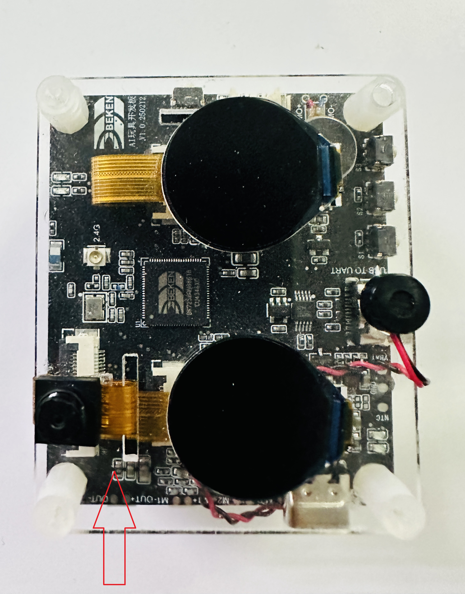

石头剪刀布
=================================

:link_to_translation:`en:[English]`

1. 简介
---------------------------------

    本工程是基于开源的手势检测模型和TensorFlow Lite轻量级的深度学习框架实现的石头剪刀布的猜拳游戏demo工程，通过Camera将手势图像检测出来后与随机生成的猜拳类别进行PK，最终将对局结果分别显示到两个屏幕上，并语音播报对局输赢结果。

1.1 规格
,,,,,,,,,,,,,,,,,,,,,,,,,,,,,,,,,

    * 硬件配置：
        * SPI LCD X2 (GC9D01)
        * 麦克
        * 喇叭
        * SD NAND 128MB
        * NFC (MFRC522)
        * 陀螺仪 (SC7A20H)
        * 充电管理芯片 (ETA3422)
        * 锂电池
        * DVP (gc2145)

2. 测试说明
---------------------------------

    该工程测试时需要按照如图所示的方向伸手手势，且需要将手势正对摄像头上方约50cm处。

    Figure 1. Rock_Paper_Scissors Gesture Direction

3. 测试步骤
---------------------------------

    - 1、板子上电执行后会听到语音播报准备出拳，将手势正对摄像头图像上方，保持手势不变直到语音提醒将手放下；

    - 2、Camera采集到图像后设备开始检测，并将检测的结果与设备随机出拳的结果进行对比；

    - 3、若检测成功，两个LCD屏幕将分别显示双方出拳结果，并语音播报输赢结果，否则会语音提醒未检测成功。
