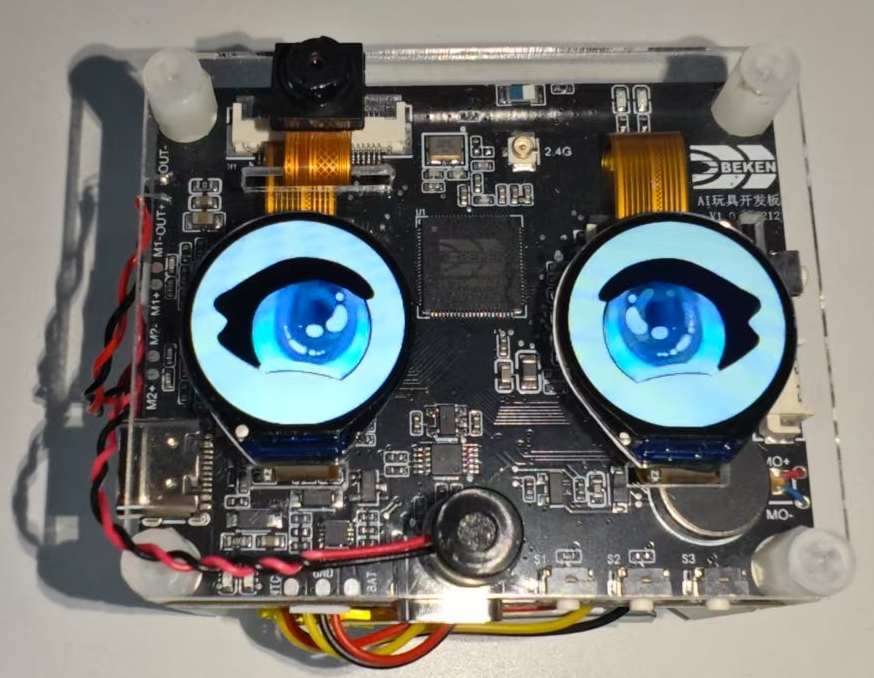
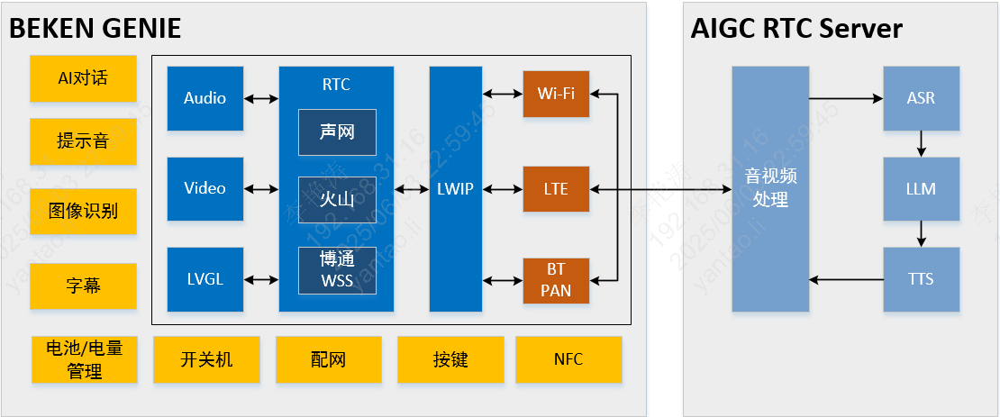
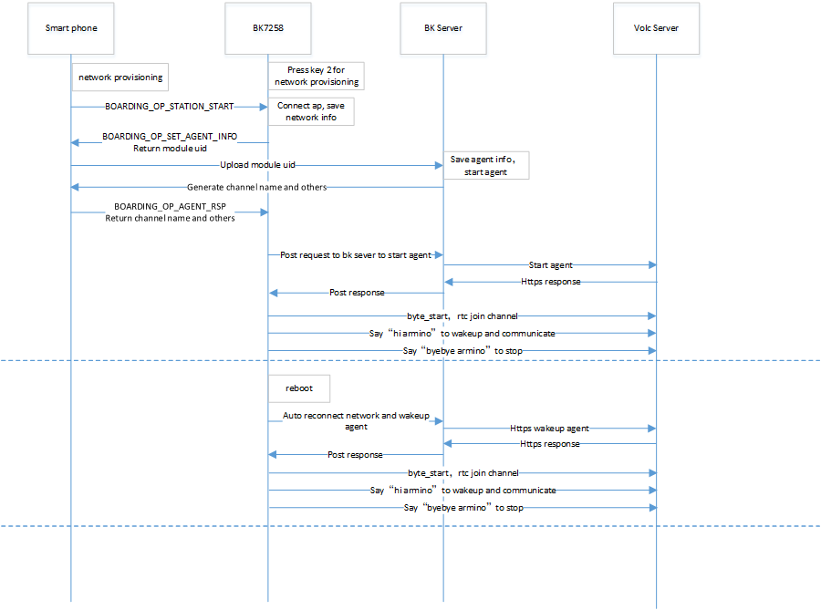
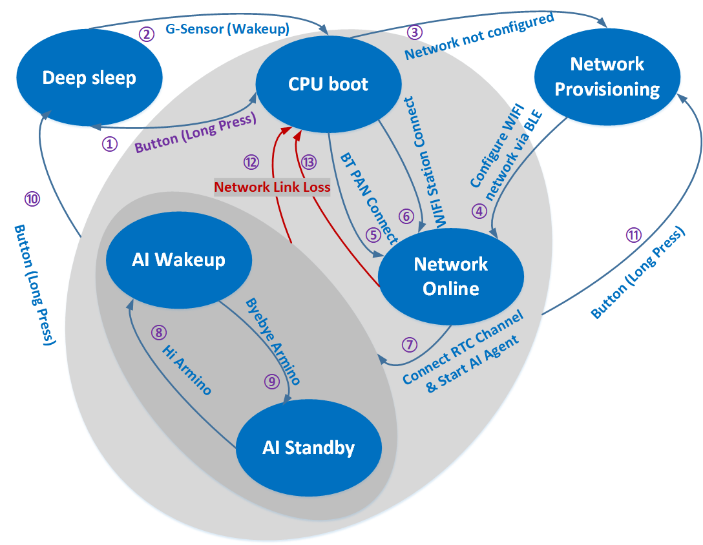

Beken Genie火山RTC版本
=================================

:link_to_translation:`en:[English]`

**1. 简介**
---------------------------------

    * 本工程是基于，端对云，云对大模型的设计方案。
    * 支持双屏显示，提供视觉加语音的陪伴体验和情绪价值。
    * 支持端侧打通，各种通用大模型的设计方案，直接对接Open AI、豆包、DeepSeek等。
    * 并且能够有效，利用云的分布式部署，降低网络延迟，提高交互体验。
    * 支持端侧AEC，NS等音频处理算法，支持G711/G722编码格式，支持KWS关键字打断唤醒，支持提示音播放。
    * 包含常用外设的参考设计以及Demo，比如，陀螺仪，NFC，按键，震动马达，Nand Flash，LED灯效，充电管理，DVP camera，双QPSI屏。
    * **本工程使用火山RTC**

**1.1 硬件原理图**
,,,,,,,,,,,,,,,,,,,,,,,,,,,,,,,,,

   * `AI玩具开发板 原理图 <https://docs.bekencorp.com/HW/BK7258/AIDK_AI%E7%8E%A9%E5%85%B7%E5%BC%80%E5%8F%91%E6%9D%BF_%E5%8E%9F%E7%90%86%E5%9B%BE.pdf>`_
   * `AI玩具开发板_底层位号图 <https://docs.bekencorp.com/HW/BK7258/AIDK_AI%E7%8E%A9%E5%85%B7%E5%BC%80%E5%8F%91%E6%9D%BF_%E5%BA%95%E5%B1%82%E4%BD%8D%E5%8F%B7%E5%9B%BE.pdf>`_
   * `AI玩具开发板_顶层位号图 <https://docs.bekencorp.com/HW/BK7258/AIDK_AI%E7%8E%A9%E5%85%B7%E5%BC%80%E5%8F%91%E6%9D%BF_%E9%A1%B6%E5%B1%82%E4%BD%8D%E5%8F%B7%E5%9B%BE.pdf>`_

**1.2 规格**
,,,,,,,,,,,,,,,,,,,,,,,,,,,,,,,,,

    * 硬件配置：
        * SPI LCD X2 (GC9D01 160x160)
        * 麦克
        * 喇叭
        * SD NAND 128MB
        * NFC (MFRC522)
        * 陀螺仪 (SC7A20H)
        * 充电管理芯片 (ETA3422)
        * 锂电池
        * DVP (gc2145)

    * 软件特性：
        * AEC
        * NS
        * G722 / G711u
        * 唤醒词定制
        * WIFI Station
        * BLE
        * BT PAN

    Figure 1. Hardware Development Board

**1.3 按键**
,,,,,,,,,,,,,,,,,,,,,,,,,,,,,,,,,

开发板下边靠右三个按键，对应丝印S1,S2,S3;右边一个按键K1

开关机
    - 开机：长按(>=3秒) ``S2`` 开机
    - 关机：当系统处于开机状态时，长按(>=3秒) ``S2`` 关机

配网
    - 配网：当系统处于开机状态时，长按(>=3秒) ``S1`` 进入等待配网状态

喇叭音量控制
    - 调大音量：单击 ``S1`` 按钮调大音量
    - 调小音量：单击 ``S3`` 按钮调小音量

恢复出厂设置
    - 恢复出厂设置：长按 ``S3`` 按钮恢复出厂设置

复位按键K1
    - 关机状态复位：单击 ``K1`` 按钮，系统从关机状态开机
    - 开机状态复位：单击 ``K1`` 按钮，系统从开机状态硬重启

按键功能开发请参考  :doc:`../../thirdparty/volc/index`

**1.4 灯效**
,,,,,,,,,,,,,,,,,,,,,,,,,,,,,,,,,

开发板上边有红绿两个状态指示灯，重要信息红灯闪烁，一般性提示绿灯闪烁，以及特殊性提醒红绿灯交替闪烁。

    绿灯常亮/长灭提示信息
        - 开机时，绿灯长亮，等待用户操作或下一个事件开始
        - 对话开始，绿灯灭

    红绿灯交替闪烁提示信息
        - 用户配网：用户配网

    绿灯闪烁提示信息
        - 上电联网中：绿灯快闪
        - 大模型服务器连接成功：绿灯慢闪
        - 对话停止：绿灯慢闪

    红灯闪烁提示信息
        - 配网失败/网络重连失败：红灯快闪
        - RTC连接断开：红灯快闪
        - 大模型服务器连接断开：红灯快闪
        - 电池电量低于20%：红灯慢闪30秒后自动停止闪烁；如果充电中，则红灯不闪烁
        - 无重要提醒事件：当无重要提醒事件时，红灯处于关闭状态

灯效开发参考代码led_blink.c。

**1.5 SD-NAND存储器**
,,,,,,,,,,,,,,,,,,,,,,,,,,,,,,,,,
    - SD-NAND存放本地资源文件，比如显示屏上的图片资源文件
    - SD-NAND存储器默认使用FAT32文件系统，供应用程序通过VFS接口间接调用FATFS开源程序接口访问文件
    - PC端，通过USB接口，读写访问开发板SD-NAND文件(开发板左边USB接口)
    - 请注意PC端删除的文件，不要同时被本地应用程序使用，防止系统异常

**1.6 陀螺仪-Gsensor**
,,,,,,,,,,,,,,,,,,,,,,,,,,,,,,,,,
    - 本地Gsensor支持唤醒系统功能，用户可以S形轨迹晃动开发板，将系统唤醒

**1.7 充电管理**
,,,,,,,,,,,,,,,,,,,,,,,,,,,,,,,,,
    - 1.当前开发板使用充电管理芯片型号为 (ETA3422)
    - 2.充电满时，充电口边上的红灯会关闭，绿灯亮；红灯亮表示在充电
    - 3.注意：在充电过程中或者外部电源接入的情况下，系统切换至外部输入电压源进行电压检测，而非使用电池电压，此时用命令获取的电压为外部输入电压。
    - 4.充电状态监测取决于GPIO51和GPIO26。
        - GPIO51负责检测是否为充电状态，GPIO51为高时，存在外部供电输入，反之，则没有。
        - GPIO26为高时，则表示电池正在充电中。为低时，则表示电池已经充满电。
        - 注意：该功能需要确认硬件上R14电阻是否已经焊接，如无焊接，需额外焊接。
        - 具体硬件信息以该项目原理图为准。
    - 5.使能充电管理功能需配置CONFIG_BAT_MONITOR=y，使能充电管理的测试用例需配置CONFIG_BATTERY_TEST=y。
    - 6.配置电池测试命令使能后，可以通过battery命令对电池的信息进行获取。
        - 比如“battery init”可以对电池监控任务进行初始化。
        - “battery get_battery_info”可以查看电池的基本信息。
        - “battery get_voltage”可以查看电池当前的电压值。
        - “battery get_level”可以查看电池当前的电量。
        - 如上命令使用时，需注意是否为外部电源供电情况下，否则检测电压信息为外部供电电压。
        - 具体其他命令，可以只发送“battery”，打印相关命令支持。更进一步信息，可参考cli_battery.c中的定义。
    - 7.当电量等于或小于20%时，会发送低电量告警事件。
        - 只有不插电的时候会触发，外部供电或者充电时，不会发送低电量告警。
        - 每次进入低电量状态时，只会发送一次。
        - 此时，另一侧的红灯慢闪30s。
    - 8.充电管理任务在充电时，会打印“Device is charging...”信息。
    - 9.在充满电时，会打印“Battery is full.”信息。
    - 10.尽管电池存在低压保护功能，但建议用户在低电量的时候及时充电，可延长电池的寿命。
    - 11.用户如果使用其他厂家的电池，需要根据具体电池的信息修改电量插值表s_chargeLUT以及iot_battery_open中电池基本信息的内容。
    - 12.在我们的SDK中，我们提供了电流、电压和电量的API函数。目前，电池仅支持电压和电量的检测功能。需要注意的是，电流检测的API接口虽然已保留，但目前尚未实现，因此如果用户的设备支持电流检测，需要自行对电流的API进行实现。
    - 13.由于目前硬件仅支持非充电状态下的电量检测，若用户需要充电期间检测电压，硬件上需要进行改造。去除D6二极管和R21电阻即可。
    - 14 按键旁边的USB口既是充电口又是串口。
    - 15.电量采样的ADC接口为芯片内部的ADC0，外部不需要接电阻分压电路再加ADC通道采集。ADC0与VBAT监控通道直连，该接口为芯片内部专用接口，没有外部连线。
    - 16.注意：电池最高检测电压为4.35V。高于该电压存在烧坏系统的风险。

**1.8 唤醒词**
,,,,,,,,,,,,,,,,,,,,,,,,,,,,,,,,,

    1. ``hi armino`` 或 ``嗨阿米诺`` 用于唤醒，本地端侧和云端AI互动，同时LCD亮起，展示眼睛动画。

        响应词为 ``A Ha``

    2. ``byebye armino`` 或 ``拜拜阿米诺`` 用于关闭，本地端侧和云端AI互动，同时关闭LCD，眼睛动画不再展示。

        响应词为 ``Byebye``

**1.9 马达**
,,,,,,,,,,,,,,,,,,,,,,,,,,,,,,,,,
    - 1.LDO连接马达的正极，PWM连接马达的负极，通过调节PWM的占空比来控制马达的振动强度。
    - 2.通过长按按键开机时，马达会振动。
    - 3.PWM详细使用例程见cli_pwm.c。

**1.10 提示音**
,,,,,,,,,,,,,,,,,,,,,,,,,,,,,,,,,

开发板工作过程中会根据事件播放对应提示音，事件对应的提示音内容如下：

    蓝牙配网：
        - 开始蓝牙配网： ``请使用蓝牙配网``
        - 蓝牙配网： ``蓝牙配网失败，请重新配网。``
        - 蓝牙配网成功： ``蓝牙配网成功``

    连网
        - 连网中： ``网络连接中，请稍后。``
        - 连网失败： ``网络连接失败，请检查网络。``
        - 连网成功： ``网络连接成功``

    唤醒和关闭
        - 唤醒： ``A Ha``
        - 关闭： ``Byebye``

    AI智能体
        - AI智能体连接成功： ``AI智能体已连接``
        - AI智能体断开连接： ``AI智能体已断开``

    设备断连
        - 设备断开连接： ``设备断开连接``

    电池电量
        - 电池低电量： ``电池电量低，请充电。``

    请参考文档：:doc:`音频组件开发指南 <../../api-reference/bk_aud_intf>`
    默认提示音文件资源路径： ``/projects/common_componets/resource/``

**1.11 倒计时**
,,,,,,,,,,,,,,,,,,,,,,,,,,,,,,,,,
    - 配网事件倒计时为五分钟，五分钟未配网，则芯片会进入深度睡眠(类似于关机)。
    - 网络错误倒计时为五分钟，若发生网络错误，五分钟内网络未恢复，则芯片会进入深度睡眠。
    - 待机状态倒计时为三分钟，系统上电后默认状态为待机状态，当您喊 ``byebye armino`` 或 ``拜拜阿米诺`` 之后，系统也会处于待机状态，若无其他事件发生，三分钟后芯片会进入深度睡眠。
    - 您可以在countdown_app.c的s_ticket_durations[COUNTDOWN_TICKET_MAX]数组里修改倒计时时间。

**1.12 火山RTC**
,,,,,,,,,,,,,,,,,,,,,,,,,,,,,,,,,

火山RTC，参考文档  :doc:`../../thirdparty/volc/index`

**2. 工程使用介绍**
---------------------------------

**2.1 代码下载及编译**
,,,,,,,,,,,,,,,,,,,,,,,,,,,,,,,,,

    * `AIDK 代码下载 <../../get-started/index.html#armino-aidk-sdk>`_

    * `SDK 构建环境搭建 <https://docs.bekencorp.com/arminodoc/bk_idk/bk7258/zh_CN/v2.0.1/get-started/index.html>`_

    * 代码编译: ``make bk7258 PROJECT=volc_rtc``

        * 在源代码根目录下编译
        * 工程目录位于 ``<source code>/project/volc_rtc``

**2.2 APP注册和下载**
,,,,,,,,,,,,,,,,,,,,,,,,,,,,,,,,,

    APP下载：https://docs.bekencorp.com/arminodoc/bk_app/app/zh_CN/v2.0.1/app_download/index.html

    注册登录：使用邮箱注册登录

**2.3 固件烧录和资源文件烧录**
,,,,,,,,,,,,,,,,,,,,,,,,,,,,,,,,,

2.3.1 烧录固件
+++++++++++++++++++++++++++++++++
烧录固件可请参考如下文档 `固件烧录 <https://docs.bekencorp.com/arminodoc/bk_idk/bk7258/zh_CN/v2.0.1/get-started/index.html>`_

.. note::

    烧录的二进制文件位于 ``<source code>/build/volc_rtc/bk7258/all-app.bin``

2.3.2 拷贝资源文件
+++++++++++++++++++++++++++++++++

将 ``<source code>/project/common_components/resource`` 目录音视频文件拷贝到AIDK开发版的SD NAND中。
SD NAND具体使用方法可参考 `Nand磁盘使用注意事项 <../../api-reference/nand_disk_note.html>`_

2.3.3 上电
+++++++++++++++++++++++++++++++++

烧录编译好的all-app.bin文件并上电执行即可。

**2.4 配网**
,,,,,,,,,,,,,,,,,,,,,,,,,,,,,,,,,

2.4.1 首次配网
+++++++++++++++++++++++++++++++++

    a)手机进入如下界面，按照图片步骤操作

    .. figure:: ../../../_static/add_device_zh.png
        :scale: 30%

    .. figure:: ../../../_static/add_devcie_ai_toy_zh.png
        :scale: 30%

    .. figure:: ../../../_static/device_info_zh.png
        :scale: 30%

    b)手机开始BLE扫描后，长按下图配网键3s，板子进入配网模式

    .. figure:: ../../../_static/add_ai_device_8.png
        :scale: 70%

    c)手机端扫到如下设备，点击设备开始配网

    .. figure:: ../../../_static/ble_scan_zh.png
        :scale: 30%

    .. figure:: ../../../_static/select_model_zh.png
        :scale: 30%

    .. figure:: ../../../_static/ai_activate_type_zh.png
        :scale: 30%

    .. figure:: ../../../_static/wifi_select_zh.png
        :scale: 30%

    .. figure:: ../../../_static/activating_zh.png
        :scale: 30%

    .. figure:: ../../../_static/added_zh.png
        :scale: 30%

2.4.1 重新配网
+++++++++++++++++++++++++++++++++

.. warning::

    重新配网之前，需要原来的配网的手机上，把设备移除，然后再重复上述章节的操作。

    移除设备方法如下：

..

    a)长按图示区域，会弹出提示框。

    .. figure:: ../../../_static/added_zh.png
        :scale: 30%

    b)点击确认，完成操作。

    .. figure:: ../../../_static/del_zh.png
        :scale: 30%

.. note::

    更多APP操作，请参考APP文档：

    https://docs.bekencorp.com/arminodoc/bk_app/app/zh_CN/v2.0.1/app_usage/app_usage_guide/index.html#ai

**2.5 AI对话**
,,,,,,,,,,,,,,,,,,,,,,,,,,,,,,,,,

对板载mic说唤醒词 ``hi armino`` 或 ``嗨阿米诺``，设备唤醒后会播放提示音 ``啊哈`` ，然后可以进行AI对话

对板载mic说关键词词 ``byebye armino`` 或 ``拜拜阿米诺``，设备检测到后会播放提示音 ``byebye`` ，然后进入睡眠，停止与AI的对话

**3. 开发指南**
---------------------------------

**3.1 模块架构图**
,,,,,,,,,,,,,,,,,,,,,,,,,,,,,,,,,

此AI demo方案和门锁方案类似，设备端和和AI大模型端双向语音通话，同时设备端向AI大模型端单向图传，门锁方案中的对端apk变为了AI Agent机器人。
软件模块架构如下图所示：

    Figure 3. software module architecture

..

    * 方案中，设备端采集mic语音，通过火山RTC SDK将语音数据发送至服务器，服务器负责和AI Agent大模型的交互，将mic语音发送至AI Agent并获取回复，再将语音回复发送至设备端喇叭播放。
    * 方案中，设备端采集图像，通过火山RTC SDK将每帧图像发送至服务器，服务器再将图像送至AI Agent大模型进行识别。

**3.2 配网及对话时序图**
,,,,,,,,,,,,,,,,,,,,,,,,,,,,,,,,,

    Figure 4. Operation Flow Sequence

**3.3 工作状态机**
,,,,,,,,,,,,,,,,,,,,,,,,,,,,,,,,,

    Figure 5. module state diagram

::

    1/2 Green light stays on.
    3/4 Green and red lights flash alternately
    5/6 Green light flashes quickly.
    7 Green light flashes quickly.
    8 LCD on, LED off.
    9 LCD off
    12/13 Red light flashes quickly

**3.4 主要配置**
,,,,,,,,,,,,,,,,,,,,,,,,,,,,,,,,,

    打开火山RTC功能库需要在 ``cpu0`` 上打开以下配置:

    +----------------------------------------+----------------+---------------+----------------+
    |Kconfig                                 |   CPU          |   Format      |      Value     |
    +----------------------------------------+----------------+---------------+----------------+
    |CONFIG_VOLC_RTC_EN                      |   CPU0         |   bool        |        y       |
    +----------------------------------------+----------------+---------------+----------------+

    打开Beken配网及agent启动需要在 ``cpu0`` 上打开以下配置:

    +----------------------------------------+----------------+---------------+----------------+
    |Kconfig                                 |   CPU          |   Format      |      Value     |
    +----------------------------------------+----------------+---------------+----------------+
    |CONFIG_BK_SMART_CONFIG                  |   CPU0         |   bool        |        y       |
    +----------------------------------------+----------------+---------------+----------------+

    打开双屏显示及AVI播放需要打开以下配置:

    +----------------------------------------+----------------+---------------+----------------+
    |Kconfig                                 |   CPU          |   Format      |      Value     |
    +----------------------------------------+----------------+---------------+----------------+
    |CONFIG_LCD_SPI_GC9D01                   |   CPU1         |   bool        |        y       |
    +----------------------------------------+----------------+---------------+----------------+
    |CONFIG_LCD_SPI_DEVICE_NUM               |   CPU1         |   int         |        2       |
    +----------------------------------------+----------------+---------------+----------------+
    |CONFIG_AVI_PLAY                         |   CPU1         |   bool        |        y       |
    +----------------------------------------+----------------+---------------+----------------+
    |CONFIG_DUAL_SCREEN_AVI_PLAY             |   CPU0 & CPU1  |   bool        |        y       |
    +----------------------------------------+----------------+---------------+----------------+
    |CONFIG_LVGL                             |   CPU1         |   bool        |        y       |
    +----------------------------------------+----------------+---------------+----------------+
    |CONFIG_LV_IMG_UTILITY_CUSTOMIZE         |   CPU1         |   bool        |        y       |
    +----------------------------------------+----------------+---------------+----------------+
    |CONFIG_LV_COLOR_DEPTH                   |   CPU1         |   int         |        16      |
    +----------------------------------------+----------------+---------------+----------------+
    |CONFIG_LV_COLOR_16_SWAP                 |   CPU1         |   bool        |        y       |
    +----------------------------------------+----------------+---------------+----------------+

**3.5 按键开发说明**
,,,,,,,,,,,,,,,,,,,,,,,,,,,,,,,,,
GPIO按键使用说明
    - 按键功能配置，参考 ``/projects/common_components/bk_key_app/key_app_config.h`` 和 ``key_app_service.c``，开发者在该表中填写对应的IO管脚和按键对应的回调函数事件即可
    - 长按键时长配置参考multi_button.h中的LONG_TICKS宏定义
    - 当前所有的按键事件转到任务中执行，如果按键事件执行程序被阻塞或执行时间过长，会影响按键响应速度

GPIO按键注意事项
    - 请确认GPIO管脚只供按键使用，否则同一个GPIO管脚功能冲突，会引起按键无效问题
    - 如果开发者开发板与beken_genie开发板不同，请根据开发板硬件设计重新配置GPIO。关于GPIO使用方法，请参考 ``bk_avdk/bk_idk/docs/bk7258/zh_CN/api-reference/peripheral/bk_gpio.rst``

**3.6 BLE配网及agent定制指南**
,,,,,,,,,,,,,,,,,,,,,,,,,,,,,,,,,

BLE配网及agent相关代码主要分布在  ``/projects/common_components/bk_boarding_service`` 目录及 ``/projects/common_components/bk_smart_config`` 目录，客户可以参考如下说明定制自己的方案

核心代码如下：
 - 进入BLE配网模式，请参考 ``bk_sconf_prepare_for_smart_config(void)`` 实现
 - 手机app通过BLE交互配网信息，参考代码 ``bk_genie_message_handle(void)``
 - 将Agent配置参数发送给手机app，参考代码 ``bk_sconf_send_agent_info(char *payload, uint16_t max_len)``
 - 解析服务器启动Agent参数，参考代码 ``bk_sconf_prase_agent_info(char *payload, uint8_t reset)``
 - 启动Agent和RTC，参考代码 ``bk_sconf_wakeup_agent(uint8_t reset)``
 - wifi连上后启动agent、保存wifi及agent信息及配网，参考代码 ``bk_sconf_netif_event_cb``
 - 保持（存flash）/擦除/获取Agent信息相关函数接口， ``bk_sconf_erase_agent_info`` ``bk_sconf_save_agent_info`` ``bk_sconf_get_agent_info``
 - 按键切换多模态，参考代码 ``ir_mode_switch_main``
 - 启动火山agent及设备端rtc，参考代码 ``bk_sconf_start_volc_rtc``, reset参数用来通知beken服务器是否强制切回初始agent配置

**3.7 火山相关功能开发**
,,,,,,,,,,,,,,,,,,,,,,,,,,,,,,,,,
火山相关功能开发请参考 `火山RTC功能 <../../thirdparty/volc/index.html#id6>`_

4. 问题&回答
---------------------------------

Q：应用层没有mic数据上报？
A：目前beken_genie默认支持基于命令词的语音唤醒功能，只有唤醒后才会上报mic采集的数据应用层，应用层再将数据发送给AI进行对话。如果客户不需要语音唤醒功能，可通过宏 ``CONFIG_AUD_INTF_SUPPORT_AI_DIALOG_FREE`` 将该功能关闭。

Q：UI资源播放显示异常？
A：本工程中使用的UI资源必须是AVI格式的视频，其分辨率是320x160，且必须经过AVI转换工具转换后才能使用，可先检查一下UI资源是否符合上述要求。